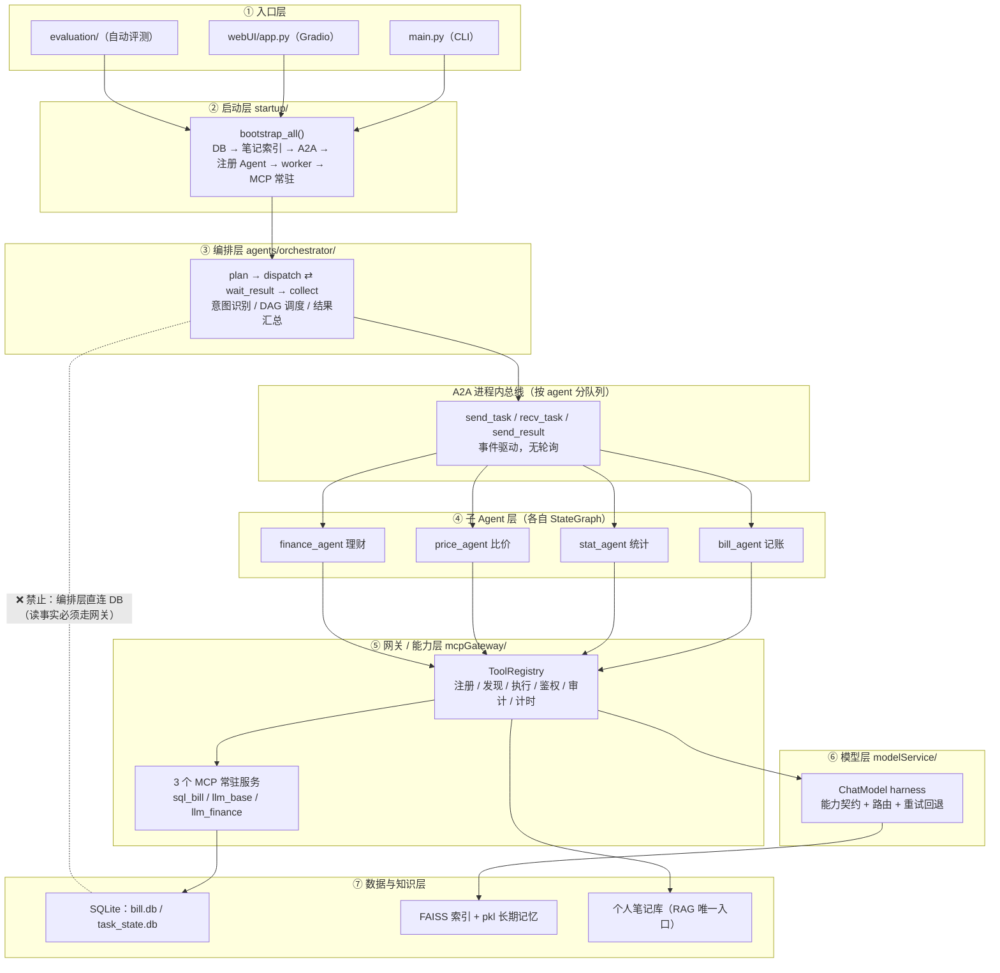
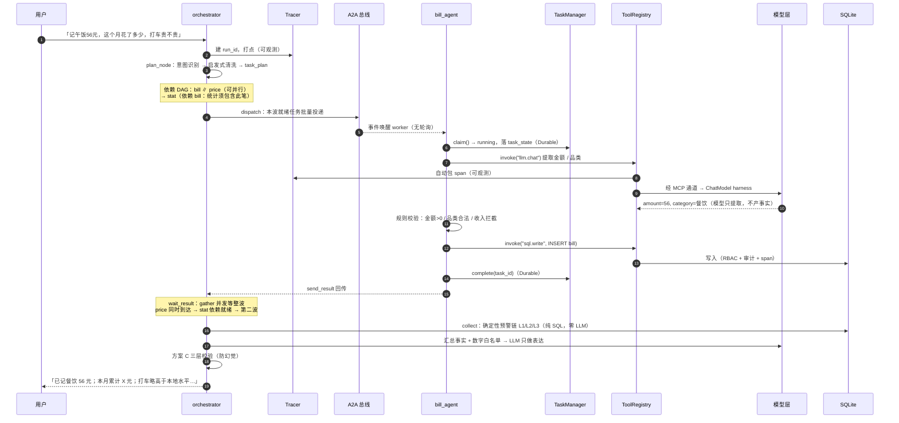
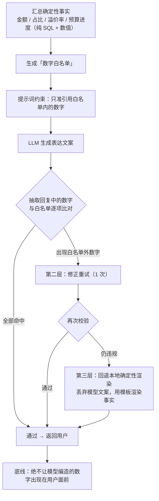
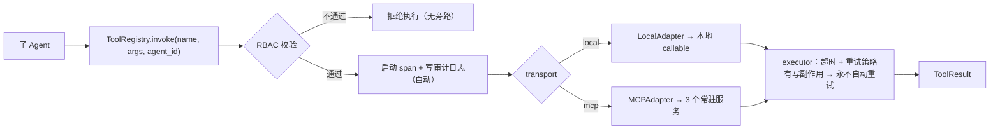
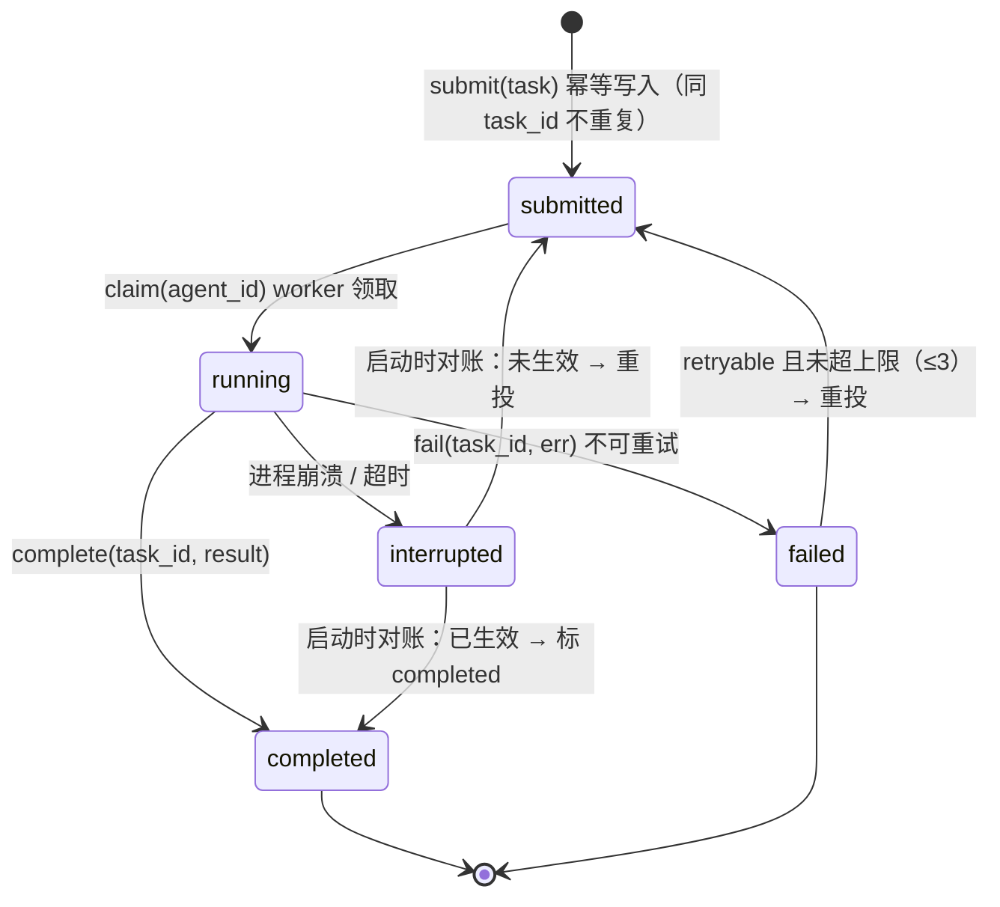
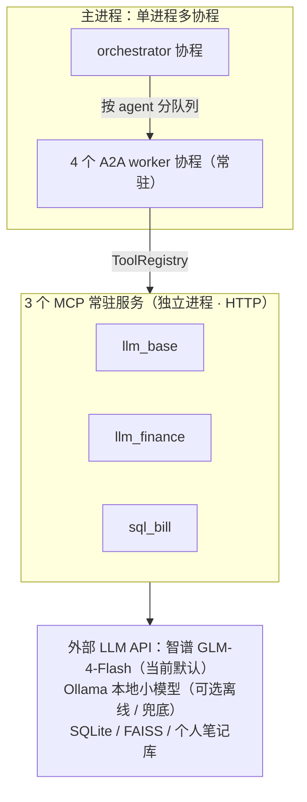

# 消费管家智能体 · 说一句话就记账的 AI 消费管家

**多 Agent 协作 · 回复里的数字全部由 SQL 算出 · 推理当前默认走外部大模型 API（智谱 GLM-4-Flash）**

**设计意图与当前形态**：这个项目最初的设计是**全链路跑本地小模型**（对 1.8B 底座做 QLoRA 微调，零外部依赖、零 API 费用）。但在落地过程中发现，**意图识别**要把口语拆成结构化任务计划（哪个 Agent 干、依赖谁），金额/品类提取要输出稳定 JSON——这类重活在 1.8B 小模型上实测做不了，也难调试（JSON 输出不稳定、单次推理可到 189s，依据见 §6）。所以编排与各 Agent 的推理**实际落地切到了外部大模型 API**：当前调通并默认使用**智谱 GLM-4-Flash**（OpenAI 兼容协议 `https://open.bigmodel.cn/api/paas/v4`，`FORCE_EXTERNAL=1` 使全部 Agent 走外部，配置见 §3）。本地小模型（Ollama 加载 `qwen-bill-1.5-1.8b-q4km`）保留为**可选离线 / 兜底通道**——不配任何 API 仍能跑通全流程，只是效果与稳定性回退。

不用填表单、不用选分类、不用记命令——**像发消息一样把账记了**：

```
记午饭56元
这个月花了多少
打车贵不贵
给我点省钱建议
```

下面是它的实际形态、能做的事，以及 30 秒跑起来的方法。想了解实现，直接从[架构](#6-架构给想深挖的人)看起。

---

## 目录

- [1. 它长什么样](#1-它长什么样)
- [2. 它能干什么](#2-它能干什么)
- [3. 30 秒跑起来](#3-30-秒跑起来)
- [4. 常用指令一览](#4-常用指令一览)
- [5. 这些数字是怎么来的](#5-这些数字是怎么来的)
- [6. 架构（给想深挖的人）](#6-架构给想深挖的人)
- [7. 五个核心设计](#7-五个核心设计)
- [8. 实测数据](#8-实测数据)
- [9. 目录结构](#9-目录结构)
- [10. 测试与评测](#10-测试与评测)
- [11. 技术栈](#11-技术栈)
- [12. 已知边界与后续方向](#12-已知边界与后续方向)

---

## 1. 它长什么样

### Web 界面（Gradio，浏览器打开即用）

```
┌────────────────────────────────────────────────────────────────┐
│  消费管家智能体                                    [ 退出系统 ]  │
├────────────────────────────────────────────────────────────────┤
│  ▸ 预算与偏好设置                              （点击展开）     │
├────────────────────────────────────────────────────────────────┤
│                                                                │
│  你  │ 记午饭56元                                               │
│      │                                                         │
│  AI  │ 记账成功 ✅ 已记「餐饮 · 午饭」56 元                     │
│      │ 本月餐饮累计 X 元（月预算 Y 元的 Z%）                    │
│      │ 额度档位：正常                                           │
│      │                                                         │
│  你  │ 这个月花了多少                                           │
│      │                                                         │
│  AI  │ 本月累计 X 元，共 N 笔                                   │
│      │ 餐饮 X 元（Z%）· 交通 X 元（Z%）· 购物 X 元（Z%）        │
│      │ 环比上月 +A%                                             │
│      │                                                         │
│  你  │ 打车贵不贵                                               │
│      │                                                         │
│  AI  │ 交通 · 打车：本地均价 X 元，你的均值 Y 元，溢价 Z%       │
│      │ 结论：略高于本地水平                                     │
│                                                                │
├────────────────────────────────────────────────────────────────┤
│ [ 想记一笔？直接输入，如：记午饭56元（Enter 发送）        ]      │
│                              [ 发送 ] [ 新会话 ]                │
└────────────────────────────────────────────────────────────────┘
```

界面由三块组成：**顶栏**、**预算与偏好设置**（折叠面板，表单直写配置，不经过大模型）、**对话区**。
设置面板里可设：所在城市、月度总预算、消费模式（节俭 / 正常 / 宽松）、分品类预算（餐饮 / 交通 / 住宿 / 购物 / 娱乐）、提醒偏好——保存后即刻生效，后续记账与预警都按新配置计算。

### 命令行（`python main.py`）

同一个后端，两种入口，随时切换：

```
===== 消费管家智能体启动完成，输入exit退出对话 =====
用户：记午饭56元
智能体：记账成功 ✅ 已记「餐饮 · 午饭」56 元，本月餐饮累计 X 元

用户：exit
程序退出
```

> 上面 `X` / `Y` / `Z` / `A` / `N` 为运行时真实数字，此处仅示意格式。

---

## 2. 它能干什么

**六件事，一句话触发：**

| 能力 | 你怎么说 | 它做什么 |
|---|---|---|
| **记账** | `记午饭56元` / `昨天打车花了32` | 自动提取金额、品类、日期并落库，顺带沉淀消费习惯 |
| **改账 / 删账** | `把刚才那笔改成60` / `删掉刚才那笔` | 靠上下文指代定位到那一条，改完重新计算当月统计 |
| **统计** | `这个月花了多少` / `查7月开销` | 月度/分类汇总、占比、同比环比 |
| **比价** | `打车贵不贵` / `咖啡比市场价高吗` | 与所在城市同类均价对比，给出溢价率 |
| **理财建议** | `给我点省钱建议` | 结合消费结构、近 3 月习惯、你的笔记，给出可执行的省钱项 |
| **预算与笔记** | `设置月预算3000` / `记下：我们那香蕉8块一斤` | 配置即时生效；笔记进入个人知识库，理财分析时作为参考 |

**一次说多件事，它会自己拆开并行处理：**

```
你 > 记午饭56元，这个月花了多少，打车贵不贵

消费管家 > 记账成功 ✅ 已记「餐饮 · 午饭」56 元
            本月累计 X 元（含本笔，月预算 Y 元的 Z%）
            交通 · 打车：本地均价 X 元，你的均值 Y 元，溢价 Z%
```

一句包含三个意图：系统自动识别为「记账 + 统计 + 比价」，**记账与比价并行执行，统计等记账落库后再算**（保证这笔被统计进去）。

**超支会主动提醒**，分三个层级，全是规则触发、不靠模型判断：单笔明显高于同类均价 → 提醒；某品类接近预算 → 提醒；月度总预算按四档（安全 / 关注 / 预警 / 超支）→ 提醒。

---

## 3. 30 秒跑起来

### 环境

- Python **3.10+**（本项目开发于 3.10.11）
- **当前默认形态**：任一 OpenAI 兼容 API——项目已用**智谱 GLM-4-Flash** 调通（推荐，配置见下）
- 可选离线：[Ollama](https://ollama.com/) + 本地小模型（`qwen-bill-1.5-1.8b-q4km`），未配 API 时自动兜底

### 安装

```powershell
git clone <你的仓库地址>
cd billAgent

# 方式一：一键脚本（建 venv + 装依赖 + 检查本地模型）
install_cpu.bat

# 方式二：手动
python -m venv venv
.\venv\Scripts\pip install -r requirements.txt
```

> torch 为 CPU 版，建议按 [PyTorch 官方 CPU 源](https://pytorch.org/get-started/locally/) 单独安装。
> `gradio==4.44.1` / `huggingface-hub==0.20.3` / `fastapi==0.115.6` 是配套锁定组合，不建议单独升级。

### 启动

```powershell
# Web 界面：浏览器自动打开 http://127.0.0.1:7860
start_webui.bat

# 或命令行对话（输入 exit 退出）
.\venv\Scripts\python.exe main.py
```

启动会依次完成：数据库连通校验 → 加载个人笔记索引 → 拉起 3 个 MCP 常驻服务（端口 8001/8002/8003）并健康检查 → 清理残留任务 → 崩溃恢复 → 注册 Agent 与 worker。终端出现「全部底层初始化完毕，可以启动聊天交互」即可对话。

然后直接输入第一句话：

```
记午饭56元
```

### 配置外部大模型（当前落地形态，已用智谱 GLM-4-Flash 调通）

系统**默认就走外部大模型**，原因与设计意图见顶部。以下 5 个变量与本机当前生效配置一致（OpenAI 兼容协议）：

```powershell
$env:BILLAGENT_EXT_LLM_BASE_URL="https://open.bigmodel.cn/api/paas/v4"
$env:BILLAGENT_EXT_LLM_API_KEY="你的API密钥"
$env:BILLAGENT_EXT_ORCH_MODEL="glm-4-flash"
$env:BILLAGENT_EXT_FINANCE_MODEL="glm-4-flash"
$env:BILLAGENT_FORCE_EXTERNAL="1"     # 全部 Agent 走外部；不设则仅编排 Agent 走外部，其余回退本地
```

不配 API 时系统回退**本地 Ollama 小模型 + 本地确定性渲染**，链路仍可跑通（演示/离线场景），这是架构刻意保留的底牌。

也可把上面变量写进项目根 `.env`（已集成 `load_dotenv()`）；注意 `.env` 优先级低于已存在的环境变量，二者择一。`.env` 含密钥，**切勿提交**。

| 开关 | 作用 |
|---|---|
| `BILLAGENT_FORCE_EXTERNAL=1` | 所有 Agent 走外部模型（默认仅编排 Agent 走外部） |
| `BILLAGENT_DISABLE_LOCAL_LLM=1` | 硬开关：封死本地通道，走到即报错（排查用） |
| `BILLAGENT_EXT_TIMEOUT` | 外部调用超时秒数（默认 300） |
| `BILLAGENT_MCP_STDIO=1` | 回滚开关：MCP 退回 stdio 短连接模式 |

> 选型提示：优先选**非推理模型**（如 `glm-4-flash`）。推理模型的 `thinking` 会吃满 `max_tokens` 预算导致「返回 200 但正文为空」；若必须用推理模型，请调大 `config/config.py` 中 `EXTERNAL_BASE_LLM_OPTIONS.max_tokens`。

---

## 4. 常用指令一览

| 想做什么 | 直接说 |
|---|---|
| 记账 | `记午饭56元` / `昨天买菜花了88` |
| 改账 | `把刚才那笔改成60` |
| 删账 | `删掉刚才那笔` |
| 查统计 | `这个月花了多少` / `查7月开销` / `餐饮花了多少` |
| 比价 | `打车贵不贵` / `咖啡比市场价高吗` |
| 理财建议 | `给我点省钱建议` |
| 设预算 | `设置月预算3000` |
| 记笔记 | `记下：我们那香蕉8块一斤` |
| 管笔记 | `删掉XX那条笔记` / `列一下我的笔记` |

信息不全时它会**追问，最多 3 轮**；仍不满足则明确告知失败，不会瞎猜硬记。

---

## 5. 这些数字是怎么来的

记账类应用最怕一件事：**账是错的**。让大模型直接"算账并回答"，它会一本正经地给出不存在的数字。

所以这里做了明确分工：

| 环节 | 谁来做 | 说明 |
|---|---|---|
| 金额、汇总、占比、溢价率、预算进度 | **SQL 与数值计算** | 事实唯一来源，100% 确定 |
| 意图识别、从句子里提取金额/品类、组织语言 | **大模型** | 只做"理解和表达" |
| 回复发出前的最后一道检查 | **数字白名单** | 回复中出现的每个数字都要与白名单比对，越界就修正重试，仍不行则回退本地渲染 |

一句话概括：**模型负责把话说好听，数字不归它管**。防幻觉靠的是分工与闸门、不赌模型大小——这正是最初敢在小模型上做财务场景的原因；如今在意图识别等结构化环节换用外部 GLM-4-Flash（见 §6 的落地修正），出口的白名单闸门依旧在把关。

---

## 6. 架构（给想深挖的人）

### 设计动机

三条初始约束，加上落地后**被现实修正的一条**：

| 约束 | 挤出的设计 |
|---|---|
| 数字不能错 | 事实层（SQL/数值）与表达层（LLM）**物理分离**，中间用白名单闸门 |
| 本地小模型能力有限 | 大任务拆小、专业分工（1 编排 + 4 子 Agent）、确定性计算兜底 |
| 不能依赖外部服务（**最初约束**） | 最早确实想全本地零依赖：1.8B 底座 + QLoRA 微调，即 Ollama 加载 `qwen-bill-1.5-1.8b-q4km` |
| 意图识别等结构化输出小模型撑不住（**落地修正**） | 1.8B 模型 JSON 输出不稳定、难调试，实测单次推理最长 189s、e2e 4 条用例耗时 36 分钟（记录在 `config/config.py` 注释）；因此**当前默认走外部大模型 API（智谱 GLM-4-Flash，OpenAI 兼容）**，本地小模型降为可选离线通道，未配 API 仍能兜底回退 |

> 演化痕迹：`FORCE_EXTERNAL`（全部 Agent 走外部）与 `DISABLE_LOCAL_LLM`（封死本地通道、排查用）两个开关，就是这段从「本地为主」到「外部为主」演进留下的可回滚开关。

### 总览：七层 + 一条铁律

**只能向下调用，出口唯一。**



为什么是「1 编排 + 4 子 Agent」而不是一个超级 Agent：提示词越大、意图边界越模糊，小模型越容易漏任务或脑补任务；而每个意图一个 Agent 又会让通信拓扑随数量膨胀。1+4 换来的是**职责内聚、失败隔离、可单独替换与测试**。

### 一次请求的完整旅程



---

## 7. 五个核心设计

### 7.1 防幻觉：方案 C 三层防护



边界也清楚：个人笔记里的数字（如「我们那香蕉8块一斤」）是**用户陈述而非系统事实**，不进白名单，引用时标注来源；与事实冲突时以事实为准并说明。

### 7.2 工具平台：唯一出口自动附加横切能力



工具被建模成**可管理资产**而非散落的调用点：一次声明元数据，**鉴权 / 审计 / 计时 / 文档**四件套自动生效。编排器只有只读权限、零写权限——写操作只可能发生在有职责的子 Agent 里。

### 7.3 Durable：任务不丢、重投不重



`interrupted` 不是终态：启动时按 `task_id` 对账后分流。这就是「崩了不丢账、重投不重复记账」的全部秘密。

### 7.4 可观测：run_id + span 树

一次请求一个 `run_id`；工具调用经 Registry 自动包 span、LLM 调用经 harness 自动埋点，**业务代码不写一行打点**。落库到 `trace_span`（链路）与 `llm_call_stat`（token / 耗时 / 成败 / 按 Agent 归因），可用 `utils/trace_view.py` 直接看 span 树。

> 踩过的坑：早期零可观测开发，参数语义不兼容、死代码、重试不分层等问题长期未暴露。结论是**可观测属于前置需求**，且任何兜底都必须告警 + 计数，禁止静默失败。

### 7.5 执行模型：协程 + 事件驱动 + 批量派发



三个改造有严格先后：总线从轮询改事件驱动 → MCP 从 stdio 短连接改常驻 HTTP 并拆掉全局锁 → 派发从"一次一个"改"整波批量 + 并发收集"。**并行派发的收益必须建立在常驻 + 拆锁之后**，否则收益为零。

---

## 8. 实测数据

同环境 A/B 实测：

| 项 | 改造前 | 改造后 | 收益 |
|---|---|---|---|
| A2A 投递延迟（P95） | 30.891 ms（0.1s 轮询） | 0.306 ms（事件驱动） | **101×** |
| 空闲唤醒 | 36 次/秒 | 0 次/秒 | 空转归零 |
| MCP 调用 | stdio 每次冷启动 26~29 s | 常驻 HTTP，就绪约 6 s（一次） | 端到端 76.6 s → 58.5 s（**-24%**） |
| 并发读写 / 跨进程 | 读写互斥，易 `database is locked` | WAL + `busy_timeout=5000` | 读不阻塞写；双进程各写 80 行，**零锁错误** |
| 多任务调度 | 一次一个，延迟 = ΣT | 整波批量，延迟 = max(T) | 实测 10.2 s → **7.6 s**（结果逐字一致） |
| 崩溃恢复 | 丢账 / 重复记账 | 状态机 + `task_id` 幂等 | kill -9 重启后恢复，重复投递无重复记账 |

---

## 9. 目录结构

```
agents/         5 个 Agent：orchestrator 编排 + bill/stat/price/finance 子 Agent
mcpGateway/     工具平台：tool_model / registry / executor / adapters
                + 3 个 MCP 常驻服务 + A2A 消息总线 + RBAC + sandbox 沙箱
modelService/   模型接入层：ChatModel 抽象 + Router + Provider（本地 / OpenAI 兼容）
                附本地 embedding 模型（bge-small-zh / bge-reranker）
database/       SQLite：bill.db（业务事实）+ task_state.db（任务状态机）
startup/        bootstrap（启动编排）+ task_manager（Durable 状态机）+ chat_loop
memory/         短期会话记忆 + 长期向量记忆（FAISS）+ 个人笔记库（RAG 唯一入口）
utils/          tracer / trace_view（可观测）+ number_whitelist（防幻觉）等横切工具
webUI/          Gradio 界面
evaluation/     检索评测、回答质量评测脚本
tests/          unit / integration / e2e 三层测试
eval_reports/   评测基线存档
config/         集中配置（端口 / 超时 / 模型参数 / 权限映射）
```

---

## 10. 测试与评测

```powershell
# 单元测试：零外部依赖（不连模型、不连 MCP 服务）
.\venv\Scripts\python.exe -m pytest tests/unit -q

# 集成测试：需先启动系统（3 个 MCP 常驻服务在跑）
.\venv\Scripts\python.exe -m pytest tests/integration -q

# 端到端：需 MCP 常驻 + worker + 模型就绪
.\venv\Scripts\python.exe -m pytest tests/e2e -v

# 检索评测 / 回答质量评测
.\venv\Scripts\python.exe evaluation\user_docs_recall_eval.py
.\venv\Scripts\python.exe evaluation\agent_answer_eval.py
```

| 层级 | 规模 | 当前结果 | 前置条件 |
|---|---|---|---|
| **单元** | 21 个文件 | **271 passed / 34s** | 无 |
| **集成** | 5 个文件 | 依赖服务 | 需先启动系统；服务未起时会报 `ConnectError`（连接失败，非功能缺陷） |
| **e2e** | 11 个文件 | 依赖模型 | 需 MCP 常驻 + worker + 本地或外部模型 |
| **检索评测** | 13 条查询 | hit@1 61.54% / hit@3 100% / recall@5 92.86% | 需 embedding 模型 |
| **回答质量** | 12 条用例 | 本地渲染 **12/12（均分 10.0）**；外部模型 + 方案 C **12/12（均分 9.83）** | 需模型，耗时较长 |

检索基线存档见 `eval_reports/l2_baseline_userdocs_20260904.txt`。

单元测试中含 `test_contract_check.py`：**契约漂移检测**——设计约定与代码实现不一致即 FAIL，用测试守住架构红线。

---

## 11. 技术栈

| 领域 | 选型 | 说明 |
|---|---|---|
| 编排 | LangGraph | 每个 Agent 一个 StateGraph，编排器 plan / dispatch / wait / collect 四节点 |
| 工具协议 | MCP（FastMCP） | 3 个常驻服务，Streamable HTTP；保留 stdio 回滚开关 |
| 模型接入 | 自研 ChatModel harness | 能力契约 + 路由 + 参数归一 + 结构化错误；外部 OpenAI 兼容（当前智谱 GLM-4-Flash）/ 本地 Ollama 双通道 |
| 存储 | SQLite ×2 + FAISS | WAL 并发；长期记忆向量索引 + pkl 原文 |
| 检索 | BM25 + 向量（bge） | 向量不可用时自动降级 BM25，不崩 |
| 界面 | Gradio | 端口 7860，单实例保护 |
| 可观测 | 自研 Tracer | run_id / span 树 / 按 Agent 归因，落 `trace_span` + `llm_call_stat` |

几个值得单独说的取舍：

- **子 Agent 用协程不用进程**：主进程不做重计算（推理在外部 API / 本地 Ollama），协程足以覆盖 IO 等待；进程化反而带来 IPC、状态序列化与数倍内存开销。
- **参数绝不跨通道转译**：本地 `num_predict`（软约束）≠ 外部 `max_tokens`（硬上限且含 reasoning 消耗），同义归一、**异义过滤并告警**——曾因直接透传导致推理模型正文为空、连续重试烧 token。
- **重试先分类**：可重试（格式错 / 5xx / 429 / 空响应）走统一预算池；不可重试（401 / 400 / 鉴权失败）立即短路；有写副作用的工具**永不自动重试**（防重复记账）。

---

## 12. 已知边界与后续方向

诚实地列当前限制：

- **单机单用户**：面向个人使用，无用户体系与服务端，数据在本地文件系统。
- **会话态在进程内存**：多轮草稿与追问计数随进程存在，重启即丢；跨进程方案（如 Redis + TTL）是明确的演进方向。
- **意图识别等重活当前依赖外部模型**：落地测试表明 1.8B 小模型在意图拆解/结构化输出上不稳且难调试（依据见 §6），故编排与全部 Agent 当前默认走外部 API（智谱 GLM-4-Flash）；本地小模型仅作离线/兜底，效果会明显回退，纯本地运行需接受上述能力边界。
- **集成 / e2e 测试有前置依赖**：需要系统已启动，尚未做到一键自举。
- **沙箱为设计预留**：进程级资源限制 + 工具超时 + 危险操作前缀拦截已实现，当前工具均为内置可信工具。

后续方向：会话态外置、接入真实第三方 MCP 服务、评测接入 CI、长期记忆引入时间衰减策略。

---

## 附：常用命令

```powershell
# 最快反馈：只跑单元测试
.\venv\Scripts\python.exe -m pytest tests/unit -q

# 查看某次请求的 span 树
.\venv\Scripts\python.exe utils\trace_view.py --run_id <run_id>

# 端口说明
# 7860 Web 界面 ｜ 8001 sql_bill ｜ 8002 llm_base ｜ 8003 llm_finance
```
