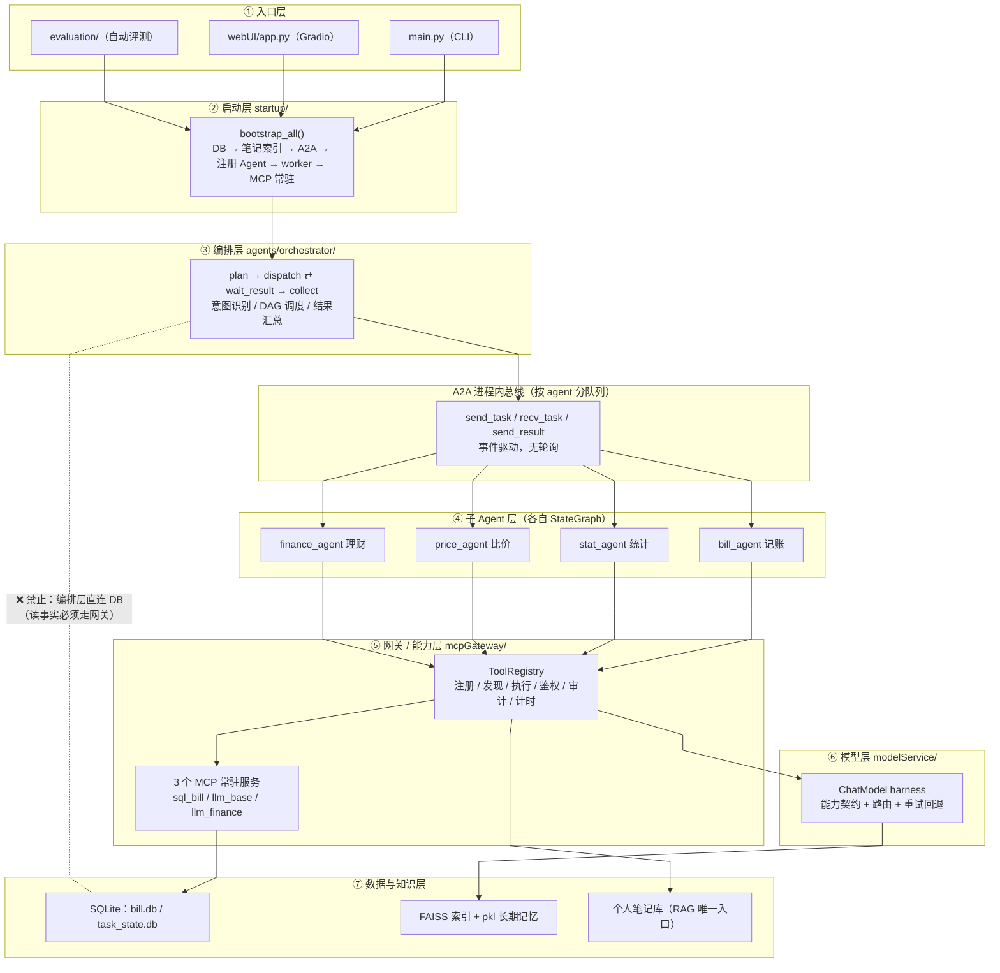
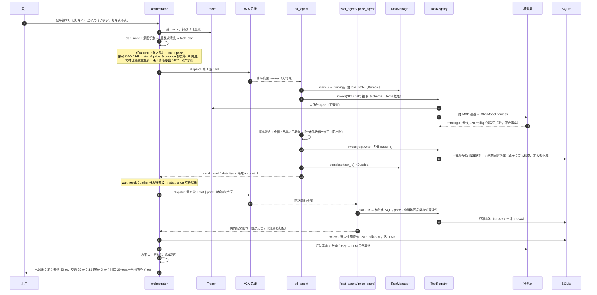
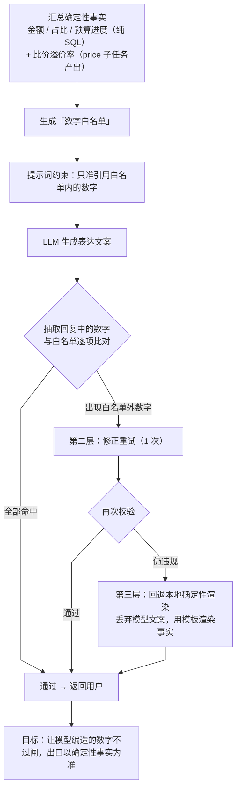
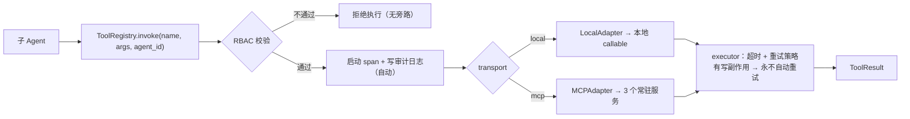
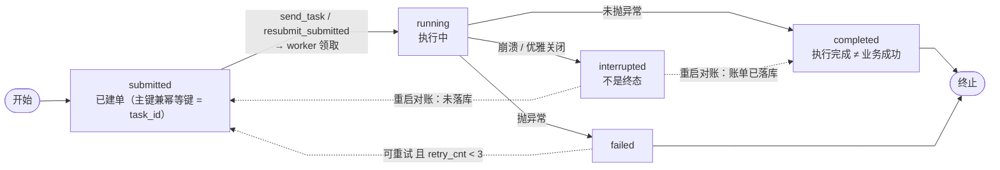
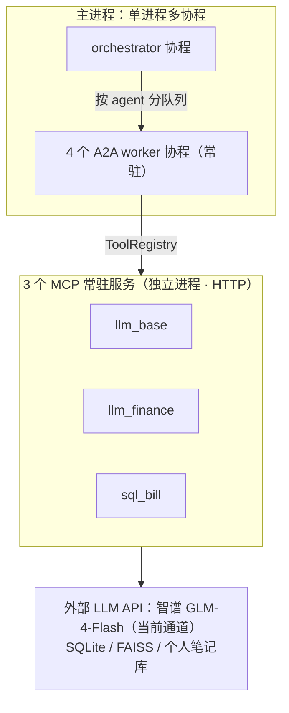

# 消费管家智能体（billAgent）· 消费决策与复盘助手

**多 Agent 协作 · 花前决策（预算进度 / 同类比价）+ 花后复盘（消费评估 / 省钱建议）· 回复中的数字均由确定性计算产出 · 单机可运行**

## 问题：记账工具在两个关键时刻失灵

现有记账工具以流水式记录为主，于是在最需要它的两个时刻都用不上：

- **花钱之前**——给不出依据：这个月还剩多少预算？这笔花完会不会超支？这笔消费在同类里算贵还是便宜？而这些恰恰是"要不要花这笔钱"最需要的参考。
- **花完之后**——只给一堆数字，不做评估：钱主要花在哪、哪些项其实可以省、跟上个月比是变好了还是变差了？这些"复盘"该有的结论，得自己算。

## 方案：多 Agent 编排 + 确定性数值计算

把自然语言拆解为可执行任务，交由多个 Agent 分工完成，**所有数值由确定性计算产出**：

| 环节 | 做法 |
|---|---|
| **编排** | 用 LangGraph 做编排器 + 4 个子 Agent（记账 / 统计 / 比价 / 理财）：先判断这句话要做什么，再按依赖关系派给对应 Agent，最后汇总结果 |
| **工具接入** | 自建工具接入层，本地函数与 MCP 服务走同一个入口：权限校验、参数检查、日志、超时都统一在这一层处理 |
| **数值计算** | 金额、汇总、占比、预算进度、比价溢价率全部由 **SQL 与数值计算**产出，模型只负责理解意图和组织语言 |
| **防幻觉** | 回复发出前，把里面的每个数字与 SQL 算出的结果逐个核对；对不上就让模型重写一次，还不行就改用模板输出 |
| **模型通道** | 走外部大模型（OpenAI 兼容协议，当前用智谱 GLM-4-Flash）；本地小模型通道已弃用，代码保留用于回滚 |

## 产品：一个能直接用的记账助手

**记一句话，完成记账、查预算、同类比价、消费评估与省钱建议**：

```
记午饭56元
这个月还剩多少预算
打车 20 元贵不贵
给我点省钱建议
```

约 2.2 万行 Python，另有 1.6 万行测试；单机运行，提供 Web（Gradio）与 CLI 两个入口。下面是它的实际形态、能做的事，以及 30 秒跑起来的方法。想了解实现，直接从[架构](#6-架构给想深挖的人)看起。

---

## 目录

- [1. 它长什么样](#1-它长什么样)
- [2. 它能干什么](#2-它能干什么)
- [3. 30 秒跑起来](#3-30-秒跑起来)
- [4. 常用指令一览](#4-常用指令一览)
- [5. 这些数字是怎么来的](#5-这些数字是怎么来的)
- [6. 架构（给想深挖的人）](#6-架构给想深挖的人)
- [7. 五个核心设计](#7-五个核心设计)
- [8. 实测数据](#8-实测数据)
- [9. 目录结构](#9-目录结构)
- [10. 测试与评测](#10-测试与评测)
- [11. 技术栈](#11-技术栈)
- [12. 已知边界与后续方向](#12-已知边界与后续方向)

---

## 1. 它长什么样

### Web 界面（Gradio，浏览器打开即用）

```
┌────────────────────────────────────────────────────────────────┐
│  消费管家智能体                                    [ 退出系统 ]  │
├────────────────────────────────────────────────────────────────┤
│  ▸ 预算与偏好设置                              （点击展开）     │
├────────────────────────────────────────────────────────────────┤
│                                                                │
│  你  │ 记午饭56元                                               │
│      │                                                         │
│  AI  │ 记账成功 ✅ 已记「餐饮 · 午饭」56 元                     │
│      │ 本月餐饮累计 X 元（月预算 Y 元的 Z%）                    │
│      │ 额度档位：正常                                           │
│      │                                                         │
│  你  │ 这个月花了多少                                           │
│      │                                                         │
│  AI  │ 本月累计 X 元，共 N 笔                                   │
│      │ 餐饮 X 元（Z%）· 交通 X 元（Z%）· 购物 X 元（Z%）        │
│      │ 环比上月 +A%                                             │
│      │                                                         │
│  你  │ 打车20元贵不贵                                           │
│      │                                                         │
│  AI  │ 交通 · 打车 20 元：本地同类均价 X 元，溢价 Z%            │
│      │ 结论：略高于本地水平                                     │
│                                                                │
├────────────────────────────────────────────────────────────────┤
│ [ 想记一笔？直接输入，如：记午饭56元（Enter 发送）        ]      │
│                              [ 发送 ] [ 新会话 ]                │
└────────────────────────────────────────────────────────────────┘
```

界面由三块组成：**顶栏**、**预算与偏好设置**（折叠面板，表单直写配置，不经过大模型）、**对话区**。
设置面板里可设：所在城市、月度总预算、消费模式（节俭 / 正常 / 宽松）、分品类预算（餐饮 / 交通 / 住宿 / 购物 / 娱乐）、提醒偏好——保存后即刻生效，后续记账与预警都按新配置计算。

### 命令行（`python main.py`）

同一个后端，两种入口，随时切换：

```
===== 消费管家智能体启动完成，输入exit退出对话 =====
用户：记午饭56元
智能体：记账成功 ✅ 已记「餐饮 · 午饭」56 元，本月餐饮累计 X 元

用户：exit
程序退出
```

> 上面 `X` / `Y` / `Z` / `A` / `N` 为运行时真实数字，此处仅示意格式。

---

## 2. 它能干什么

**覆盖消费的完整闭环：花前有决策依据、花后有评估复盘；记账是入口，不是终点。** 下面按「花之前 / 花之后 / 基础与配置」三类拆开：

### A. 花这笔钱之前 —— 决策依据

| 能力 | 你怎么说 | 它做什么 |
|---|---|---|
| **预算进度** | `这个月还剩多少预算` | 结合本月已消费额与月预算，给出剩余额度与档位（安全 / 关注 / 预警 / 超支） |
| **比价** | `打车20元贵不贵` / `咖啡30元比市场价高吗` | 与所在城市同类均价对比，给出溢价率（**要带上金额**才构成可比对象） |

### B. 花完之后 —— 评估、复盘与建议（这是更厚的一块）

| 能力 | 你怎么说 | 它做什么 |
|---|---|---|
| **消费评估与理财建议** | `给我点省钱建议` | 综合消费结构、近 3 月习惯与个人笔记，给出**可执行的省钱项**（不是泛泛的"少花钱"） |
| **统计复盘** | `这个月花了多少` / `查7月开销` | 月度 / 分类汇总、占比、同比环比 —— 看清楚钱花在哪、跟上月比变好还是变差 |
| **超支预警** | 无需发问，规则主动触发 | 某品类接近或超出预算 → 提醒；月度总预算按**四档**（安全 / 关注 / 预警 / 超支）→ 提醒 |

### C. 基础能力与配置

| 能力 | 你怎么说 | 它做什么 |
|---|---|---|
| **记账** | `记午饭56元` / `昨天打车花了32` | 自动提取金额、品类、日期并落库，顺带沉淀消费习惯 |
| **改账 / 删账** | `把刚才那笔改成60` / `删掉刚才那笔` | 靠上下文指代定位到那一条，改完重新计算当月统计 |
| **预算与笔记** | `设置月预算3000` / `记下：我们那香蕉8块一斤` | 配置即时生效；笔记进入个人知识库，理财分析时作为参考 |

**一次说多件事，它会自己拆开处理：**

```
你 > 记午饭30，记打车20，这个月花了多少，打车贵不贵

消费管家 > 记账成功 ✅
            1. 餐饮 30 元（09-19）
            2. 交通 20 元（09-19）
            本月累计 X 元（含这两笔，月预算 Y 元的 Z%）
            交通 · 打车 20 元：本地均价 X 元，溢价 Z%
```

一句包含三个意图：系统识别为「记账（**2 笔**）+ 统计 + 比价」。**先落账，统计与比价再并行** —— 两者都依赖记账完成（统计要把这两笔算进去；比价要用"打车 20 元"作为可比对象）。

**一句话多笔账会被逐笔落库**：`bill` 只派发**一次**，内部按 `items` 逐笔抽取与校验，最后用**单条多值 INSERT** 一次写入 —— 要么两笔都成、要么都不成，不会"记一笔漏一笔"。

**超支会主动提醒**，规则触发、不靠模型判断：某品类接近或超出预算 → 提醒；月度总预算按四档（安全 / 关注 / 预警 / 超支）→ 提醒。（至于"这一笔贵不贵"，由**比价**负责，见上表。）

---

## 3. 30 秒跑起来

### 环境

- Python **3.10+**（本项目开发于 3.10.11）
- **当前默认形态**：任一 OpenAI 兼容 API——项目已用**智谱 GLM-4-Flash** 调通（推荐，配置见下）
- 本地小模型通道（Ollama + `qwen-bill-1.5-1.8b-q4km`）**已弃用**：代码与 Provider 保留用于回滚，默认不启用

### 安装

```powershell
git clone https://github.com/ChenXB-168/billAgent.git
cd billAgent

# 方式一：一键脚本（建 venv + 装依赖 + 检查本地模型）
install_cpu.bat

# 方式二：手动
python -m venv venv
.\venv\Scripts\pip install -r requirements.txt
```

> torch 为 CPU 版，建议按 [PyTorch 官方 CPU 源](https://pytorch.org/get-started/locally/) 单独安装。
> `gradio==4.44.1` / `huggingface-hub==0.20.3` / `fastapi==0.115.6` 是配套锁定组合，不建议单独升级。

### 启动

```powershell
# Web 界面：浏览器自动打开 http://127.0.0.1:7860
start_webui.bat

# 或命令行对话（输入 exit 退出）
.\venv\Scripts\python.exe main.py
```

启动会依次完成：数据库连通校验 → 加载个人笔记索引 → 拉起 3 个 MCP 常驻服务（端口 8001/8002/8003）并健康检查 → 清理残留任务 → 崩溃恢复 → 注册 Agent 与 worker。终端出现「全部底层初始化完毕，可以启动聊天交互」即可对话。

然后直接输入第一句话：

```
记午饭56元
```

### 配置外部大模型（当前落地形态，已用智谱 GLM-4-Flash 调通）

系统**默认就走外部大模型**，原因与设计意图见顶部。以下 5 个变量与本机当前生效配置一致（OpenAI 兼容协议）：

```powershell
$env:BILLAGENT_EXT_LLM_BASE_URL="https://open.bigmodel.cn/api/paas/v4"
$env:BILLAGENT_EXT_LLM_API_KEY="你的API密钥"
$env:BILLAGENT_EXT_ORCH_MODEL="glm-4-flash"
$env:BILLAGENT_EXT_FINANCE_MODEL="glm-4-flash"
$env:BILLAGENT_FORCE_EXTERNAL="1"     # 全部 Agent 走外部；不设则仅编排 Agent 走外部，其余回退本地
```

**必须配置外部 API**：本项目已**彻底弃用本地小模型通道**（`BILLAGENT_DISABLE_LOCAL_LLM` 默认 `1`），
未配 API 时 `ModelRouter.resolve` 会**直接抛 `RuntimeError`**（快速失败、不静默降级）。
如需临时恢复本地兜底（回滚）：设 `BILLAGENT_DISABLE_LOCAL_LLM=0`（代码与 Provider 均保留）。

也可把上面变量写进项目根 `.env`（已集成 `load_dotenv()`）；注意 `.env` 优先级低于已存在的环境变量，二者择一。`.env` 含密钥，**切勿提交**。

| 开关 | 作用 |
|---|---|
| `BILLAGENT_FORCE_EXTERNAL=1` | 兜底开关（默认**已全 Agent 走外部**，见 `BILLAGENT_EXT_AGENTS`） |
| `BILLAGENT_DISABLE_LOCAL_LLM=0` | **回滚开关**：恢复本地兜底（默认 `1` —— 本地通道已封死，走到即报错） |
| `BILLAGENT_EXT_TIMEOUT` | 外部调用超时秒数（默认 **60**；超时链 工具 60 < 任务 120 < 编排器 150） |
| `BILLAGENT_MCP_STDIO=1` | 回滚开关：MCP 退回 stdio 短连接模式 |

> 选型提示：优先选**非推理模型**（如 `glm-4-flash`）。推理模型的 `thinking` 会吃满 `max_tokens` 预算导致「返回 200 但正文为空」；若必须用推理模型，请调大 `config/config.py` 中 `EXTERNAL_BASE_LLM_OPTIONS.max_tokens`。

---

## 4. 常用指令一览

| 想做什么 | 直接说 |
|---|---|
| 记账 | `记午饭56元` / `昨天买菜花了88` |
| 改账 | `把刚才那笔改成60` |
| 删账 | `删掉刚才那笔` |
| 查统计 | `这个月花了多少` / `查7月开销` / `餐饮花了多少` |
| 比价 | `打车20元贵不贵` / `咖啡30元比市场价高吗`（**要带上金额**，否则没有可比对象） |
| 理财建议 | `给我点省钱建议` |
| 设预算 | `设置月预算3000` |
| 记笔记 | `记下：我们那香蕉8块一斤` |
| 管笔记 | `删掉XX那条笔记` / `列一下我的笔记` |

信息不全时它会**追问，最多 3 轮**；仍不满足则明确告知失败，不会瞎猜硬记。

---

## 5. 这些数字是怎么来的

记账类应用最怕一件事：**账是错的**。让大模型直接"算账并回答"，它会一本正经地给出不存在的数字。

所以这里做了明确分工：

| 环节 | 谁来做 | 说明 |
|---|---|---|
| 金额、汇总、占比、预算进度、比价溢价率 | **SQL 与数值计算** | 事实唯一来源，结果确定可复算（比价溢价率由 `price` 子 Agent 算好再交汇总层引用） |
| 意图识别、从句子里提取金额/品类、组织语言 | **大模型** | 只做"理解和表达" |
| 回复发出前的最后一道检查 | **数字白名单** | 回复中出现的每个数字都要与白名单比对，越界就修正重试，仍不行则回退本地渲染 |

一句话概括：**模型负责把话说好听，数字不归它管**。防幻觉靠的是分工与核对，而不是赌模型的大小 —— 这也是这个项目一开始敢尝试本地小模型的原因；后来在意图识别这类结构化环节换成了外部模型（见 §6），出口的数字核对仍然保留。

---

## 6. 架构（给想深挖的人）

### 设计动机

三条初始约束，加上落地后**被现实修正的一条**：

| 约束 | 挤出的设计 |
|---|---|
| 数字不能错 | 事实层（SQL/数值）与表达层（LLM）**物理分离**，中间用白名单闸门 |
| 本地小模型能力有限 | 大任务拆小、专业分工（1 编排 + 4 子 Agent）、确定性计算兜底 |
| 不能依赖外部服务（**最初约束，后被现实推翻**） | 最早想全本地零依赖：Ollama 加载 1.8B 底座（`qwen-bill-1.5-1.8b-q4km`）；**微调路线只做过评估，未落地实施** |
| 意图识别等结构化输出小模型撑不住（**落地修正**） | 1.8B 底座在意图拆解与结构化输出上不稳定、难调试（耗时与失败案例记录在 `config/config.py` 注释）；因此**改为以外部大模型 API（智谱 GLM-4-Flash，OpenAI 兼容）为主通道**，本地通道已弃用（代码保留、可回滚） |

> 演化痕迹：`FORCE_EXTERNAL` 与 `DISABLE_LOCAL_LLM`（后者**默认已开启**，即本地通道默认封死）两个开关，就是这段从「本地为主」到「外部为主」演进留下的可回滚开关。

### 总览：七层 + 一条铁律

**只能向下调用，出口唯一。**


```mermaid
%%{init: {"theme": "default", "flowchart": {"curve": "linear"}}}%%
flowchart TB
    subgraph L1["① 入口层"]
        CLI["main.py（CLI）"]
        WEB["webUI/app.py（Gradio）"]
        EVAL["evaluation/（自动评测）"]
    end

    subgraph L2["② 启动层 startup/"]
        BOOT["bootstrap_all()<br/>DB → 笔记索引 → A2A → 注册 Agent → worker → MCP 常驻"]
    end

    subgraph L3["③ 编排层 agents/orchestrator/"]
        ORCH["plan → dispatch ⇄ wait_result → collect<br/>意图识别 / DAG 调度 / 结果汇总"]
    end

    subgraph LB["A2A 进程内总线（按 agent 分队列）"]
        BUS["send_task / recv_task / send_result<br/>事件驱动，无轮询"]
    end

    subgraph L4["④ 子 Agent 层（各自 StateGraph）"]
        A1["bill_agent 记账"]
        A2["stat_agent 统计"]
        A3["price_agent 比价"]
        A4["finance_agent 理财"]
    end

    subgraph L5["⑤ 网关 / 能力层 mcpGateway/"]
        REG["ToolRegistry<br/>注册 / 发现 / 执行 / 鉴权 / 审计 / 计时"]
        SRV["3 个 MCP 常驻服务<br/>sql_bill / llm_base / llm_finance"]
    end

    subgraph L6["⑥ 模型层 modelService/"]
        CM["ChatModel harness<br/>能力契约 + 路由 + 重试回退"]
    end

    subgraph L7["⑦ 数据与知识层"]
        DB["SQLite：bill.db / task_state.db"]
        IDX["FAISS 索引 + pkl 长期记忆"]
        DOC["个人笔记库（RAG 唯一入口）"]
    end

    CLI --> BOOT
    WEB --> BOOT
    EVAL --> BOOT
    BOOT --> ORCH
    ORCH --> BUS
    BUS --> A1
    BUS --> A2
    BUS --> A3
    BUS --> A4
    A1 --> REG
    A2 --> REG
    A3 --> REG
    A4 --> REG
    REG --> SRV
    REG --> CM
    SRV --> DB
    CM --> IDX
    REG --> DOC
    ORCH -.-|"❌ 禁止：编排层直连 DB（读事实必须走网关）"| DB
```

为什么是「1 编排 + 4 子 Agent」而不是一个超级 Agent：提示词越大、意图边界越模糊，模型越容易漏任务或脑补任务；而每个意图一个 Agent 又会让通信拓扑随数量膨胀。1+4 换来的是**职责内聚、失败隔离、可单独替换与测试**。

**颗粒度分工（一条容易踩错的设计线）**：编排层按**任务类型**规划，**每种类型至多一条**；"一次多笔记账""多个时间窗统计"这类**同一领域内的多次操作**，由**子 Agent 内部**承接。

| 层 | 颗粒度 | 例子 |
|---|---|---|
| 编排层 | **任务类型**（bill / stat / price / finance，各至多一条） | "记午饭30，记打车20" → 派发**一条** `bill` |
| 子 Agent | **领域内的原子操作** | `bill` 内按 `items` **逐笔**落库；`stat` 内按 `groups[]` **逐组**查询 |

这样做的收益：**编排层不必为"多次"展开成多个任务** —— `task_plan` 保持"按类型索引的 dict"，`dispatch` / `wait_result` / 依赖图 / 环检测全部无需改动，而表达力完整保留。

**唯一例外是 `finance`**：它产出的是"综合分析"结论，多条无意义，故硬约束**同轮至多一条**；同时它会**汇总全部上游产出**（`bill` / `stat` / `price` 的结果）再给建议 —— 它是"汇总者"，不是"执行者"。

> 依此规则，`price` 与 `finance` **不互斥**（"吃火锅花了80，贵不贵"既要比价也要合理性分析，两者互补）；而无明确记账指令的消费陈述（"奶茶15块"）**只补比价、绝不记账**。

### 一次请求的完整旅程

以「**记午饭30，记打车20，这个月花了多少，打车贵不贵**」为例 —— 一句话同时含
**两笔记账 + 统计 + 比价**，是当前能力的"满汉全席"场景（注意：比价的"打车"带金额 20，比价才有对象）：


```mermaid
sequenceDiagram
    autonumber
    participant U as 用户
    participant O as orchestrator
    participant T as Tracer
    participant Q as A2A 总线
    participant B as bill_agent
    participant S as "stat_agent / price_agent"
    participant TM as TaskManager
    participant R as ToolRegistry
    participant M as 模型层
    participant D as SQLite

    U->>O: 「记午饭30，记打车20，这个月花了多少，打车贵不贵」
    O->>T: 建 run_id，打点（可观测）
    O->>O: plan_node：意图识别 → 启发式清洗 → task_plan
    Note over O: 任务 = bill（含 2 笔）+ stat + price<br/>依赖 DAG：bill → stat ∥ price（stat/price 都要等 bill 完成）<br/>每种任务类型至多一条：多笔账由 bill **一次**承接
    O->>Q: dispatch 第 1 波：bill
    Q-->>B: 事件唤醒 worker（无轮询）
    B->>TM: claim() → running，落 task_state（Durable）
    B->>R: invoke("llm.chat") 抽取（schema = items 数组）
    R->>T: 自动包 span（可观测）
    R->>M: 经 MCP 通道 → ChatModel harness
    M-->>R: items=[{30,餐饮},{20,交通}]（模型只提取，不产事实）
    B->>B: 逐笔兜底：金额 / 品类 / 日期各自按**本笔片段**修正（防串账）
    B->>R: invoke("sql.write", 多值 INSERT)
    R->>D: **单条多值 INSERT** → 两笔同时落库（原子：要么都成、要么都不成）
    B->>TM: complete(task_id)（Durable）
    B-->>O: send_result：data.items 两笔 + count=2
    Note over O: wait_result：gather 并发等整波 → stat / price 依赖就绪
    O->>Q: dispatch 第 2 波：stat ∥ price（本波内并行）
    Q-->>S: 两路同时唤醒
    S->>R: stat：IR → 参数化 SQL；price：查当地同品类均价算溢价
    R->>D: 只读查询（RBAC + 审计 + span）
    S-->>O: 两路结果回传（乱序无害，按任务名归位）
    O->>D: collect：确定性预警链 L2/L3（纯 SQL，零 LLM）
    O->>M: 汇总事实 + 数字白名单 → LLM 只做表达
    O->>O: 方案 C 三层校验（防幻觉）
    O-->>U: 「已记账 2 笔：餐饮 30 元、交通 20 元；本月累计 X 元；打车 20 元高于当地均价 Y 元」
```

**两个容易看漏的点**：

1. **多笔账只派发一次 `bill`**：拆分责任在**子 Agent 内部** —— `bill` 按 `items` 逐笔抽取与兜底，最后用**单条多值 INSERT** 一次落库（原子）。编排层不需要为"多笔"展开成多个任务。
2. **比价必须先有金额**：`price` 依赖 `bill`（同一句里的"记打车20"就是它的比价对象）。若只说"打车贵不贵"而没有金额，价格任务拿不到可比的消费额 —— 所以这句话里**一定要带上金额**才构成有效比价。

---

## 7. 五个核心设计

### 7.1 防幻觉：数字幻觉的三层防护


```mermaid
%%{init: {"theme": "default", "flowchart": {"curve": "linear"}}}%%
flowchart TB
    START["汇总确定性事实<br/>金额 / 占比 / 预算进度（纯 SQL）<br/>+ 比价溢价率（price 子任务产出）"]
    START --> WL["生成「数字白名单」"]
    WL --> P["提示词约束：只准引用白名单内的数字"]
    P --> LLM["LLM 生成表达文案"]
    LLM --> CHK{"抽取回复中的数字<br/>与白名单逐项比对"}
    CHK -->|全部命中| PASS["通过 → 返回用户"]
    CHK -->|出现白名单外数字| L2["第二层：修正重试（1 次）"]
    L2 --> CHK2{"再次校验"}
    CHK2 -->|通过| PASS
    CHK2 -->|仍违规| L3["第三层：回退本地确定性渲染<br/>丢弃模型文案，用模板渲染事实"]
    L3 --> PASS
    PASS --> NOTE["目标：让模型编造的数字不过闸，出口以确定性事实为准"]
```

边界也清楚：个人笔记里的数字（如「我们那香蕉8块一斤」）是**用户陈述而非系统事实**，不进白名单，引用时标注来源；与事实冲突时以事实为准并说明。

> 白名单是**降低**幻觉概率的闸门，不是零漏检的保证：当前对**单个汉字**表示的金额（如"花了三块"）不做越界判定（`utils/number_whitelist.py` 取"误报代价高于漏检"的取舍），这类表述靠回退渲染兜底。

### 7.2 工具平台：唯一出口自动附加横切能力


```mermaid
%%{init: {"theme": "default", "flowchart": {"curve": "linear"}}}%%
flowchart LR
    AG["子 Agent"] --> INV["ToolRegistry.invoke(name, args, agent_id)"]
    INV --> RBAC{"RBAC 校验"}
    RBAC -->|不通过| DENY["拒绝执行（无旁路）"]
    RBAC -->|通过| SPAN["启动 span + 写审计日志（自动）"]
    SPAN --> ROUTE{"transport"}
    ROUTE -->|local| LA["LocalAdapter → 本地 callable"]
    ROUTE -->|mcp| MA["MCPAdapter → 3 个常驻服务"]
    LA --> EX["executor：超时 + 重试策略<br/>有写副作用 → 永不自动重试"]
    MA --> EX
    EX --> RES["ToolResult"]
```

工具被建模成**可管理资产**而非散落的调用点：一次声明元数据，**鉴权 / 审计 / 计时**由引擎层自动附加，调用点无需重复实现。编排器只声明只读权限、不持有任何写权限工具——写操作只可能发生在有职责的子 Agent 里。

> **边界（须知）**：这套权限是**代码内的逻辑层校验**（`ToolSpec.required_perm`），**不是 OS 级强制隔离** —— 同进程内的代码若绕过 `invoke` 直连数据库，是拦不住的。要机制层强制需拆进程 + 落库账号受限，代价是引入 IPC 与状态序列化开销，当前规模下未做。

### 7.3 Durable：任务不丢、重投不重


```mermaid
%%{init: {"theme": "default", "flowchart": {"curve": "linear"}}}%%
flowchart LR
    START(["开始"]) --> S["submitted<br/>已建单（主键兼幂等键 = task_id）"]
    S -->|"send_task / resubmit_submitted<br/>→ worker 领取"| R["running<br/>执行中"]
    R -->|"未抛异常"| C["completed<br/>执行完成 ≠ 业务成功"]
    R -->|"抛异常"| F["failed"]
    R -->|"崩溃 / 优雅关闭"| I["interrupted<br/>不是终态"]
    I -.->|"重启对账：账单已落库"| C
    I -.->|"重启对账：未落库"| S
    F -.->|"可重试 且 retry_cnt < 3"| S
    C --> END(["终止"])
    F --> END
```

`interrupted` 不是终态：启动时按 `task_id` 对账后分流。这就是「崩了不丢账、重投不重复记账」的全部秘密。

> **怎么读这张图**（实线 = 正常流转，虚线 = 崩溃/关闭后的恢复路径）：
> 1. `submitted` 是**数据库状态**，而 worker 只认**内存队列**——中间必须经 `resubmit_submitted()` 重投，这一步原状态图容易漏（`startup/task_manager.py:323`）。
> 2. `completed` 的判据是「worker 未抛异常」，**不是**业务成功；正常的业务拒绝（如收入不入账）也算 `completed`，成败由 `result` 字段承载（`task_manager.py:23-25`）。
> 3. 对账只针对**有副作用**的 `bill_agent`（`SIDE_EFFECT_AGENTS`，`:41`）：查 `bill` 表有无该 `task_id` —— 有 → 标 `completed`（**不是 failed**），无 → 回 `submitted` 等重投（`:282-288`）。
> 4. 崩溃在「账单已写、状态未改」这一瞬间也不会重复记账：重启对账发现 `bill` 表已有记录即判完成。

### 7.4 可观测：run_id + span 树

一次请求一个 `run_id`；工具调用经 Registry 自动包 span、LLM 调用经 harness 自动埋点，**业务代码不写一行打点**。落库到 `trace_span`（链路）与 `llm_call_stat`（token / 耗时 / 成败 / 按 Agent 归因），可用 `utils/trace_view.py` 直接看 span 树。

> 踩过的坑：早期零可观测开发，参数语义不兼容、死代码、重试不分层等问题长期未暴露。结论是**可观测属于前置需求**，兜底路径都应有告警与计数。
> **已知未覆盖**：启动重投路径暂未消费 `send_task` 的返回值，队列恰好满时该条任务会保留在 `submitted` 等下次重启重投（不丢，但无即时告警）—— 列为待补项。

### 7.5 执行模型：协程 + 事件驱动 + 批量派发


```mermaid
%%{init: {"theme": "default", "flowchart": {"curve": "linear"}}}%%
flowchart TB
    subgraph MAIN["主进程：单进程多协程"]
        ORCH2["orchestrator 协程"]
        WK["4 个 A2A worker 协程（常驻）"]
    end
    subgraph MCP["3 个 MCP 常驻服务（独立进程 · HTTP）"]
        M1["llm_base"]
        M2["llm_finance"]
        M3["sql_bill"]
    end
    EXT["外部 LLM API：智谱 GLM-4-Flash（当前通道）<br/>SQLite / FAISS / 个人笔记库"]

    ORCH2 -->|按 agent 分队列| WK
    WK -->|ToolRegistry| MCP
    MCP --> EXT
```

三个改造有先后关系：总线从轮询改事件驱动 → MCP 从 stdio 短连接改常驻 HTTP 并拆掉全局锁 → 派发从"一次一个"改"整波批量 + 并发收集"。
**之所以按这个顺序**：并行派发的收益依赖前两步 —— 若 MCP 仍是按需冷启动、总线仍在轮询，多任务并发反而会放大冷启动与空转开销（这是设计推演得出的判断，实测数据见 §8）。

---

## 8. 改造效果（同环境对照）

同环境 A/B 实测：

| 项 | 改造前 | 改造后 | 效果 |
|---|---|---|---|
| A2A 投递延迟 | 轮询式，受轮询周期支配（数十毫秒级） | 事件驱动唤醒 | 降至**亚毫秒级** |
| 空闲唤醒 | 周期性轮询 | 无消息即挂起 | 空转归零 |
| MCP 调用 | stdio 每次冷启动需数十秒 | 常驻 HTTP，仅首次就绪 | 端到端耗时明显下降 |
| 并发读写 / 跨进程 | 读写互斥，易 `database is locked` | WAL + `busy_timeout=5000` | 读不阻塞写，跨进程并发写入未再出现锁错误 |
| 多任务调度 | 一次一个，延迟 = ΣT | 整波批量，延迟 = max(T) | 多任务场景下调度耗时显著下降（结果逐字一致） |
| 崩溃恢复 | 可能丢账 / 重复记账 | 状态机 + `task_id` 幂等 | 异常终止后重启可对账恢复，重复投递不重复记账 |

> **口径说明**：上表为改造前后**同环境对照**，数据来自本机观测；延迟类指标由 `bench/bench_a2a_latency.py` 采样（分位统计），其余为端到端耗时对比。
> **本项为单机单用户的个人项目，样本规模有限，数字仅用于横向对照，不作为生产环境性能主张。**
> 复现：`.\venv\Scripts\python.exe bench\bench_a2a_latency.py`（结果落盘 `bench/bench_result.txt`）。

---

## 9. 目录结构

```
agents/         5 个 Agent：orchestrator 编排 + bill/stat/price/finance 子 Agent
                （每个 Agent 内含 state.py / nodes.py / prompts/）
agentCore/      Agent 公共底层能力：结构化输出解析（parsers/json_parser.py），被 5 个 Agent 共用
mcpGateway/     工具平台：tool_model / registry / executor / adapters（协议适配层）
                + 3 个 MCP 常驻服务 + A2A 消息总线 + RBAC + sandbox 沙箱
coreModules/    跨 Agent 复用的核心算法（price_compare.py：溢价率口径，
                被 price_agent 与 orchestrator 预警链共用，避免两处各自维护导致口径漂移）
modelService/   模型接入层：ChatModel 抽象 + Router + Provider（本地 / OpenAI 兼容）
                附本地 embedding 模型（bge-small-zh / bge-reranker）
database/       SQLite：bill.db（业务事实）+ task_state.db（任务状态机）
startup/        bootstrap（启动编排）+ task_manager（Durable 状态机）+ chat_loop
memory/         短期会话记忆 + 长期向量记忆（FAISS）+ 个人笔记库（RAG 唯一入口）
utils/          横切工具：tracer / trace_view（可观测）+ number_whitelist（防幻觉）
                + contract_check（契约自检）+ retry_utils + Dockerfile / docker_compose
webUI/          Gradio 界面
evaluation/     检索评测、回答质量评测脚本
tests/          unit / integration / e2e 三层测试
eval_reports/   评测基线存档
bench/          性能基准脚本（A2A 投递延迟 A/B 对照，输出 P50/P95/P99）
config/         集中配置（端口 / 超时 / 模型参数 / 权限映射）
```

---

## 10. 测试与评测

```powershell
# 单元测试：零外部依赖（不连模型、不连 MCP 服务）
.\venv\Scripts\python.exe -m pytest tests/unit -q

# 集成测试：需先启动系统（3 个 MCP 常驻服务在跑）
.\venv\Scripts\python.exe -m pytest tests/integration -q

# 端到端：需 MCP 常驻 + worker + 模型就绪
.\venv\Scripts\python.exe -m pytest tests/e2e -v

# 检索评测 / 回答质量评测
.\venv\Scripts\python.exe evaluation\user_docs_recall_eval.py
.\venv\Scripts\python.exe evaluation\agent_answer_eval.py
```

| 层级 | 规模 | 当前结果 | 前置条件 |
|---|---|---|---|
| **单元** | **33 个文件** | **566 passed / ~53s**；业务代码语句覆盖率 **78%** | 无 |
| **集成** | **4 个文件** | 依赖服务 | 需先启动系统；服务未起时会报 `ConnectError`（连接失败，非功能缺陷） |
| **e2e** | **9 个文件** | 依赖模型 | 需 MCP 常驻 + worker + 本地或外部模型 |
| **检索评测** | 自建 **13 条**查询（样本小，仅作回归基线） | hit@1 61.54% / hit@3 100% / recall@5 92.86% | 需 embedding 模型 |
| **回答质量** | 自建 **12 条**用例 | 本地渲染 12/12、外部模型 12/12 | 需模型，耗时较长 |

检索基线存档见 `eval_reports/l2_baseline_userdocs_20260904.txt`。

单元测试中含 `test_contract_check.py`：**文档↔代码漂移检测**——设计文档里写的符号必须在代码中存在、
行号引用不得越界、签名参数不得漂移，不一致即 FAIL（守的是"文档不过期"，**不是权限防线**）。

> **崩溃恢复的强杀取证脚本**：`tests/manual/crash_recovery_probe.py`。它会**真实 SIGKILL 进程**，
> 若被自动回归收集会杀掉自己的子进程、破坏测试环境 —— 故置于 `tests/manual/` 且**刻意命名为
> `*_probe.py`**（不匹配 pytest 的 `test_*.py` / `*_test.py` 收集规则），仅在人工取证时手动执行：
> `python tests\manual\crash_recovery_probe.py`（覆盖三个中间态，含"账单已写、状态未更新"这一关键态）。

---

## 11. 技术栈

| 领域 | 选型 | 说明 |
|---|---|---|
| 编排 | LangGraph | 每个 Agent 一个 StateGraph，编排器 plan / dispatch / wait / collect 四节点 |
| 工具协议 | MCP（FastMCP） | 3 个常驻服务，Streamable HTTP；保留 stdio 回滚开关 |
| 模型接入 | 自研 ChatModel harness | 能力契约 + 路由 + 参数归一 + 结构化错误；当前走外部 OpenAI 兼容（智谱 GLM-4-Flash），本地通道保留但默认弃用 |
| 存储 | SQLite ×2 + FAISS | WAL 并发；长期记忆向量索引 + pkl 原文 |
| 检索 | BM25 + 向量（bge） | 向量不可用时自动降级 BM25，不崩 |
| 界面 | Gradio | 端口 7860，单实例保护 |
| 可观测 | 自研 Tracer | run_id / span 树 / 按 Agent 归因，落 `trace_span` + `llm_call_stat` |

几个值得单独说的取舍：

- **子 Agent 用协程不用进程**：主进程不做重计算（推理在外部 API），协程足以覆盖 IO 等待；进程化反而带来 IPC、状态序列化与数倍内存开销。
- **参数绝不跨通道转译**：本地 `num_predict`（软约束）≠ 外部 `max_tokens`（硬上限且含 reasoning 消耗），同义归一、**异义过滤并告警**——曾因直接透传导致推理模型正文为空、连续重试烧 token。
- **重试先分类**：可重试（格式错 / 5xx / 429 / 空响应）走统一预算池；不可重试（401 / 400 / 鉴权失败）立即短路；有写副作用的工具**永不自动重试**（防重复记账）。

---

## 12. 已知边界与后续方向

诚实地列当前限制：

- **单机单用户**：面向个人使用，无用户体系与服务端，数据在本地文件系统。
- **会话态在进程内存**：多轮草稿与追问计数随进程存在，重启即丢；跨进程方案（如 Redis + TTL）是明确的演进方向。
- **意图识别等重活依赖外部模型**：落地测试表明 1.8B 小模型在意图拆解 / 结构化输出上不稳且难调试（依据见 §6），故编排与全部 Agent 均走外部 API（智谱 GLM-4-Flash）；**本地通道默认已封死**，需要时可用开关回滚，但效果会明显回退。
- **集成 / e2e 测试已实现一键自举**：`tests/conftest.py` 的 session 级 fixture 会按 `mcpGateway.client.SERVER_CMD_MAP`（单一来源）自动拉起**全部 3 个** MCP 常驻服务，路径由 `BASE_DIR` 解析，可跨机器 / CI / WSL 运行。直接 `pytest tests/integration` 或 `pytest tests/e2e` 即可；也可跑根目录 `run_all_tests.bat` 一次覆盖 L1 → L3。**唯一外部前置**：L3（e2e / 回答质量评测）需配置外部模型 API（见 §3），未配时脚本会自动跳过并提示。
- **沙箱为设计预留**：当前工具均为**内置可信工具**，未接入外部不可信工具，因此沙箱**实际只落地了工具超时与危险操作前缀拦截**；进程级资源限制（内存 / CPU 配额）尚未真正启用 —— 接入外部工具前需补齐。
- **同领域的"多次"能力边界**：一句话**多笔记账**（`bill` 按 `items` 逐笔抽取、**单条多值 INSERT 原子落库**）与**多时间窗统计**（`stat` 按 `groups[]` 逐组查询、按组返回）**均已支持**；但 **`price` 一次只对一个品类比价**、**`finance` 同轮只产出一次综合分析** —— 这是刻意设计（前者由编排层按需派发，后者多条无意义）。
- **比价必须有金额**：`price` 依赖 `bill`（同一句里要带上消费金额）。只说"打车贵不贵"而没给金额时，价格任务拿不到可比对象，给不出偏离度 —— 有效问法是"**打车 20 元贵不贵**"。

后续方向：

- **移动端形态（产品层面的第一优先级）**：当前是单机 Web / CLI，而"**花前能问、花后能评**"这套能力要真正用起来，必须**随身可用**——只有把交互搬到移动端，才能做到"**花一笔记一笔、花前先问建议、花后即时复盘**"。当前形态的目标是把「意图识别 → 多 Agent 编排 → 确定性执行 → 防幻觉」这条工程链路先验证扎实，再把已验证的能力搬到贴身场景。
- 技术侧：会话态外置、接入真实第三方 MCP 服务、评测接入 CI、长期记忆引入时间衰减策略。

---

## 附：常用命令

```powershell
# 最快反馈：只跑单元测试
.\venv\Scripts\python.exe -m pytest tests/unit -q

# 查看某次请求的 span 树
.\venv\Scripts\python.exe utils\trace_view.py --run_id <run_id>

# 端口说明
# 7860 Web 界面 ｜ 8001 sql_bill ｜ 8002 llm_base ｜ 8003 llm_finance
```
