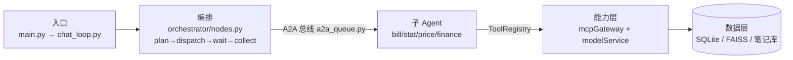

# billAgent 代码阅读路线

> 面向**第一次通读本项目代码**的人。按"一次请求的数据流"组织，而不是按目录顺序。
> 行号基准：2026-09-06（代码变动后行号会漂移，函数名才是稳定锚点）。

---

## 0. 开始前：先跑一遍，别急着读

```powershell
start_webui.bat          # 浏览器打开 http://127.0.0.1:7860
# 输入：记午饭56元，这个月花了多少，打车贵不贵
```

**目的**：先建立「输入一句话 → 系统做了 N 步 → 输出一段话」的直觉。没有这个直觉，读代码就是在一堆函数里迷路。

---

## 1. 全局地图

### 1.1 数据流的四个驿站



### 1.2 文件规模（先知道"大头"在哪）

| 文件 | 行数 | 定位 |
|---|---:|---|
| `agents/orchestrator/nodes.py` | 1678 | **最大核心**，但只有 4 个节点函数是主干 |
| `utils/contract_check.py` | 560 | 契约红线测试，最后看 |
| `memory/user_docs.py` | 549 | 笔记库（RAG） |
| `database/init_db.py` | 444 | 表结构，当字典查 |
| `mcpGateway/registry.py` | 367 | 工具注册中心 |
| `utils/common.py` | 356 | DatabaseCRUD + 日志 |
| `agents/bill_agent/nodes.py` | 350 | 子 Agent 范例 |
| `utils/tracer.py` | 344 | 可观测 |
| `memory/long_memory.py` | 337 | 长期记忆 |
| `startup/bootstrap.py` | 291 | 启动编排 |
| `mcpGateway/client.py` | 265 | MCP 客户端 |
| `startup/task_manager.py` | 253 | Durable 状态机 |
| `modelService/router.py` | 203 | 模型路由 |
| `mcpGateway/sandbox.py` | 199 | 沙箱 |

> **`modelService/embedding/` 与 `modelService/llm/` 里是模型权重文件，不要进去翻。**

---

## 2. 阶段一：主干——一次请求怎么走完（优先吃透）

| 顺序 | 文件 | 看什么 |
|---|---|---|
| 1 | `main.py`（6 行）→ `startup/chat_loop.py`（54 行） | 入口极简，看请求怎么进编排器 |
| 2 | `agents/orchestrator/state.py` + `graph.py` | **先看这两个**：状态字段 + LangGraph 节点连线，主线骨架 |
| 3 | `agents/orchestrator/nodes.py` | ⚠️ **只按序跳读**：`plan_node`(920) → `dispatch_node`(1233) → `wait_result_node`(1335) → `collect_node`(1514) |
| 4 | `startup/bootstrap.py` | `bootstrap_all()`(226) 启动顺序；`_bill_agent_worker()`(120) 看 worker 常驻消费 |
| 5 | `mcpGateway/a2a_queue.py`（167） | 总线：怎么发、怎么收、为什么是事件驱动 |

**⚠️ 读 `nodes.py` 的纪律**：1678 行里大部分是提示词拼装、文本渲染、预算计算的辅助函数（`_render_*`、`build_*_prompt`、`_calc_*`）。
**先只读上面 4 个节点函数**，辅助函数等到你追问"这个数字哪来的 / 这句提示词怎么拼的"时再回头查。

### 带着问题读

1. 用户一句话进来，**谁决定拆成几个任务**？（`plan_node`）
2. 记账和统计谁先谁后？**代码里怎么保证"统计包含这一笔"**？（`_merge_deps`(573)、`_has_cycle`(596)）
3. 第二波任务**什么时候派发**？（`wait_result_node`）
4. 最终回复怎么拼出来的？**纯计算的部分在哪**？（`_calc_alert_facts`(816) → `collect_node`）

### 读完应该能回答

- 一次请求被拆成几个任务、按什么顺序执行？
- 「并行」体现在哪一行代码？

---

## 3. 阶段二：一个子 Agent 的完整一生

`agents/bill_agent/graph.py` → `state.py` → `nodes.py`（350 行）

bill_agent 最典型：**解析 → 校验 → 落库**。读完它，`stat` / `price` / `finance` 三个是同构的，**扫一眼结构即可，不必逐个精读**。

对照阶段一，确认这个分工：
> 编排器管「怎么拆、怎么收口」，子 Agent 只管「怎么干」。

---

## 4. 阶段三：能力是怎么拿到的（工具平台，本项目核心资产）

| 顺序 | 文件（行数） | 看什么 |
|---|---|---|
| 1 | `mcpGateway/tool_model.py`（153） | `ToolSpec`：工具被建模成"资产"，先吃透这个数据结构 |
| 2 | `mcpGateway/registry.py`（367） | `ToolRegistry` 类(21) + `_build_platform`(183)＝全系统工具清单 |
| 3 | `mcpGateway/executor.py`（167）→ `adapters.py`（112）→ `client.py`（265） | 一次调用从 Registry 到真正执行的完整链路 |
| 4 | `mcpGateway/rbac_config.py`（63） | 权限表（谁有写权限、谁只读） |
| 5 | `mcpGateway/fact_tools.py`（83） | 编排器"读事实走正门"的实现 |

### 读完应该能回答

- 为什么"鉴权 / 审计 / 计时"业务代码一行都不用写？
- 想新增一个工具，改几个地方？

---

## 5. 阶段四：模型接入（很快，约 400 行）

`modelService/chat_model.py`（98）→ `router.py`（203）→ `llm_loader.py`（108）

看两件事：

1. `Capabilities` **能力契约**怎么声明（`supported_params` / `reasoning` / `context_window`）；
2. 本地 `num_predict` 与外部 `max_tokens` 为什么**绝不互转**——这是踩过坑的地方（推理模型 reasoning 吃满预算导致正文为空）。

---

## 6. 阶段五：数据、状态、记忆（按需查，别通读）

| 文件 | 定位 |
|---|---|
| `database/init_db.py`（444） | **当字典查**，需要某表字段时再来 |
| `startup/task_manager.py`（253） | Durable 状态机 + 崩溃对账 |
| `memory/short_memory.py`（115） | 会话态（草稿、追问计数） |
| `memory/long_memory.py`（337） | 长期记忆（FAISS + pkl） |
| `memory/user_docs.py`（549） | 笔记库，RAG 唯一入口 |

### 读状态机时的关键语义（易踩坑）

1. `completed` = **执行完成**，不是业务成功（如"收入不入账"是正常拒绝，不是失败，成败在 `result` 字段）；
2. `bill_agent` 的任务 `retriable=0`：有副作用，**崩溃后禁止盲重投**，必须先按 `task_id` 对账；
3. `interrupted` ≠ `failed`：优雅关闭/崩溃遗留，重启后对账分流为 `completed` 或 `submitted`。

---

## 7. 阶段六：横切与收尾

| 文件 | 看什么 |
|---|---|
| `utils/tracer.py`（344） | span 树怎么自动产生 |
| `utils/trace_view.py`（99） | 怎么查一次请求 |
| `utils/number_whitelist.py` | 防幻觉核心，很短，必读 |
| `utils/common.py`（356） | `DatabaseCRUD` + 日志配置 |
| `mcpGateway/sandbox.py`（199） | 沙箱三层 |
| `utils/contract_check.py`（560） | **最后看**：契约红线测试（设计约定与代码漂移即 FAIL） |

---

## 7.5 阶段七：账单改删与账单面板（M15 —— "能确定的就确定"）

> 这是唯一一个**从 UI 反向往回穿**的功能：用户在界面上指一条账 → 说要改/删 → 库里那条真的被改掉。
> 单独读它的价值在于：**"确定性 vs 自主"的取舍**在这里被摆到了台面上（`设计/12` §2、§4.7）。

### 7.5.1 四层数据流（先建立路径感）

```
① UI 层（webUI/）                        只读展示 + 只把目标写进输入框（**不写库**）
        │  产出：一句自然语言「把 id=515 那笔改成 」
        ▼
② 编排层（agents/orchestrator/nodes.py） 识别意图 → 决定派给谁、用什么 operate_sub_type
        │  A2A 任务：{name: "bill", operate_sub_type: "edit" / "delete" / "add"}
        ▼
③ 执行层（agents/bill_agent/）           定位目标 → 取出新值 → 调工具写库
        │  工具调用：bill.update / bill.delete（SQL 由工具写死）
        ▼
④ 工具层（mcpGateway/bill_tools.py）     参数化的确定性 SQL + 「先读存在性 → 写 → 后回读校验」
```

**一句话红线**：**UI 不是第二条写通道**。按钮只生产一句话，写操作一律走 `orchestrator → bill_agent` 单通道
—— RBAC、审计、`task_id` 对账、**二次确认**、习惯重算（`habit.recalc`）这五道治理一个都不会被绕开。

### 7.5.2 六个关键设计决策

| # | 决策 | 为什么 | 取舍 |
|---|---|---|---|
| 1 | 面板**只读**；选择器选中值用 **`id`** 而非序号 | 序号会因"中间又记了一笔"整体漂移 → 会**改错账**；`id` 是持久主键 | 输入框文案变长（`把 id=515 那笔改成 `），换"点的是哪条就改哪条" |
| 2 | **三档窗口分离**：`UI_BILL_FETCH_LIMIT`(200) / `RECENT_BILL_MAX`(20) / `RECENT_BILL_WINDOW`(3) | 面板给人看可以宽；模型清单受上下文预算约束必须窄；"最近 3 笔"只防**自然语言指代**命中错行 | 三个数字极易混淆（见 §7.5.5 第 1 条） |
| 3 | **显式主键不受任何窗口约束** | 主键 = 无歧义指认；窗口的本意是防模糊指代 | 需要一条"节点内部读数"通道（`get_bill_by_id`），但**不注册为工具** → 模型看不到 |
| 4 | **执行路径按输入形态分流** | 见 §7.5.3 | 放弃"所有 edit 都走 FC"的纯粹性，换点选路径可预期 |
| 5 | **删除恒走确定性路径** | 删除**不可逆**，"先确认后删"不能交给模型裁量（实测 FC 会跳过确认直接删库） | 删除失去"自主定位"，只能靠显式指代或窗口内自然语言 |
| 6 | 面板**按天分页**（7 天/页 + 上下翻页） | 以"天"为粒度符合用户心智（"看上周那些账"），且**同一天补记不会让分页整体错位** | 早于取数窗口的历史账单不在面板内（同源取数的必然边界） |

### 7.5.3 输入形态分流（本功能的核心）

| 输入形态 | 走哪条路 | 理由 |
|---|---|---|
| **显式主键**：`把 id=515 那笔改成 50`（= UI 点选产物） | **P3a 确定性**：代码定位 + 代码改 | 目标已由主键唯一确定，让模型再"自主定位"没有增益只有风险 —— 实测 FC 下模型把 `bill.update` 的 tool_call 当**正文**输出、工具没执行、数据没改 |
| **自然语言指代**：`把昨天那笔打车改成 50` | **FC 自主循环**（开关关闭时回落 P3a） | "在候选里自主定位"正是这套架构要交付的范式能力，不因噎废食 |
| **删除**（任何形态） | **恒 P3a** | 不可逆 + 必须先确认 |

### 7.5.4 阅读顺序（从"用户看得见的"读到"最底层的"）

| 步 | 文件 | 先看什么 | 看点 |
|---|---|---|---|
| 1 | `webUI/bill_panel.py` | 模块头 docstring → `load_bills` → `_group_by_day` → `_page_slice` → `page_label` → `render_bill_panel` → `bill_choices` → `page_view` / `panel_updates` | **全是纯函数**（取数只经 `load_bills` 一处），因此能脱离 Gradio 单测；模块头写明唯一红线 |
| 2 | `webUI/app.py` | 搜 `M15（P4）`：面板组件定义段 → 事件绑定段 | **outputs 顺序契约**：`respond` 4 项、`page_view` 4 项，与返回元组逐一位置对应 |
| 3 | `agents/orchestrator/nodes.py` | `EDIT_HINT_KEYWORDS` / `DELETE_HINT_KEYWORDS` → `_is_consume_statement` → `prune_tasks_by_heuristics` → `_render_result_text` | 意图识别在这里；`prune` 还要把 `operate_sub_type` 从默认 `add` **就地纠正**成 `edit`/`delete` |
| 4 | `agents/bill_agent/nodes.py` | `execute_node` 的分流区（搜 `_explicit_id`）→ `_execute_delete` / `_execute_edit` → `_fetch_bill_by_id` → `_tool_tags` / `_execute_fc` | 分流区五行决定走哪条路；`_execute_*` 是 P3a，`_execute_fc` 是 FC 自主循环 |
| 5 | `agents/bill_agent/bill_target.py` | `locate_bill` 优先级链 → `_explicit_index` → `CHANGE_VERB_RE` | **定位规则可穷举**（序号 > 金额 > 金额+属性 > 属性 > 指代词）；`CHANGE_VERB_RE` 同时用于"把新值数字从定位线索里剔除" |
| 6 | `mcpGateway/bill_tools.py` | 模块头（三段式写语义）→ `get_bill_by_id` / `recent_bills_for_ui` / `recent_bills` → `add_bill` / `update_bill` / `delete_bill_record` | **SQL 全部写死在函数内**；写操作统一"先读存在性 → 写 → 后回读校验"（`execute_sql` 只回 bool） |
| 7 | 测试（行为契约的权威） | `test_webui_bill_panel_paging.py` → `test_webui_bill_panel.py` → `test_bill_edit_delete.py` → `test_bill_fc_loop.py` | 用例名即契约清单，比读实现更快建立预期 |

### 7.5.5 读代码时最容易困惑的 5 个点

1. **三个窗口数字别搞混**：`UI_BILL_FETCH_LIMIT`(200) 管**面板取数** / `RECENT_BILL_MAX`(20) 管**模型可见清单上限** / `RECENT_BILL_WINDOW`(3) 管**自然语言指代窗口** —— 服务三个不同对象。
2. **三个读函数长得很像**：`recent_bills`（clamp 到 20、**注册为工具**）／ `recent_bills_for_ui`（上限 200、**不注册**）／ `get_bill_by_id`（按主键取单行、**不注册**）。判断标准是"**是否在 `registry` 登记**"，不是函数名。
3. **`operate_sub_type` 的默认值是 `add`**：`TASK_SUB_TYPE_DEFAULTS` 那条兜底会让"改"变成"新增" —— 这是"用户说改、结果多一笔账"的源头。
4. **删除是两轮状态机**：第一轮只写草稿槽（`memory.short_memory` 的 `bill_delete`）+ 追问，**不删**；第二轮原文命中确认词才真删并清草稿。所以说完"删掉 X"必须再说"确认"。
5. **`gr.State` 与 outputs 的顺序**：`page_view` 返回 `(面板HTML, 选择器update, 页码文案, 新页码)`，`app.py` 的 `outputs=[bill_panel, bill_pick, page_info, bill_page]` 必须**同序**（错位会关错组件）。

### 7.5.6 定位命令（可直接复制）

```powershell
# 面板（UI 层）全貌
Select-String -Path webUI\bill_panel.py -Pattern "^def |^UI_BILL_PAGE_DAYS"

# 接线（组件定义 + 事件绑定）
Select-String -Path webUI\app.py -Pattern "M15（P4）|\.click\(|\.submit\("

# 执行分流（走 P3a 还是 FC）
Select-String -Path agents\bill_agent\nodes.py -Pattern "_explicit_id|BILL_FC_ENABLED|_execute_(edit|delete|fc)"

# 意图词表与纠偏
Select-String -Path agents\orchestrator\nodes.py -Pattern "EDIT_HINT_KEYWORDS|DELETE_HINT_KEYWORDS|def prune_tasks_by_heuristics"

# 工具层：谁注册了、谁只是内部读数
Select-String -Path mcpGateway\bill_tools.py -Pattern "^def "
Select-String -Path mcpGateway\registry.py -Pattern "bill\."
```

### 读完应该能回答

- 用户点选一条账后，目标是怎么从"界面上的一条"变成"库里的那一行"的？（§7.5.1 + §7.5.3）
- 为什么 UI 按钮不直接写库？绕开会少掉哪五道治理？
- 同样是 edit，为什么"点选"和"口语指代"走两条不同的执行路径？
- 为什么删除不能交给模型判断"要不要先确认"？
- 面板能显示 200 笔、而模型只看得见 20 笔，为什么这不矛盾？显式主键为什么不设窗口？

## 8. 三个提速技巧

1. **用 trace 反查代码**（最有效）
   跑一次请求后执行 `python utils/trace_view.py <run_id>`，看真实 span 树（哪一步耗时、调了哪个工具），
   **拿 span 名字去搜代码**，比从入口追调用链快得多。

2. **单元测试是最好的文档**
   `tests/unit/test_orchestrator_plan.py`（38 例）、`test_tool_platform.py`（16 例）、`test_task_manager.py`（15 例）——
   它们直接给出函数的输入输出契约，比读实现快。

3. **用 IDE 大纲视图跳读**
   尤其 `orchestrator/nodes.py`，用函数列表跳，不要顺序翻。

---

## 9. 通关自测（也是面试高频追问）

读完阶段 1–3，能回答这四问就说明主干通了：

1. 用户一句话进来后，**谁决定拆成几个任务**？
2. 记账和统计的**先后顺序由什么保证**？动态依赖出错会怎样？
3. `bill_agent` 崩溃后，重启时**怎么保证不重复记账**？
4. 回复里的数字**为什么不会错**？模型编了数字会怎样？

---

## 10. 阅读时容易踩的坑

| 坑 | 说明 |
|---|---|
| 顺着 `nodes.py` 从头读 | 1678 行会被辅助函数淹没，按节点函数跳读 |
| 进 `modelService/embedding/` | 里面是模型权重，不是代码 |
| 想从 `contract_check.py` 入手 | 它是"红线校验"，需要先理解被校验的对象 |
| 忽略 `prompts/*.j2` | 提示词模板在 `agents/*/prompts/` 下，理解模型行为必须看 |
| 以为"多 Agent 并发写账单" | **不会**：RBAC 只有 `bill_agent` 有写权限，真正并发的是横切写入（统计/span/任务状态）与读写并发 |
