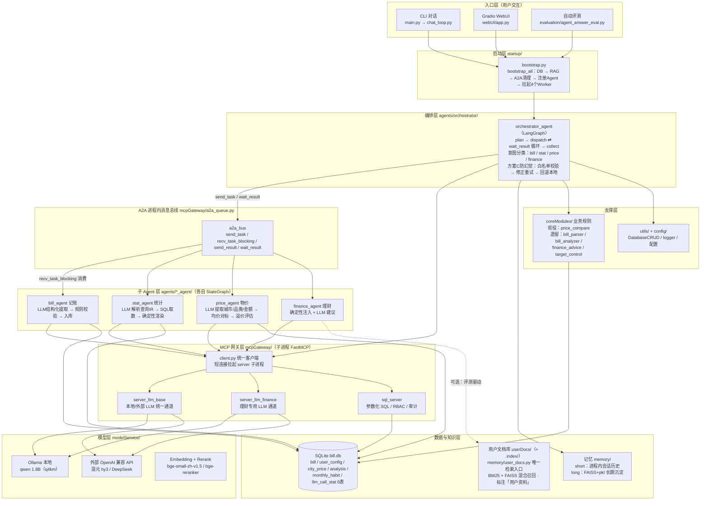
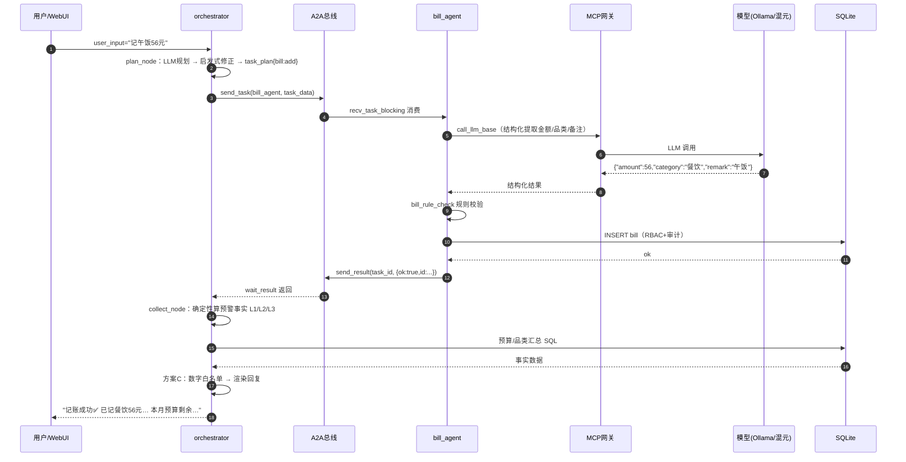
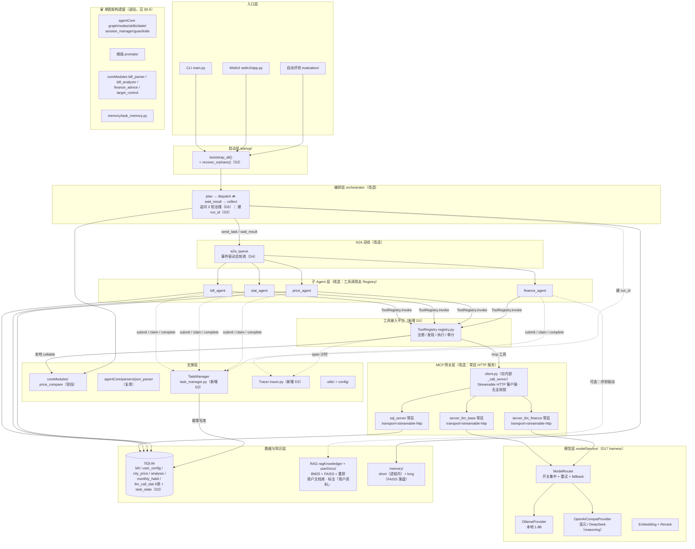
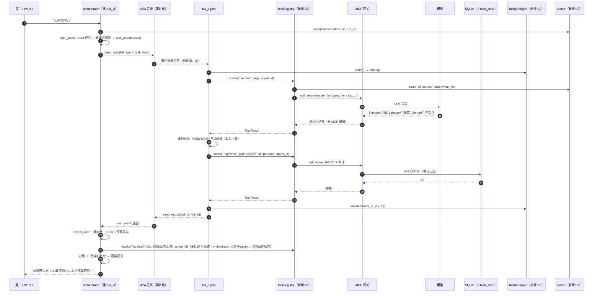
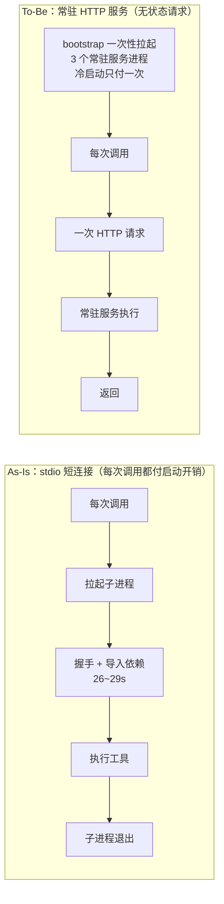
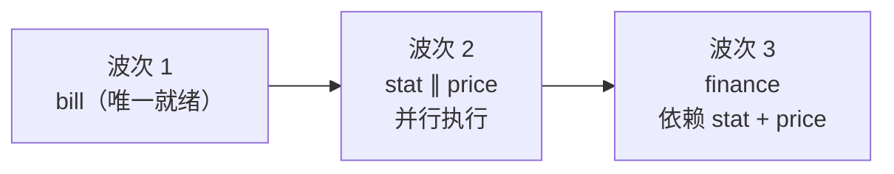

# 03 · 逻辑架构设计（视图 1）

> **视图定位**：回答"系统由**哪些模块**构成、各自**职责是什么**、模块之间**怎么协作**"。
> 数据落点归 `04_数据架构`，运行时行为归 `05_执行架构`，本视图不越界。
>
> **在文档体系中的位置**：`00` 总纲 → `01` 需求 → `02` 现状与缺陷 → **本文（`03`）** → `04` 数据 / `05` 执行 / … 。
> 与相邻文档的分工：缺陷的完整盘点在 `02`（本文第二部分只收录**与本视图相关**的）；
> 目标架构的**实施级细节**在 `08`（本文只给架构级结论与取舍）；**接口签名与改动红线**查 `10`。
>
> 更新日期：2026-08-30 ｜ 配套可交互架构图：`架构图.html`（浏览器打开，滚轮缩放 / 拖拽平移）
> 本文 Mermaid 图可被 Typora / VS Code Mermaid 插件 / CodeBuddy 内置预览直接渲染。
>
> **本文分三个平级部分，请按序阅读**：
>
> | 部分 | 回答什么问题 | 章节 |
> |---|---|---|
> | **一、当前架构（As-Is）** | 系统**现在**是什么样：模块、职责、协作链路 | §1–§5 |
> | **二、当前架构缺陷分析** | **为什么必须改**：缺陷证据、根因归类、每个改造的**取舍** | §6–§8 |
> | **三、目标架构（To-Be）** | **改成什么样**：目标全景、改造方案、每一处设计的**考量** | §9 |
>
> **设计输入** = `01_需求与约束.md`（需求基线 R1–R10、决策 Q1–Q6）+ `02_现状盘点与缺陷分析.md`（缺陷 D1–D17，其中 D17 = ChatModel 接入层，见 §9.7 / `08`）。
>
> **一条主线**：把 As-Is 的「**可用架构**」升级为「**可演进的基础设施**」——
> 第一部分讲清"现在是什么"，第二部分论证"为什么非改不可、为什么这么改"，第三部分给出"改完是什么样"。

---

## 第一部分 · 当前架构（As-Is）

> 本部分是**现状的客观描述**，只回答"**是什么**"，不做评价；缺陷列表与改造理由在第二部分。

### 一、架构总览

系统采用 **「LangGraph 多 Agent 编排 + A2A 进程内消息总线 + MCP 网关 + 双通道 LLM」** 架构：

- **编排器**（orchestrator）负责意图规划、依赖调度、结果汇总，通过 A2A 总线把任务派发给 4 个专职子 Agent；
- 子 Agent（记账/统计/物价/理财）各自是独立的 LangGraph StateGraph，消费队列任务并回传结构化结果；
- 所有 LLM 调用统一走 **MCP 网关**（子进程 FastMCP server），网关内部按配置分流 **本地 Ollama 1.8B** 或 **外部 OpenAI 兼容 API**（混元 hy3 / DeepSeek）；
- 数据层为 **SQLite + RBAC + 审计**；RAG 基础设施（BM25 + FAISS 混合检索 + 重排）服务**用户文档库**（`userDocs/`：用户笔记 → 「用户资料」注入 finance，标注来源、**不进白名单**，`01` §3.5）；记忆分 **短期（进程内）+ 长期（FAISS 落盘）**；
- **「方案 C」防幻觉三层防护**：LLM 表达 → 数字白名单校验 → 修正重试 → 回退本地确定性渲染，保证回复中的数字 100% 来自确定性计算层。

#### 1.1 分层架构图



> 调度注：当前 `dispatch_node` **一次只派一个就绪任务**（`ready[0]`），任务链严格串行（`bill → stat/price → finance`）；To-Be 规划就绪任务**批量并行派发**，依赖顺序仍由就绪检查 `deps ⊆ done` 保证（§9.4 ③ + §9.8.4）。
>
> 传输注：As-Is 的 MCP 网关为 **stdio 短连接**（每次调用拉起子进程，付一次冷启动开销）；To-Be 改为 **Streamable HTTP 常驻服务**（§9.8.2）。✅ **M3 已完成（2026-09-02）**：HTTP 常驻为主路径，`BILLAGENT_MCP_STDIO=1` 可回滚 stdio。
>
> 并发注：As-Is `mcpGateway/client.py` 的 `self._lock` 把**所有 MCP 调用全局串行化**——这是并行收益无法兑现的真正瓶颈，To-Be 随常驻化一并拆除（§9.8.3）。✅ **M3 已删除该锁**（实测：2 个 LLM 调用串行 2.1s vs 并发 1.6s）。

#### 1.2 一次「记午饭56元」请求的时序



---

### 二、各模块职责与接口说明

#### 2.1 入口层

| 模块 | 职责 | 关键接口 |
|------|------|---------|
| `main.py` | CLI 对话入口 | 交互循环 → `chat_loop.py` |
| `startup/chat_loop.py` | CLI 对话循环 | 落库用户提问 → `bootstrap_all()` → `AGENT_GRAPH["orchestrator_agent"].ainvoke(init_state)` → 取 `final_reply` |
| `webUI/app.py` | Gradio WebUI（M7 新增） | `respond(user_input, history)`；进程级 `SESSION_ID` 保多轮记忆；**常驻事件循环**（`new_event_loop()`，因 `bootstrap_all` spawn 的 worker 依赖存活 loop）；启动 `127.0.0.1:7860` |
| `evaluation/agent_answer_eval.py` | L3 回答质量评测（12 条用例） | 每条用例执行完整 Agent 链路 → 五维打分（intent/params/semantics/format/no_hallucination）+ DB 硬校验 → 增量落盘 `eval_reports/*.json` |

#### 2.2 启动层 `startup/`

| 接口 | 说明 |
|------|------|
| `bootstrap_all()` | 一次性初始化：①初始化 DB；②构建 RAG 索引；③清空 A2A 队列；④注册 5 个 Agent 到 `AGENT_GRAPH`；⑤以常驻 asyncio 协程拉起 4 个 worker（bill/stat/price/finance）消费总线任务 |
| `shutdown_system()` | 优雅关闭：停 worker、关闭资源 |
| `AGENT_GRAPH` | `Dict[str, CompiledStateGraph]`，键 `orchestrator_agent` / `bill_agent` / `stat_agent` / `price_agent` / `finance_agent` |

#### 2.3 编排层 `agents/orchestrator/`

**LangGraph 节点流转**（4 节点，无静态条件边，全部由 `Command(goto=...)` 动态控制）：

```
START → plan_node → dispatch_node ⇄ wait_result_node（循环调度）→ collect_node → END
```

| 节点 | 职责 |
|------|------|
| `plan_node` | 读会话历史+长期记忆 → LLM 规划任务 JSON → `repair_task_names` / `validate_task_list` / `prune_tasks_by_heuristics` 清洗 → 构建 task_plan DAG → 准入/收入/拒记/死循环拦截 |
| `dispatch_node` | 筛就绪任务（deps 全 done）→ **当前实现：一次只派第一个就绪任务**（`ready[0]`，串行单派）→ 按类型组装 task_data → `a2a_bus.send_task` 派发 |
| `wait_result_node` | 阻塞 `a2a_bus.wait_result(task_id, timeout=240)`（**单任务等待，串行**）→ 解析结构化结果 → 写 `agent_result_cache` → 记账成功沉淀月度习惯记忆 → 轮次自增（上限 20） |
| `collect_node` | `need_more_info` 追问分流；纯记账时确定性算 L1/L2/L3 预警事实；外部模型开 → LLM 汇总 + **方案 C 防幻觉闸门**（数字白名单 → 修正重试 1 次 → 仍幻觉回退本地渲染）；stat 结果沉淀长期记忆 |

**调度语义（As-Is）**：任务依赖表 `TASK_CONTEXT_DEPS = {"stat": ["bill"], "price": ["bill"], "finance": ["bill","stat","price"]}`——deps 只作用于**同批任务内存在的依赖**（只问统计时不会强制先记账）；bill 完成后 stat/price **同时就绪**，但当前 `dispatch_node` 一次只派一个 + `wait_result` 阻塞等待，整条链路**严格串行**；To-Be 已规划就绪任务**并行派发**（见 §9.4 ③）。

**意图分类（4 类）**：`bill`（记账，add/edit/delete）、`stat`（统计查询）、`price`（物价对比）、`finance`（理财分析）。LLM 规划为主 + 关键词启发式纠正（`STAT_HINT_KEYWORDS` / `FINANCE_STRONG_KEYWORDS` / `PRICE_HINT_KEYWORDS` / `BILL_VERB_KEYWORDS` / `INCOME_KEYWORDS` 拦截 / `REFUSE_BILL_KEYWORDS` 拒记）。

**`OrchState` 核心字段**：`user_input` / `session_id` / `task_plan`（任务 DAG）/ `current_task` / `agent_result_cache` / `final_reply` / `dispatch_round` 等。

#### 2.4 子 Agent 层 `agents/*_agent/`

每个子 Agent = 独立 StateGraph，通过 A2A 消费任务、回传结构化 JSON：

| Agent | 职责 | LLM 依赖 | 核心流程 |
|-------|------|:---:|---------|
| `bill_agent` 记账 | 记账/删改 | ✅ | `parse_json_output`（带业务校验+重试）结构化提取 → `bill_rule_check` 规则校验 → 入库 → 回传 `{ok, id}` |
| `stat_agent` 统计 | 月度开销/笔数/品类汇总 | ✅ LLM 解析 IR | `parse_query_node`（LLM→统计IR）→ `execute_query_node`（SQL 取数）→ `reply_node`（确定性渲染） |
| `price_agent` 物价 | 同类消费溢价对比 | ✅ LLM 提取参数 | LLM 提取城市/品类/金额 → `price_compare` 城市均价（同级兜底）→ 溢价评估 |
| `finance_agent` 理财 | 省钱建议/消费分析 | ✅ | 确定性注入（目标/统计/物价/习惯/记忆）→ LLM 建议 |

> 注：4 个子 Agent **均依赖 LLM**，但 LLM 只做"意图解析 / 参数提取 / 文本生成"，**执行与渲染全部是确定性代码**（正确性由规则兜底，见 §四.1）——"LLM 定内容、代码定框架"原则的体现。

#### 2.5 网关层 `mcpGateway/`

| 模块 | 接口 | 说明 |
|------|------|------|
| `a2a_queue.py` | `send_task(target_agent, session_id, task_id, task_data)` / `recv_task(agent_id, session_id, max_wait=3)`（**快路径 `get_nowait` + 慢路径 `wait_for(get())`**）/ `recv_task_blocking(agent_id, session_id)`（`await queue.get()`，零空转）/ `send_result(task_id, result)`（✅ **D4 验收③已删除死参数** `target_agent`/`session_id`）/ `wait_result(task_id, timeout=240)` / `clear_all()` | **A2A 进程内消息总线**：Agent 间通信的唯一通道（asyncio.Queue + Future）。✅ **D4 去轮询已完成（M2，2026-09-01）**：空闲唤醒 **36 次/秒 → 0**，P95 投递延迟 **30.9ms → 0.31ms**；会话不匹配消息改**旁路暂存 `_parked`**（不再放回主队，否则 `await get()` 会忙循环）；`clear_all()` 重建队列（规避 Queue 跨 event loop 绑定） |
| `client.py` | `_call_server(server_key, tool_name, arguments, max_retry=None)`（内部）/ `_server_url(server_key)` / `_is_connection_error(e)` / `call_bill_sql(agent_id, sql, params=None)` / `call_llm_base(sys_prompt, user_text, agent_tag="unknown")` / `call_llm_finance(agent_id, sys_prompt, user_text)` / `list_server_tools` / `list_all_server_tools` / `shutdown_all` | 统一 MCP 客户端。✅ **M3 已完成（2026-09-02）**：传输层改为 **Streamable HTTP 常驻服务**（`streamablehttp_client`，stdio 回滚保留），**全局串行锁 `self._lock` 已拆除**；`call_*` 三方法内部转调 `registry.invoke`（M1）。对外 3 个手写方法为**兼容层**（D1 改造对象，To-Be 退役，见 §9.5）。完整签名与上下游连接见 `10` §5.6.1.1 |
| `server_llm_base.py` | `server_llm_base` FastMCP 进程 | LLM 统一通道（内部按 `EXTERNAL_LLM_ENABLED` 分流本地/外部） |
| `server_llm_finance.py` | `server_llm_finance` FastMCP 进程 | 理财专用 LLM 通道（外部优先，失败回退本地） |
| `sql_server.py` | `sql_*` 工具 | 参数化 SQL 执行 + **RBAC 权限**（agent 类型白名单）+ **审计日志** |

#### 2.6 模型层 `modelService/`

| 接口 | 说明 |
|------|------|
| `llm_loader.py` → `llm_chat(...)` / `external_llm_call(...)` | **双通道 LLM**：`EXTERNAL_LLM_ENABLED`（base_url+api_key 齐备自动推导）→ 外部 OpenAI 兼容 API；否则本地 Ollama。`EXTERNAL_LLM_TIMEOUT=300s`。✅ **T4/T5**（`08` 第 7 章）：参数按后端分层（`num_predict`/`max_tokens` 语义隔离）+ 请求层重试分类（可重试/不可重试，统一预算池）。⚠️ **D17**（`02`）：仍是**两个平级入口**（无统一 ChatModel 抽象 / 无能力契约 / 路由散落），T4/T5 是"止血补丁"非"结构根治"——To-Be 升级为标准 harness 模型接入层（`08` 第 8 章 / §8.2 T11）——✅ **M14 已落地（2026-09-04，阶段 A）**：`chat_model.py` 抽象 + `providers/` 隔离 + `router.py` 路由集中；本行现为 `llm_loader.py` 兼容层描述（阶段 B 退役），现役行为见 `10` §5.6.5 |
| Embedding | `bge-small-zh-v1.5`（FAISS 向量索引） |
| Rerank | `bge-reranker-base`（RAG 重排） |

#### 2.7 数据与知识层

| 模块 | 接口 | 说明 |
|------|------|------|
| `database/` | `init_all_tables()`（⚠️ **代码无 `init_db()` 函数**，入口实为 `init_all_tables(close_after=True)`；含 migrate/ensure 幂等迁移）+ `import_city_price.py`（运维种子脚本） | SQLite `bill.db`，**6 张表**：`user_config`（预算/城市/提醒偏好）、`bill`（记账流水，五分类 CHECK）、`city_price`（城市均价 + `city_level` 分级）、`analysis`（🚫 零调用死表，见 `10` §5.6.8）、`monthly_habit`（月度习惯语义记忆）、`llm_call_stat`（D3 Tracer 统计表） |
| `utils/common.py` | `DatabaseCRUD`（全局单例 `db`）+ `db_lock` | 参数化 SQL 封装（杜绝注入）、线程锁防写冲突 |
| ~~`ragKnowledge/rag_builder.py`~~ | ~~`load_rag_index()` / `build_rag_index()`~~ | 🚫 **M8 已删除**（2026-09-04）：`RAW_KNOWLEDGE`（Q6）清理 + 构建逻辑移入 `memory/user_docs.py`（`04` §3.5.4） |
| ~~`ragKnowledge/rag_service.py`~~ | ~~`get_rag_context(query, top_k)`~~ | 🚫 **M8 已删除**（2026-09-04）：检索 → 重排 → 拼接 `str`（无来源标注）逻辑退役，见下行 |
| `memory/user_docs.py`（✅ **M8 已落地**） | `search_user_docs(query, top_k)` / `load_user_docs()` / `add_doc` / `delete_doc` / `list_docs` | **唯一检索入口**（A 方案）：检索 `userDocs/` → 返回 **`list[dict]`（含 `doc_id`/`text`/`score`）**；索引落盘 `.index/` 四件套 + 内容哈希对账 + BM25-only 降级 + 原子写（`04` §3.5 / `10` §5.5） |
| `memory/short_memory.py` | `get_session_memory(session_id)` → `.add_msg()` / `.export_all()` | 进程内会话历史（多轮上下文 + 草稿缓存） |
| `memory/long_memory.py` | `save_consume_memory` / `search_history_consume` / `upsert_month_habit_memory` | FAISS+pkl 落盘长期记忆（消费摘要/月度习惯） |

#### 2.8 支撑层

| 模块 | 说明 |
|------|------|
| `coreModules/` | ✅ **仅 `price_compare` 现役**（`calc_premium_evaluate` 被 `price_agent` / orchestrator 预警链引用）；其余 4 个（`bill_parser` / `bill_analyzer` / `finance_advice` / `target_control`）已于 **2026-09-04 删除**（单图遗留整链退役，`bill_agent` 早已内联解析/分析逻辑替代；§9.6） |
| `config/config.py` | 全局配置：路径、`DEFAULT_USER_CITY`、`EXTERNAL_*` 外部模型开关、超时 |
| `prompts/`（根级）+ `agents/*/prompts/` | ⚠️ **根级 `prompts/` 为单图架构遗留**（仅被 LEGACY `agentCore/nodes.py` 引用，To-Be 退役）；**现役提示词在各 `agents/*/prompts/`**（`prompt_loader.py` + `.j2` 模板）：`system.md`（规划）/`user.j2`/`summarize.md`/`summarize_user.j2` + 各子 Agent 提示词 |
| `utils/` | `logger`（loguru）、`retry_utils`、`common`（DB CRUD） |
| `agentCore/` | ✅ **已清理（2026-09-04）**：单图遗留图栈（`graph`/`nodes`/`skills`/`state`/`session_manager`/`guardrails`/`intent_parser`）已**删除**，连同其唯一引用方（offline_debug 调试脚本、`memory/task_memory.py` 及其单测、顶层 `prompts/`）整链退役；本包现仅保留 `parsers/json_parser.py`——带自校验+重试的 JSON 解析器 `parse_json_output`，被 5 个 agent + orchestrator 复用（§9.6） |

#### 2.9 A2A 消息结构与 State 字段（接口契约详表）

> 2.1–2.8 回答"模块有哪些接口"；本节回答"**接口长什么样**"——消息结构与 State 字段的**唯一权威定义**，`10_模块契约手册.md` §4/§5 据此收敛（避免双份维护）。

**A2A 消息结构**（`mcpGateway/a2a_queue.py`）：

| 消息 | 结构 | 说明 |
|------|------|------|
| `send_task(target_agent, session_id, task_id, task_data)` | `task_data: dict` | 派发任务；`task_data` 按目标 Agent 四套差异（下表） |
| `send_result(task_id, result)` | `result: dict` | 子 Agent 回传，统一走 final_struct 通信标准（下表）。✅ **D4 已删除死参数** `target_agent`/`session_id`（结果存储与唤醒均以 `task_id` 为唯一键，旧四参签名作废） |
| `wait_result(task_id, timeout=240)` | 返回 `result` | orchestrator 阻塞等结果；超时 240s（对齐 `MODEL_TIMEOUT`，`orchestrator/nodes.py:1146`） |

**task_data 四套差异**（`orchestrator/nodes.py:1075-1116` dispatch 组装）：

| 目标 Agent | task_data 字段 |
|-----------|----------------|
| `bill_agent` | `raw_segments` / `operate_sub_type` / `session_memory` / `city` / `month` |
| `stat_agent` | `raw_segments`（=用户原始输入的列表）/ `user_input` / `operate_sub_type` / `session_memory` |
| `price_agent` | `raw_segments` / `operate_sub_type` / `session_memory` |
| `finance_agent` | `raw_segments` / `operate_sub_type` / `session_memory` / `target_control` / `bill_result` / `stat_result` / `price_result` / `habit_data` |

**final_struct 回传通信标准**（`orchestrator/nodes.py:400`，5 字段）：

```json
{"success": bool, "agent_type": str, "msg": str, "data": dict|null, "error": str|null}
```

- `error="need_more_info"` 为追问信号；`data` 为各 Agent 的结构化结果（由 orchestrator 的 `build_user_display_text` 统一渲染，子 Agent 禁止拼文案）。

**各 Agent State 字段**（`agents/*/state.py`）：

| State | 字段 |
|-------|------|
| `OrchState` | `user_input` / `session_id` / `session_history` / `task_plan` / `current_task` / `all_task_results` / `final_reply` / `error_msg` / `current_agent` / `dispatch_round` / `current_sub_agent_struct` / `agent_result_cache` |
| `BillState` | `session_id` / `task_id` / `raw_segments` / `city` / `month` / `result` |
| `StatState` | `session_id` / `task_id` / `user_input` / `session_memory` / `target_control` / `raw_ir` / `final_struct` |
| `PriceState` | `session_id` / `task_id` / `raw_segments` / `extract_info` / `final_struct` / `error_stack` |
| `FinanceState` | `session_id` / `task_id` / `raw_segments` / `operate_sub_type` / `session_memory` / `target_control` / `bill_result` / `stat_result` / `price_result` / `habit_data` / `user_query` / `llm_input_prompt` / `llm_raw_answer` / `final_struct` / `error_stack` |

> 字段类型与含义详见 `10_模块契约手册.md` §5。

---

### 三、技术栈

| 类别 | 技术 | 说明 |
|------|------|------|
| 语言 | Python 3.10+ | 全项目 |
| 多 Agent 编排 | **LangGraph**（`langgraph>=0.2.0`，`StateGraph` + `Command(goto)` 动态流转） | 编排器 + 4 个子 Agent 图 |
| Agent 框架 | LangChain（`langchain>=0.2.0`） | 依赖 LangGraph 运行 |
| 消息总线 | **A2A 自研进程内队列**（asyncio.Queue + Future） | `mcpGateway/a2a_queue.py`，Agent 间解耦通信 |
| 模型协议 | **MCP**（`mcp>=1.20`，FastMCP）；As-Is **stdio 子进程**（短连接），To-Be **Streamable HTTP 常驻服务**（§9.8.2） | 统一 LLM/SQL 工具通道 |
| 本地模型 | **Ollama**（`qwen-bill-1.5-1.8b-q4km`，HTTP API） | 免费基线，零 API 依赖 |
| 外部模型 | OpenAI 兼容 API（**混元 hy3 / DeepSeek**） | 可选增强，走「方案 C」三层防幻觉 |
| 数据库 | **SQLite**（pysqlite3）+ 参数化 SQL | **6 张表**（`bill` / `user_config` / `city_price` / `analysis`（🚫 死表）/ `monthly_habit` / `llm_call_stat`（D3 新增），表契约见 `10` §5.6.8）；⚠️ **无 `audit_log` 表**——审计落**日志文件** `logs/audit.log`（`write_audit_log`，`04` §2 / `06` §1）；RBAC 矩阵见 `10` §5.6.1.6 |
| RAG | **BM25**（M8 起内嵌 `_BM25`，Okapi k1=1.5/b=0.75，`rank_bm25` 非必需）+ **FAISS**（faiss-cpu `IndexIDMap`）+ **bge-small-zh-v1.5**（embedding）+ 重排（bge-reranker-base **保留未接线**）+ jieba 分词（未装则退化为空白切分） | **用户文档库**（`01` §3.5：用户笔记 → 「用户资料」注入 finance，不进白名单；唯一入口 `memory/user_docs.py`，M8 已落地） |
| 向量/重排 | sentence-transformers + transformers 4.32.0（CPU）+ torch（CPU） | RAG 底层 |
| 会话记忆 | short_memory（进程内 dict）+ long_memory（FAISS + pkl 落盘） | 多轮 + 跨会话 |
| WebUI | **Gradio**（`gradio>=4.0.0`，本机 6.x） | M7 交付界面 |
| 日志 | loguru | 统一日志（`logs/`） |
| 数据处理 | pandas / numpy 1.26.4 | 统计计算 |
| 其他 | requests、python-dotenv、redis（已声明未使用） | 辅助 |

---

### 四、核心设计要点

1. **确定性优先**：统计/物价/预警事实（L1/L2/L3）全部由纯 SQL/数值计算产生，LLM 只负责"表达"；
2. **方案 C 防幻觉**：外部 LLM 汇总时数字白名单校验 → 修正重试 1 次 → 回退本地确定性渲染，保证数字 100% 来自计算层（M6 评测混元 12/12 PASS、均分 9.83）；
3. **本地基线可交付**：不配任何 API 也能完整运行（本地 1.8B 全流程），`EXTERNAL_LLM_ENABLED` 自动推导；
4. **双通道回退**：finance 外部 LLM 失败自动回退本地；`EXTERNAL_LLM_TIMEOUT=300s` 防挂起；
5. **MCP 传输**：As-Is **短连接**（每次调用拉起子进程，避免长驻内存，代价是每次调用都要付一次冷启动开销）；To-Be 改为 **Streamable HTTP 常驻服务 + 无状态请求**（§9.8.2）——服务常驻只付一次启动开销，**且客户端不持有任何需维护的连接**，从根上消除 stdio 长连接的 cancel scope 跨 task 崩溃问题；
6. **进程内 A2A**：单进程多 Agent 协程协作，无需外部消息中间件，部署零依赖。**To-Be 明确维持单进程多协程，子 Agent 不进程化**（§9.8.6）——推理负载本就在主进程之外（Ollama / 外部 API），进程化是负优化。

### 五、运行与评测

| 入口 | 命令 |
|------|------|
| CLI | `python main.py` |
| WebUI | `start_webui.bat` 或 `python webUI/app.py`（浏览器 `http://127.0.0.1:7860`） |
| 冒烟测试 | `python smoke_test.py` |
| L1 单元/集成 | `pytest tests/ -m "not slow"` |
| L3 回答质量评测 | `python evaluation/agent_answer_eval.py`（报告 `eval_reports/`） |

---

## 第二部分 · 当前架构缺陷分析（为什么改）

> 从 As-Is 到 To-Be 之间必须有**理由链**，否则改造就是拍脑袋。本部分回答三件事：
> **① 有什么缺陷、证据在哪 ② 根因是什么（不是一个散点清单，是三条根）③ 每个改造为什么选这个方案、放弃了什么**。
>
> 缺陷的完整盘点在 `02_现状盘点与缺陷分析.md`；本部分只收录**与逻辑架构相关**（模块 / 拓扑 / 协作方式）的缺陷，
> 并补上 `02` 未展开的**取舍论证**。

### 六、缺陷清单与证据（本视图相关）

| 编号 | 缺陷 | 现象 | 代码证据 | 对架构的影响 | 级别 |
|---|---|---|---|---|---|
| **D1** | 工具抽象层缺失 | 能力硬编码为 3 个手写调用方法，无注册、无发现 | `mcpGateway/client.py`；`ToolSpec` 代码零命中 | 鉴权 / 审计 / 计时**无处挂载** → D3、D15 皆由此衍生 | P0 |
| **D2** | Durable Execution 为零 | 任务状态仅存内存，进程重启即失 | `a2a_queue.py` L8-11；`task_memory.py` 已标注 LEGACY | 无恢复、无重试、无幂等，长任务不可靠 | P0 |
| **D3** | 无链路追踪 | 只有 loguru 日志与审计表，无 `run_id` / span | — | 无法回答"慢在哪、错在哪"，评测飞轮缺数据 | P0 |
| **D15** | 编排器绕过网关直连 DB | 9 处 `db.` 直连（含 1 处写），违反自建 RBAC | `orchestrator/nodes.py`；`rbac_config.py:18` 明令"无数据库权限" | 安全防线出现**后门**、审计黑洞 | P0 |
| **D4** | 总线定时轮询 | `asyncio.Queue` + sleep 轮询取任务 | `a2a_queue.py` | 空转 + 延迟（**严重性已下调**：非正确性缺陷） | P1 | ✅ **M2 已修复（2026-09-01）** |
| **D5** | 会话态无治理 | 草稿 / 追问状态在进程内全局 dict，无 TTL；追问无上限 | `short_memory.py` L4；`dispatch_round` 是调度轮次**非**追问轮次 | 无限追问、重启即失、脏草稿带入下次记账 | P1 |
| **D16** | finance 防幻觉覆盖不全 | finance 输出无白名单校验、无规则底稿、历史记忆收到即弃 | `finance_agent/nodes.py`；`finance_advice.py` 弃用 | 防幻觉三层只剩最外层——**"数字可信"承诺在 finance 链路失效** | P1 |
| **—** | 单图架构遗留未清理 | `coreModules` 5 模块仅 1 现役；`agentCore/` 图栈、根级 `prompts/`、`memory/task_memory.py` | 仅被 `offline_debug.py` 与 LEGACY 路径引用 | 拓扑上同时存在**两套架构**，读者无法判断哪个是真的 | P1 |
| **D14** | 数据模型"声称支持未实现" | `budget_type` 允许 `year`，但预警链只处理月 | `user_config` | 误导用户与后续开发（落点归 `04_数据架构`） | P2 |

> **与 `02` 的分工**：`02` 给**完整清单与根因分析**（D1–D17，含 D6–D13 等非拓扑类缺陷）；
> 本表只保留**会改变模块拓扑或协作方式**的缺陷，并引出下一节的根因归类。

### 七、根因归类：三条根，不是一个散点清单

```
根一：工具平台缺失（D1）  ──→  D15 后门、D3 无从埋点、D7 Skills 重复建设
根二：状态没有落点（D2+D5）──→  重启即失、无法恢复、追问无上限
根三：历史遗留未清理（单图）──→  两套架构并存，认知污染
```

**根一 · 工具平台缺失 → 后门与重复**
D15 是这条根的**直接后果**：编排器"**需要数据时没有工具可调**"，只能裸连 `db`。
后门不是恶意绕过，是**工具平台缺失的必然结果**——`02` §7 已论证这条因果链。
D1 修好（ToolRegistry + 细粒度工具），D15 的 9 处直连自然有正门可走，D3 的 span 也才有统一挂载点。

**根二 · 状态没有落点 → 一切随进程消亡**
任务状态在 `asyncio.Queue` 内存里（D2）、会话状态在进程内全局 dict 里（D5）——两者都随进程消亡。
修法**不是加字段**，而是把状态从进程内**搬进存储**：任务态 → `task_state` 表，会话态 → Redis（P2）。

**根三 · 历史遗留未清理 → 拓扑上有两套架构**
从单图架构迁移到多 Agent 时，`coreModules` 4 模块、`agentCore/` 图栈、根级 `prompts/`、`task_memory.py` 未退役。
它们不产生 bug，但**污染架构认知**——新人读到 `coreModules/finance_advice.py` 会以为理财建议走这里，实际已弃用。

> **根因归类的作用**：它决定改造的**合并方式**——
> 同一条根的缺陷应当**一起修**（修 D1 顺手收 D15 / D3），而不是各修各的、各建各的。

### 八、缺陷 → 改造映射与关键取舍

#### 8.1 缺陷 → 改造映射（本视图的落地清单）

| 缺陷 | 改造类型 | 落点（本视图内） | 取舍依据 | 详案 |
|---|---|---|---|---|
| **D1** 工具抽象层缺失 | ➕ 新增模块 | ToolRegistry（`mcpGateway/registry.py`） | T1 | `02` D1 章节 |
| **D2** Durable Execution 为零 | ➕ 新增模块 | TaskManager（`startup/task_manager.py` + `task_state` 表） | T4 | `02` D2 章节 |
| **D3** 可观测链路缺失 | ➕ 新增模块 | Tracer（`utils/tracer.py`）✅ **阶段1 已落地**（LLM 调用 token/耗时/成败采集 + `agent_tag` 归因，见 `04` §2.6） | T1（复用工具调用点） | `02` D3 章节 |
| **D15** 编排器绕过网关直连 DB | 🔧 行为改造 | 9 处直连收口：读走网关 + 写下沉 bill_agent；RBAC 收敛 `fact:read`（§9.9） | T10 | `02` D15 章节 |
| **D17** 模型接入层缺失（双平级入口 + 隐式转译 + reasoning 预算无契约） | ➕ 新增模块 | ChatModel 抽象 + Capabilities + Provider（Ollama/OpenAICompat）+ ModelRouter（`modelService/`）——✅ **M14 阶段 A 已落地（2026-09-04）**，阶段 B 留档 | T11 | `02` D17 章节 / `08` 第 8 章 |
| **D4** 总线定时轮询 | 🔧 改造现有 | A2A 总线事件化（`a2a_queue.py` 内部，~10 行） | T4 | `02` D4 章节 |
| **D5** 会话态无治理（T2/T3 追问） | 🔧 行为改造 | orchestrator 追问 3 轮治理 + 放弃清草稿 ✅ **M5 已落地（2026-09-03）**（会话级计数 `SESSION_ASK_ROUND`；⚠️ T3 的草稿池现役链路未写入、仅 LEGACY `agentCore/` 使用，故 `clear_draft()` 为防御性兜底，见 `11` M5 现状勘误） | T9 | `01` §3.4 / §8.1 |
| **D16** finance 防幻觉覆盖不全 | 🔧 行为改造 | 规则底稿 + 白名单校验 + 历史记忆注入（§9.9.3）；**RAG 职责修订**：系统规则清理 + 用户文档库接入（§9.9.3 / `01` §3.5） | T7 / T8 | `02` D16 章节 |
| **D14** 数据模型"声称支持未实现" | 🔧 数据模型 | `budget_type` 收敛为仅 `month` ✅ **M5 已落地（2026-09-03）**（数据 UPDATE + 重建表带 `CHECK(budget_type = 'month')`；`target_control` 去 `week`、`finance_advice` 删死分支） | T6 | 归 `04_数据架构` |
| **单图遗留** | 🗑 退役清理 | `coreModules` 4 模块 / `agentCore` 图栈 / 根级 `prompts/` / `task_memory.py` | T6（不做兼容抽象） | §9.6 |

> **其余缺陷不在本视图产生模块级新增**：D6（上下文）/ D7（Skills）/ D8（沙箱）/ D9（Reflection）改造的是各模块**内部实现**，
> D10–D13（模型侧 / 跨进程 / HITL / 压测）属可选优化——它们都不改变模块拓扑，详见 `02` 对应章节。

#### 8.2 关键改造的取舍分析（为什么选它、放弃了什么）

> **这一节是第二部分的重点**：每个决策都回答"**候选方案有哪些 / 选了哪个 / 为什么 / 放弃了什么**"。
> 只写结论不写取舍，读者无法判断方案是否适配自己的场景，也无法在条件变化时重新决策。

| # | 决策点 | 候选方案 | **选定** | 为什么选它 | 放弃了什么（代价） |
|---|---|---|---|---|---|
| **T1** | 能力如何暴露给 Agent | A 继续硬编码方法<br>B 声明式 `ToolSpec` 注册 | **B · ToolRegistry** | 注册即同时获得**鉴权 + 审计 + 计时 + 文档**四件套；D3（埋点）与 D15（后门）随之可解 | 破坏 ~40 处按名 patch 的测试（约束 C5）→ **兼容层是必选项，不是可选项** |
| **T2** | 子 Agent 是否进程化 | A 多进程<br>B 维持单进程多协程 | **B · 不进程化** | 推理负载本就在主进程之外（Ollama / 外部 API），主进程无 CPU 重计算；耗时集中在 IO 等待，协程已足够 | 放弃隔离性与多核利用；**边界条件**（改为进程内直载模型推理）当前不触发，触发时才必须改（§9.8.6） |
| **T3** | MCP 传输层形态 | A stdio 短连接（现状）<br>B stdio 长连接<br>C Streamable HTTP 常驻 | **C · HTTP 常驻** | A 每次调用付 26~29s 冷启动；B 实测 `cancel scope` 跨 task 崩溃（现形态由来）；C 只付一次启动，**且客户端不持有需维护的连接** | 引入常驻服务的生命周期管理（启动顺序、健康检查、端口占用） |
| **T4** | 消息总线选型 | A 进程内 `asyncio.Queue`<br>B Redis Stream + 消费组 | **A（当前）<br>→ B（P2）** | 单机单用户（R1 / C7），引入 Redis = 新增外部依赖，违背"零依赖部署"红线 | 放弃跨进程与持久化 → D2 / D4 / D11 的**彻底**解决推迟到 P2，当前只做事件化改造 |
| **T5** | 任务依赖从哪来 | A 静态表写死（现状）<br>B LLM 动态判定<br>C 动态 + 静态取并集 | **C · 并集** | 动态性只往"**更保守（更串行）**"方向走，最坏退化为 As-Is，**绝不比现状更差**；误判有兜底 | 依赖强模型（D-a 前提）；LLM 误判时退化为串行（可接受，非正确性问题） |
| **T6** | 数据模型抽象度 | A 引入字典表 / 多租户抽象<br>B 保持硬编码五分类 | **B · 保持** | Q1–Q3 已锁定"单用户 · 仅支出 · 五分类"；抽象无实际收益，只增复杂度 | 放弃可扩展性——这是**主动选择而非欠债**（`01` §8 Q1–Q3）；代价是未来扩展需改表结构 |
| **T7** | RAG 装什么 | A 系统内置规则（现状 10 条，已被确定性层覆盖）<br>B 清理内置规则、RAG 仅服务长期记忆<br>C **用户文档库（`01` §3.5）** | **C · 用户文档库** | 内置 10 条是"参数/规则"性质 → **清理**（B 成立）；但用户笔记（个性化物价 / 省钱策略）是确定性层**无法覆盖**的 → 用户文档走 RAG 检索，标注「用户资料」、**不进白名单**（文本承载数字 ≠ 系统事实，Q6 论证仍成立） | 用户文档是**参考输入**不是事实源；finance 可引用做简单对比，冲突时确定性优先并向用户说明 |
| **T8** | finance 防幻觉怎么做 | A RAG 增强<br>B 确定性底稿 + 白名单 + 记忆注入 | **B · 三件套** | 与 `01` §6 最高优先级一致：**只有确定性层产出的事实才可被白名单校验**，RAG 文本不在校验范围内 | 需要手写规则底稿（~40 行），而非"灌知识"；建议文案质量依赖 LLM 表达 |
| **T9** | 会话态存在哪 | A graph state<br>B 会话级存储 | **B · 会话级**<br>（`ShortSessionMemory`） | graph state 每次 `ainvoke` 都会重建，**无法**承载跨轮次的追问计数 | 进程内仍会丢失（P2 随 D5 方案 B 迁 Redis + TTL） |
| **T10** | 编排器怎么拿事实 | A 禁止编排器取数<br>B 裸连 DB（现状，违规）<br>C 走正门 `fact:read` | **C · 走正门** | 编排器做汇总**必须**拿到确定性事实（否则方案 C 白名单校验无从校验），问题只在于"**走哪条路**"——不是"要不要"，是"走正门还是翻窗" | 需先把工具做出来（D1 前置）；改造期内存在新旧两条取数路径并存 |
| **T11** | 模型接入层形态 | A 双平级入口 + 各自白名单过滤（现状，T4 止血）<br>B 标准 harness（ChatModel 抽象 + 能力契约 + Provider + Router） | **B · harness** | "换模型就崩"根因是**接入层缺失**——无统一抽象，参数语义靠"程序员记得"而非"结构保证"；harness 用 `Capabilities` 把适配约束为"归一 + 过滤告警"（**绝不转译**），路由集中让"换模型 = 改一处" | 引入抽象层（4 文件）；需兼容层保住 ~147 项测试与 MCP 通道（约束 C5，同 T1 判据） |

> **T11 落地注（2026-09-04，M14 阶段 A）**：选 B（harness）后已在 `modelService/` 落地 `chat_model.py`（Capabilities 契约：`supported_params` 边界 / `reasoning` 预算 / `context_window` 窗口）+ `providers/`（Ollama / OpenAICompat 各自契约，物理隔离）+ `router.py`（ModelRouter：resolve 决策表集中 + 统一重试/fallback + 单点埋点 + `context_window_for`）。兼容层保住既有调用（`llm_loader` 两函数签名不变）；阶段 B 退役线已标 TODO。执行时行为与实测见 `08` 第 8 章 / `02` D17。
>
> **取舍记录的作用**：当约束变化时（例如"必须支持多用户"或"必须离线进程内推理"），
> 可以直接回到对应行判断——**触发了哪个边界条件、该改哪一条**，而不必重新做一遍完整分析。

---

## 第三部分 · 目标架构（To-Be）

> 本部分回答"**改成什么样**"：目标全景、模块清单、行为改造、接口契约、完整时序。
> 每一处的**设计考量与取舍**已在第二部分 §8.2 论证，本节只给**结论与落地方式**，不重复论证。

### 九、目标架构（To-Be）

> **设计输入** = `01_需求与约束.md`（需求基线，R1–R10、决策 Q1–Q6）+ `02_现状盘点与缺陷分析.md`（缺陷 D1–D17，其中 D17 = ChatModel 接入层，见 §9.7 / `08`）。
> 本视图只回答"**有哪些模块、模块怎么协作**"；数据落点归 `04_数据架构`，运行细节归 `05_执行架构`。
> **目标**：把 As-Is 的「**可用架构**」升级为「**可演进的基础设施**」。

#### 9.1 完整目标架构（全景，非增量）

> 虚线 = 新增 / 改造交互；灰框「🗑 单图架构遗留」为退役清理对象（仅清理，不参与链路）。



#### 9.2 模块清单总表（最终系统全景：四类一览）

| 类别 | 模块 | 说明 |
|---|---|---|
| ✅ **保留**（现役不动） | 入口层（CLI / WebUI / 评测）、`startup/`、`orchestrator`（4 节点）、4 个子 Agent、A2A 总线、MCP 网关（`client` + 3 server）、`modelService/`、SQLite **6 表**、RAG、memory、`config/`、`utils/`、`agentCore/parsers/json_parser`、`coreModules/price_compare` | 行为不动或仅内部小改 |
| 🔧 **改造** | `a2a_queue.py`（去轮询 D4）、`orchestrator`（追问治理 D5 + run_id D3 + **就绪任务并行派发**）、4 个子 Agent（工具调用走 Registry D1）、`client.py`（对外 3 方法退役，D1）、SQLite（新增 `task_state` 表 D2）、`modelService/llm_loader.py`（转**兼容层**，内部转调 ModelRouter，D17） | 接口/行为级改造，**模块拓扑不变**（模型层拓扑变化见 D17） |
| ➕ **新增** | `ToolRegistry`（`mcpGateway/registry.py`，D1）、`TaskManager`（`startup/task_manager.py`，D2）、`Tracer`（`utils/tracer.py`，D3）、**ChatModel 接入层**（`chat_model.py` + `providers/{ollama,openai_compat}.py` + `router.py`，D17） | 6 个新文件（含 `providers/` 2 个） |
| 🗑 **退役** | 单图架构遗留：`agentCore`（`graph`/`nodes`/`skills`/`state`/`session_manager`/`guardrails`）、根级 `prompts/`、`coreModules`（`bill_parser`/`bill_analyzer`/`finance_advice`/`target_control`）、`memory/task_memory.py` | ✅ **2026-09-04 已执行**（M9 后置整链清理：上述 + offline_debug 调试脚本 + `task_memory` 单测一并删除，**只清理不迁移**；`json_parser` 与 `price_compare` 保留现役）。⚠️ D7 原「skills 本地能力迁移为本地工具集合」例外——该能力已被现役等价承接（M8 `memory/user_docs.py` 用户文档检索 + `10` §5.6.8 ragKnowledge 检索），skills 文件直接删除无能力丢失，D7 ✅ 已收口（2026-09-04，M13；能力承接矩阵见 `08` M13 / `11` §3 M13） |

> 最终系统 = 上表「保留 ∪ 改造 ∪ 新增」的并集；退役类只删代码，不改变现役模块拓扑。

#### 9.3 新增模块职责（每个一句话）

| 模块 | 一句话职责 | 关键不变量 |
|---|---|---|
| **ToolRegistry**（D1） | 工具的统一"注册 / 发现 / 执行 / 审计"入口：业务只认 `ToolSpec`，传输是最后一公里 | **加工具 = 注册一行**，不改 `client.py` / RBAC / 审计 |
| **TaskManager**（D2） | 任务的持久化状态机 `submitted→running→completed/failed`，启动时恢复孤儿任务 | **幂等键 = `task_id`**，重投不重复写库 |
| **Tracer**（D3） | `run_id` 贯穿的 span 树：自动计时 + 失败归因 + token/耗时统计 | 接入点**仅 3 处**：编排入口 / worker 执行 / Registry.invoke |
| **A2A 总线事件化**（D4） | 定时轮询改 `await queue.get()` 事件驱动，清理 `send_result` 死参数 | **消费语义不变**：仍按 agent 级消费（约束 C2） |
| **ChatModel 接入层**（D17） | 模型统一抽象 + 能力契约：业务只认 `ChatModel.generate()`，后端差异由 `Capabilities` 声明、由 Router 路由 | **参数绝不转译**：同义归一、异义过滤告警；换模型 = 换 Provider + 声明 Capabilities |

#### 9.3.1 各层设计考量（为什么这样分层、每层不做什么）

> 分层不是画图时的美观问题，而是**依赖方向的约束**：每一层只能向下调用。
> 本节回答三个问题：**职责边界在哪 / 为什么这么划 / 明确不放什么**——第三问最重要，它决定架构会不会随时间腐化。

| 层 | 职责边界 | 设计考量（为什么这么划） | 明确不放进来（防越界） |
|---|---|---|---|
| **入口层**<br>CLI / WebUI / 评测 | 收用户输入 + 展示结果，三种入口共用同一套编排入口 | 入口可替换是**评测可自动化**的前提——评测与 CLI 走**同一条链路**，评测结论才敢代表线上 | ❌ 业务逻辑<br>❌ 状态（会话态在记忆层） |
| **启动层**<br>`startup/` | 一次性装配：DB → RAG 索引 → A2A 清理 → 注册 Agent → 拉起 worker | 装配集中一处，才能**一眼看清系统由什么构成**；初始化散落是"模块清单说不清"的根因 | ❌ 业务规则<br>❌ 长周期调度（属 worker） |
| **编排层**<br>`orchestrator` | 意图识别 / 任务规划 / DAG 调度 / **结果汇总** | 编排与执行分离，使"加一个子 Agent"不必改调度逻辑；汇总在此，才能统一做**方案 C 白名单校验** | ❌ **不直接碰 DB**（D15 → 走 `fact:read` 正门）<br>❌ 不直接调子 Agent 函数（走 A2A） |
| **子 Agent 层**<br>4 个专职 Agent | 单一意图的端到端执行：解析 → 调工具 → 返回结构化结果 | 一 Agent 一意图，职责内聚、**失败可隔离**；工具调用统一走 Registry，Agent 不必知道数据从哪来 | ❌ 跨意图决策（属编排层）<br>❌ 持有其他 Agent 的状态 |
| **网关层**<br>`mcpGateway` + ToolRegistry | **唯一的能力出口**：鉴权 / 审计 / 路由 / 计时 | 收敛为唯一出口，是安全与可观测能落地的前提——D15 后门正因为"**还有别的出口**"；Registry 让"加能力"从改 client 变为注册一行 | ❌ 业务规则（在 `coreModules`）<br>❌ 业务状态（无状态请求） |
| **模型层**<br>`modelService` | ChatModel 抽象 + 能力契约 + 路由 + 回退（D17 harness） | 模型可替换是"**本地基线可交付**"红线的保障；**路由集中 + 契约隔离** → 换模型 = 换 Provider + 声明 Capabilities，**不碰业务层**；参数**绝不转译**（同义归一 / 异义过滤告警） | ❌ 提示词（在 `prompts/`）<br>❌ 结果校验（方案 C 在汇总层）<br>❌ 跨端参数转译（禁止） |
| **数据与知识层**<br>SQLite / FAISS / pkl / userDocs | 事实的唯一来源（SQL + 数值计算）＋语义检索底座（FAISS）＋用户文档库 | **确定性与语义分离**：数字只从 SQL/数值计算来（R4），语义检索服务记忆与**用户文档参考**，**文档数字不进白名单**（Q6 / R9） | ❌ Agent 不直连（走网关）<br>⚠️ 用户文档是**参考输入**，非事实源（R9，`01` §3.5） |
| **支撑层**<br>Tracer / 配置 / 记忆 | 横切能力：可观测、配置、长短记忆 | 横切能力**独立成层**而非散落各模块，才能在不改业务的前提下整体替换（如 Tracer 换 OpenTelemetry） | ❌ 不参与业务语义<br>（可观测失败**不阻断**主链路） |

**依赖方向铁律**：`入口 → 编排 → 子 Agent → 网关 → 数据 / 模型`，**只能向下**。

> 任何**向上依赖**（数据层调 Agent）或**跨层直连**（编排层直连 DB）都是架构债务。
> 当前已知的唯一例外是 **D15**（编排器 9 处直连 DB）——它正在被 §9.9 收口，收口后架构图上的依赖方向即为**真**。

#### 9.4 行为改造（非新增模块）

**① orchestrator 追问治理（D5 / T2·T3）**——不改变模块拓扑，只改 `collect_node` 追问分发逻辑：
- 追问计数放**会话级**（`SESSION_DRAFT_CACHE` 按 `draft_type` 计数）——**不能放 graph state**（每次 `ainvoke` 重建，计数会丢失）；
- **上限 3 轮**（需求 R8 / `01` §3.4）；达 3 轮仍未拿到符合格式的信息 → 放弃分支：`clear_draft()` + 返回 **"信息不全，执行失败，请重新来"**。

**② 工具调用改走 Registry（D1 落地）**：
- 4 个子 Agent 不再直调 `client.call_llm_base / call_bill_sql / ...`，统一 `ToolRegistry.invoke`；
- `client.py` 保留内部 `_call_server`，**对外 3 个手写方法退役**（拆除，避免双入口绕过审计）。

**③ 就绪任务并行派发（兑现多 Agent 并行收益）**——机制详见 **§9.8.4**：
- 现状：`dispatch_node` 一次只派 `ready[0]` + `wait_result` 阻塞等待 → 任务链严格串行（`bill→stat/price→finance`），延迟线性累加；
- 改造：dispatch 把**全部就绪任务批量投递**到各 agent 队列（A2A 按 agent 分队列天然支持），`wait_result` 改为批量收集 → 延迟从 `ΣT` 降到 `T_bill + max(T_stat, T_price)`；
- **依赖顺序保证不变**：就绪检查 `set(deps).issubset(done_tasks)` 原样保留——依赖链上的任务**本来就不会同时就绪**，因此并行改造不改变任何依赖语义（"统计必须包含本次记账"由 DAG 依赖 + DB 事务双层保证，见 §9.8.4）；
- 约束不变：finance 仍等前三者结果收口；单库单写互斥——⚠️ **`db_lock`（`asyncio.Lock`）是协程级锁**，仅护单进程内协程互斥，**跨进程写无互斥**（常驻后 server 仍独立进程），须由 **M3.5（WAL + `busy_timeout=5000`，`04` §4.2）** 兜底；
- ⚠️ **前置条件**：本项收益**必须在 §9.8.2（MCP 常驻化）+ §9.8.3（拆全局锁）之后才成立**——否则所有 MCP 调用仍被 `self._lock` 串行化，派发层并行而执行层排队，收益为零；
- 收益锚点：多 Agent 动机③「无法并行」首次兑现，端到端延迟可量化对比（命中 JD 职1c）。

**④ Skills → ToolRegistry 演进线（D1 落地，让历史资产"复活"）**：
- LEGACY `agentCore/skills.py` 的 12 个 Skill 函数，职责 = 编排业务规则 + 调用 MCP + 统一返回格式 + 异常封装——**这正是 `ToolSpec` 的雏形**；
- ToolRegistry 把"手写 12 个 Skill 函数"抽象为"声明式注册 `ToolSpec`"，统一 `invoke` 收口：业务规则 → 本地 callable，MCP 调用 → 传输层；
- 叙事：这不是"删除历史资产"，而是**抽象层次的提升**（手写适配层 → 声明式平台），一次命中 JD 职2c（Skills 编排 + MCP 集成）。
- **2026-08-30 补充（D7 拍板）**：迁移后 Skills 的新定位 = **本地工具集合**，即 `transport=local` 的 ToolSpec 源，
  与 MCP 工具并列，共同服务 D1 的**多协议适配**（`MCPAdapter` + `LocalAdapter` + `HTTPAdapter` 预留）。

#### 9.5 新增接口契约

| 模块 | 接口 | 说明 |
|---|---|---|
| ToolRegistry | `register(spec: ToolSpec)` | 注册一行；`ToolSpec` 含 `transport(local/mcp)` / `required_perm` / `side_effect` / `idempotent` / `timeout` |
| | `list_tools(agent_id) -> list[dict]` | 发现 = 权限过滤（复用双层 RBAC） |
| | `invoke(name, args, *, agent_id, session_id) -> ToolResult` | 执行 + 超时 + 审计 + span 计时（所有工具自动生效） |
| TaskManager | `submit(task) -> task_id` | 幂等写库（同 `task_id` 不重复） |
| | `claim(agent_id) -> task or None` | worker 领取 |
| | `complete(task_id, result)` / `fail(task_id, err)` | 终态；失败按 `retry<3` 重投 |
| | `recover_orphans()` | 启动扫描残留 `running` → 重投或置 `failed` |
| Tracer | `span(name, parent=None)` | contextmanager，自动计时 |
| | `dump(run_id) -> list[Span]` | 导出 span 树（JSON 落盘） |
| A2A 总线 | `recv_task()` | 由轮询改 `await queue.get()`（D4，~10 行） |
| ChatModel | `generate(*, system, user, options, agent_tag) -> ChatResult` | 统一模型调用入口；错误抛 `ChatError`（`retryable` + `error_type` 结构化，不再返回 `FINANCE_ERROR` 字符串） |
| | `capabilities -> Capabilities` | 能力契约：`supported_params` / `reasoning` / `context_window`（适配行为由契约定义） |
| ModelRouter | `resolve(agent_tag) -> (ChatModel, dict)` | 开关集中判断（4 种组合）→ Provider + 归一后参数 |
| | `generate(*, system, user, agent_tag, options=None) -> ChatResult` | 统一重试 + fallback + 埋点（业务层唯一入口） |

#### 9.6 与现状的差异清单

| 类型 | 对象 | 动作 |
|---|---|---|
| ➕ 新增 | `mcpGateway/registry.py`（ToolRegistry + ToolSpec） | 新增 |
| ➕ 新增 | `startup/task_manager.py` + `task_state` 表 | 新增 |
| ➕ 新增 | `utils/tracer.py`（Tracer + Span） | 新增（**现役代码落点即 `utils/tracer.py`**；与 `10` §5.6.8 一致——⚠️ 本行曾误写 `coreModules/tracer.py`，该文件不存在，已修正；`08` §3.2 旧稿同错，一并修正） |
| ➕ 新增 | `modelService/chat_model.py` + `modelService/providers/{ollama,openai_compat}.py` + `modelService/router.py` | 新增（D17 harness：抽象 + 能力契约 + Provider + 路由） |
| 🔧 改造 | `mcpGateway/a2a_queue.py` | 去轮询、去死参数（D4） |
| 🔧 改造 | `mcpGateway/client.py` | **传输层：stdio 短连接 → Streamable HTTP 常驻服务**；拆除全局 `self._lock`（§9.8.2 / §9.8.3） |
| 🔧 改造 | `mcpGateway/server_llm_base.py` / `server_llm_finance.py` / `sql_server.py` | `run(transport="streamable-http")` 常驻部署，随 `bootstrap_all()` 拉起（§9.8.2） |
| 🔧 改造 | `modelService/llm_loader.py` | 转**兼容层**：保留 `ollama_base_call`/`external_llm_call` 签名，内部转调 ModelRouter（D17）；白名单逻辑并入各 Provider `Capabilities.supported_params` |
| 🔧 改造 | `agents/orchestrator/nodes.py` | 追问 3 轮治理（D5）+ 挂 Tracer 建 run_id（D3）+ **依赖动态化**（LLM 输出 deps + 静态表并集 + 环检测）+ **批量派发 / 批量等待**（§9.8.4 / §9.8.5） |
| 🔧 改造 | 4 个子 Agent 工具调用 | 统一走 `ToolRegistry.invoke`（D1）；**执行模型维持单进程多协程，不进程化**（§9.8.6） |
| 🔧 改造 | `database/` schema | 新增 `task_state` 表（D2）；`budget_type` 收敛 `month`（D14，归 `04`） |
| 🗑 退役 | `client.py` 对外 3 个手写方法 | 拆除（内部 `_call_server` 保留） |
| 🗑 退役 → ✅ 已执行（2026-09-04） | `coreModules/` 的 `bill_parser` / `bill_analyzer` / `finance_advice` / `target_control` | **单图遗留**，原仅被 LEGACY skills 引用；`price_compare` 保留现役 |
| 🗑 退役 → ✅ 已执行（2026-09-04） | 根级 `prompts/` | **单图遗留**，原仅被 LEGACY agentCore 图栈引用；现役提示词在各 `agents/*/prompts/` |
| 🗑 退役 → ✅ 已执行（2026-09-04） | `agentCore/` 的 `graph` / `nodes` / `skills` / `state` / `session_manager` / `guardrails`（连同 `parsers/intent_parser.py` 与引用方 offline_debug / `task_memory` 单测） | **单图遗留**，整链删除（含顶层 `prompts/` 依赖方）；`skills.py` 的 12 个 Skill 职责已由 **ToolRegistry（ToolSpec）继承**（§9.4 ④）；**保留 `parsers/json_parser.py`**。<br>⚠️ **2026-08-30 澄清（D7 决策）**：`skills.py` 文件退役、能力迁出——本地能力（`rag_search` / 规则解析）与 MCP 封装型 9 函数的职责现由执行引擎 + M8 `user_docs` 检索 + §5.6.8 ragKnowledge 检索承接（等价，无能力丢失）；D7 ✅ 已收口（2026-09-04，M13——核验零缺口，**不新建 `local_tools/`**，本地工具现役形态 = registry `protocol="local"` ToolSpec） |
| 🗑 退役 → ✅ 已执行（2026-09-04） | `memory/task_memory.py`（LEGACY） | 仅其单测引用，已连同 `tests/unit/test_task_memory.py` 一并删除 |

---

#### 9.7 目标架构下的完整时序（记「午饭56元」）

> 与 §1.2 的 As-Is 时序对照，目标架构有 5 处不同：①总线事件驱动无轮询（D4）；②工具调用统一走 ToolRegistry——审计 + span 自动计时（D1/D3）；③TaskManager 全程记录任务状态（D2）；④Tracer 贯穿 run_id（D3）；⑤**MCP 网关为常驻 HTTP 服务，调用不再拉起子进程**（§9.8.2）。



---

#### 9.8 并发执行模型与 MCP 传输层改造（P0 前置）

> **定位**：本节**不是可选优化**，而是 §9.4 ③「就绪任务并行派发」能否兑现收益的**前置条件**。
> **核心判断**：当前系统"并行不起来"的根因不在调度层——`dispatch_node` 只取 `ready[0]` 只是表象；真正的瓶颈在**执行层：MCP 调用被全局锁串行化，且每次调用都要付一次冷启动开销**。只改调度不动执行层，收益为零。

##### 9.8.1 四项定稿决策

| # | 决策项 | As-Is | To-Be | 定稿理由 |
|---|---|---|---|---|
| **D-a** | 主 Agent 模型 | 编排器 `plan_node` 可回退本地 1.8B，幻觉多、规划不准 | 编排器固定走**外部强模型**（`EXTERNAL_ORCH_MODEL`） | 强模型是"依赖动态判定"的能力前提；1.8B 无法可靠识别任务依赖 |
| **D-b** | 任务依赖来源 | `TASK_CONTEXT_DEPS` **静态表写死**，模型无权决定执行顺序 | **LLM 输出 `deps` + 静态表兜底取并集** | 静态表是绕开小模型缺陷的妥协；强模型下放开动态性，但用并集策略保证不退化 |
| **D-c** | 子 Agent 执行模型 | 单进程 + 多协程 worker | **维持不变（不进程化）** | 推理负载本就在主进程之外，主进程无 CPU 重计算，进程化是负优化（§9.8.6） |
| **D-d** | MCP 传输层 | **stdio 短连接**：每次调用拉起子进程 | **Streamable HTTP 常驻服务 + 无状态请求** | 见 §9.8.2 |

##### 9.8.2 MCP 传输层改造：stdio 短连接 → Streamable HTTP 常驻服务

> ✅ **M3 已完成（2026-09-02）**：`client.py` `_call_server` 主路径已切 `streamablehttp_client`（stdio 回滚保留，`BILLAGENT_MCP_STDIO=1`）；3 个 server `run(transport="streamable-http")` + 按开关配对回滚；`bootstrap.py` 用**同步 `subprocess.Popen`** 拉起/关闭（跨 loop 安全）+ initialize 健康检查。
> 实测：`test_single_task` 4 用例 **HTTP 58.52s vs stdio 76.62s（-24%）**、SQL 调用 135ms、真并发 ratio 0.76、3 服务 6s 就绪。
> ⚠️ SDK 细节：新版 `streamablehttp_client` 返回三元组 `(read, write, get_session_id)`；连接异常被包装成 `ExceptionGroup`——`CONNECTION_EXC` 已加 `httpx.TransportError` 并新增 `_is_connection_error` 递归展开。

**① 现状问题（`mcpGateway/client.py` 实测）**

| 问题 | 证据 / 位置 | 后果 |
|---|---|---|
| 冷启动开销每次都付 | `client.py` 注释："子进程启动需加载依赖（实测 26~29s）" | 单次 LLM 调用凭空多出约半分钟 |
| **全局锁串行** | `self._lock = asyncio.Lock()`（client.py:48），`async with self._lock` 包裹全部 `_call_server` | **所有 Agent 的所有 MCP 调用排队** → 并行派发无效 |
| stdio 长连接不可靠 | 代码注释已记录：`Attempted to exit cancel scope in a different task` | 连接无法跨 task 复用，被迫退回短连接（即当前形态的由来） |
| 并发会爆内存 | 4 个 Agent 并行 → 4 个子进程同时启动、各加载一份依赖 | 并行改造的隐性风险 |

> 📌 **勘误（重要）**：`server_llm_base.py` 仅 import `modelService.llm_loader`（纯 `requests`）+ 常量，**并不加载 embedding / rerank 模型**。26~29s 的真实来源是 **Python 解释器冷启动 + 导入 FastMCP / starlette / uvicorn 依赖**——因此它是**可一次性摊销的纯浪费**，改常驻后直接归零。

**② 关键概念澄清：要的是「常驻服务」，不是「长连接」**

| | 长连接（应避免） | **常驻服务 + 无状态请求（采用）** |
|---|---|---|
| 客户端是否持有连接状态 | **是**，生命周期横跨多次调用 | **否**，每次调用是一次独立请求 |
| 中断后果 | 连接失效需重建（stdio 下 = 杀子进程，再付一次冷启动） | **单次请求失败，重试这一次即可** |
| cancel scope 跨 task 崩溃 | 会（已踩坑） | **不存在**——没有跨 task 持有的对象 |
| 并发能力 | 需加锁保护共享连接 | HTTP 服务天然并发 |

> 一句话：**服务常驻，请求无状态。** 这两件事此前被混为一谈——消除的是"每次启动的开销"，不是"每次建连的开销"。

**③ 改造方案（已验证 SDK 支持）**

| 侧 | 改动 |
|---|---|
| **服务端** | 3 个 server 各改一行：`llm_mcp.run(transport="streamable-http")`（FastMCP 底层 uvicorn 驱动）；由 `bootstrap_all()` 拉起常驻，`shutdown_system()` 关闭 |
| **客户端** | `client.py` 的 `_call_server` 把 `stdio_client` 换成 `streamablehttp_client`（SDK 已含 `mcp.client.streamable_http`）；**删除 `self._lock`** |
| **影响面** | 仅传输层；**RBAC / 审计 / 3 个对外方法签名全部不变**，上层 Agent 无感 |

**④ 常驻化引入的风险与缓解（2026-08-30 补全）**

> 常驻**不是**"把 server 搬进主进程"——server 仍是**独立进程**，进程边界未变。

| # | 风险 | 说明 | 缓解 |
|---|---|---|---|
| 1 | 🔴 **失去进程隔离** | 短连接下工具崩了只影响那一次；常驻后一个死循环 / 内存泄漏会**拖垮整个服务，所有 Agent 一起挂**（`02` D8 现状"天然子进程隔离"将失效） | ✅ **M4 已完成（2026-09-03）**：`mcpGateway/sandbox.py`（Windows Job Object 内存硬上限 / POSIX `RLIMIT_AS` self-prison）+ 工具级超时收紧（`ToolSpec.timeout`：SQL 30s / LLM 300s，可配关闭）——详见 `06` §2.5 |
| 2 | 🔴 **故障域扩大** | 服务挂 = 全部 MCP 调用失败（现状是单次失败自动重拉） | 健康检查 + 自动重启 + 降级方案（见 `07` §3） |
| 3 | 🟠 **状态泄漏 / 串数据** | 常驻进程的全局量 / 缓存跨调用残留；记账系统对串数据零容忍 | **无状态请求**（本项已定：服务常驻、请求无状态） |
| 4 | 🟠 **同步阻塞放大** | `utils/common.py:69-72` 用 `time.sleep(0.1)`（同步阻塞），在常驻服务里会阻塞**所有并发请求** | `to_thread` 卸载同步调用 |
| 5 | 🟠 **生命周期管理** | 谁拉起、优雅关闭、端口占用、僵尸进程 | 纳入 `bootstrap_all()` / `shutdown_system()`；`07` 补启停顺序 |
| 6 | 🟡 **并发上限** | 常驻服务内部若串行处理请求 → 并行收益打折 | 实施时确认 uvicorn worker 并发模型 |
| 7 | 🟡 **网络攻击面** | 新增监听端口（现状 stdio 无网络面） | 绑定 `127.0.0.1`，不对外暴露 |
| 8 | 🟡 **资源常驻** | 内存常驻占用 | 可接受——这正是省 26~29s 冷启动的代价 |

> **可接受性结论**：**可接受且必要**（26~29s 冷启动是硬伤，并行收益依赖常驻）。
> 前置条件：风险 1/2 必须随本项一并落地（对应 `08` 的 M3 + M4）。



**④ 服务治理清单**（常驻化后必须补，否则"常驻"会变成"僵死"）

| 项 | 措施 |
|---|---|
| 健康探活 | 调用前 MCP `ping`；失败即标记服务不可用 |
| 自动重启 | 服务进程异常退出 → 按**指数退避**重启，超上限告警 |
| 优雅停机 | `shutdown_system()` 关闭 3 个常驻服务，避免孤儿进程 |
| 并发上限 | uvicorn worker 数与下游 `OLLAMA_NUM_PARALLEL` 对齐，避免请求堆积 |
| 降级 | 服务不可用时回退**本地直连**（`httpx` 直连 Ollama / 外部 API）——可用性 > 性能 |

##### 9.8.3 拆全局锁与并发安全（并行的真正开关）

- **必须删除** `client.py` 的 `self._lock`：该锁把 SQL 与 LLM 调用**一并串行化**，是"派发层并行、执行层排队"的直接原因；
- **不引入新的串行化**：常驻 HTTP 服务本身支持并发，客户端无需加锁；
- ⚠️ **幂等性分级**（并发后重试语义变化，必须区分）：

| 调用类型 | 幂等 | 重试策略 |
|---|:---:|---|
| LLM 调用 `llm_chat` / `finance_chat` | ✅ | 可安全重试 |
| SQL **读**（`SELECT`） | ✅ | 可安全重试 |
| SQL **写**（`INSERT`/`UPDATE`/`DELETE`） | ❌ | **禁止盲重试**——并发下可能重复记账；超时后走 `TaskManager` 幂等键 `task_id` 核对（D2），或标记未知态交由用户确认 |

##### 9.8.4 就绪任务并行派发（机制与不变式）

**① 顺序保证：就绪检查原样保留（一个字不改）**

```python
ready = [name for name, info in task_plan.items()
         if info["status"] == "pending"
         and set(info["deps"]).issubset(done_tasks)]   # ← 顺序保证全部在这一行
```

**不变式**：依赖链上的任务**永远不会同时就绪** ⇒ **依赖链天然串行**；并行**只发生在同一波内互不依赖的任务之间**。

| 场景 | As-Is（串行） | To-Be（并行） | 结论 |
|---|---|---|---|
| 记账 → 统计（`stat` 依赖 `bill`） | `bill → stat`，8s | `bill → stat`，**8s** | **零收益，但零风险**——行为完全一致 |
| 统计 + 查价 + 理财（`finance` 依赖前两者） | `stat → price → finance`，12s | `stat ∥ price → finance`，**8s** | **省 33%** |

"统计必须包含本次记账"由**三层**共同保证，与调度策略无关：① **DB 事务**（bill 未提交则 stat 查不到该笔）；② **上下文注入**（bill 结果经 `agent_result_cache` 按 deps 注入 stat）；③ **DAG 顺序**（就绪检查）。

**② 节点改造**

| 节点 | As-Is | To-Be |
|---|---|---|
| `dispatch_node` | `current_task = ready[0]`，派一个 | `for name in ready: send_task(...)`，**批量派发全部就绪任务** |
| `wait_result_node` | `await a2a_bus.wait_result(task_id, 240)` 等单个 | 收集本波**全部 running**任务：`while running: 收一个 → 标 done → 写 `agent_result_cache[task_id]``；全部到齐才回 dispatch |
| 超时语义 | 单任务 240s | **每个任务各自 240s**；整波耗时 = `max(各任务)`，非累加 |
| `dispatch_round` | 派一次 +1（上限 20） | **按波次 +1**（单请求最多 2~3 波，上限下调至 8） |
| 结果顺序 | —— | **返回乱序无害**：结果按 `task_id` 索引存放，上下文注入按 `deps` 精确取用，均不依赖返回顺序 |



##### 9.8.5 任务依赖动态化（D-b 落地）

`plan_node` 的规划 JSON 增加 `deps` 字段，编排器按下列规则处理：

| 步骤 | 规则 |
|---|---|
| **① 合并** | `final_deps[t] = STATIC_DEPS.get(t, ∅) ∪ set(llm_deps[t])` —— **取并集** |
| **② 裁剪** | 仅保留**本批任务内存在**的依赖（沿用现有逻辑，避免"只问统计却强制先记账"） |
| **③ 环检测** | 复用现有 `_has_cycle()`；成环 → **丢弃 LLM 的 deps，回退纯静态表**（不终止执行） |
| **④ 引用校验** | 丢弃引用了不存在任务的依赖 |

**安全不变式（关键）**：LLM **只能增加**依赖，**不能删除**静态表中的依赖。
⇒ 动态性只往"更保守（更串行）"方向走，**永远不会出现"本该串行却被并行"的数据错误**；最坏情况只是退化到 As-Is 的串行，**绝不比现状更差**。

> 注：`_has_cycle` 与依赖裁剪逻辑在 `plan_node` 中**已存在**，本项为扩展而非新建。

##### 9.8.6 子 Agent 执行模型：为什么不进程化（D-c 论证）

| 判据 | 结论 |
|---|---|
| 主进程是否承担 CPU 重计算？ | **否**——LLM 推理在 Ollama 进程 / 外部 API，DB 在 SQLite；主进程子 Agent 只做"拼 prompt → 等 IO → 解析 JSON" |
| 协程能否覆盖？ | **能**——耗时集中在 IO 等待，协程 `await` 期间事件循环可调度其他 worker |
| 进程化代价 | A2A 内存队列 → 跨进程 IPC、state 序列化、每进程独立加载 DB/RAG（内存翻数倍）、启动慢、调试难 |

**边界条件（何时才需要进程化）**：仅当子 Agent 改为**在主进程内直接加载模型推理**（不经 Ollama，如 `modelService/llm/modeling_qwen.py` 本地直载）时——GIL 会使多线程推理互相阻塞、显存也需隔离——**那一刻才必须进程化**。当前走外部推理服务，不触发该条件。

##### 9.8.7 改造顺序与验收口径

> **顺序不可颠倒**：MCP 常驻化是并行改造的地基，跳过它直接改调度 = 收益为零。

| 阶段 | 内容 | 验收 |
|---|---|---|
| **P0-1** | MCP 改 Streamable HTTP 常驻（§9.8.2）+ 拆 `_lock`（§9.8.3） | 单任务端到端延迟下降（消除每次 26~29s 冷启动）；两次 LLM 调用可**真正并发** |
| **P0-1.5** ⭐**新增** | **SQLite 启用 WAL + `busy_timeout=5000` + `db_lock` 降级为只包写事务**（`04` §4.2 / §4.3） | 🔴 **必须项**：`db_lock` 是**进程级**的，**常驻后 server 仍是独立进程 → 跨进程写依然无互斥**，只能在 SQLite 层兜底。必须在并行派发（P1）**之前**完成 |
| **P0-2** | 依赖动态化（§9.8.5） | LLM 输出的 deps 生效；注入环 / 无效引用时正确回退静态表 |
| **P1** | 批量派发 + 批量等待（§9.8.4） | `stat ∥ price` 场景延迟从 `ΣT` 降到 `max(T)`；依赖链场景结果**与改造前完全一致** |
| **P2** | 后端并行（Ollama `OLLAMA_NUM_PARALLEL` 或子 Agent 全走外部 API） | 并发请求不再在推理后端排队 |

**回归红线（必须保持不退化）**：
1. 依赖链场景（`bill → stat`）结果与改造前**逐字一致**；
2. "统计包含本次记账"语义不被破坏 —— L3 评测 `db_accuracy` 用例全绿；
3. 单库写不出现重复记账 —— `TaskManager` 幂等键 + `db_lock` 双重复核。

---

#### 9.9 工具资产收回方案（路线 C 定稿，2026-08-30）

> **输入**：`02` §1.4 工具资产全景盘点 + 缺陷 **D15**（编排器绕过网关直连 DB）/ **D16**（finance_agent 防幻觉覆盖不全）。
> **原则一句话**：**不是"编排器不能要数据"，而是"编排器不能绕过网关要数据"**——编排器做汇总必须拿到确定性事实
> （方案 C 数字白名单校验的前提），但它必须走正门（ToolRegistry）。

##### 9.9.1 目标 RBAC 收敛（零写权限）

| Agent | As-Is | To-Be（路线 C 后） |
|---|---|---|
| **orchestrator** | `LLM_BASE`（名义）＋ 实际裸连 DB ×9（违规，D15） | `LLM_BASE` + **`fact:read`**（只读事实权限） |
| **bill_agent** | `BILL_READ` / `BILL_WRITE` + `LLM_BASE` | 不变 + **承接 `habit:write`**（记账成功顺手沉淀月度习惯） |
| stat / price | `BILL_READ` + `LLM_BASE` | 不变 |
| finance | `BILL_READ` + `LLM_FINANCE` | ✅ M8 已落地（2026-09-04）：检索**不在 finance 侧新增 `doc:read`**——由 orchestrator `_build_task_data` finance 分支检索后经 `task_data.user_docs` 下发（`03` §9.9.3 / `05` §6.1.1 修订注） |

##### 9.9.2 细粒度 ToolSpec 注册清单（D1 落地的第一批资产）

对应编排器 9 处直连的收口：

| ToolSpec | 用途 | transport | 收口位置（现网 nodes.py） | 权限 | 幂等 |
|---|---|---|---|---|---|
| `config.get_latest` | 读 `user_config` 最新配置 | local（原标 mcp，**M9 修订**） | `get_user_target_config`（L526） | `fact:read` | ✅ |
| `bill.sum_by_month` | 当月总支出 | local（原标 mcp，**M9 修订**） | `_sum_month_bills`（L598） | `fact:read` | ✅ |
| `bill.sum_by_category` | 当月各品类累计 | local（原标 mcp，**M9 修订**） | `_sum_month_bills_by_category`（L703） | `fact:read` | ✅ |
| `city_price.get_avg` | 基准均价（含同级城市兜底，**兜底整体迁入工具**） | local（原标 mcp，**M9 修订**） | `_query_city_avg_price`（L684/688/690） | `fact:read` | ✅ |
| `habit.list` | 近 N 月消费习惯聚合 | local（原标 mcp，**M9 修订**） | `_load_recent_habits`（L588） | `fact:read` | ✅ |
| `habit.upsert` | 月度习惯沉淀（**写，下沉 bill_agent**） | local（原标 mcp，**M9 修订**） | 原 `_persist_bill_habit`（L566，**函数已删**）→ `bill_agent._settle_month_habit` | `habit:write` | ❌（upsert 型聚合，重复记账按笔累加属正确语义；恢复防重由 D2 task_id 对账兜底） |
| `price_compare.evaluate` | 溢价率/档次/文案（纯计算） | **local** | L690 / L237（仍直接 import `calc_premium_evaluate`，未注册为工具） | — | ✅ |

> ✅ **M9 已落地（2026-09-04）**：上表 6 个业务工具已注册（`mcpGateway/fact_tools.py` + `registry.py`），transport 全部为 **local**——单机 SQLite 同进程复用现网 `DatabaseCRUD`，避免 sql_bill server 端 6 处新增（跨进程成对面扩大）；「走正门」= Registry 门面（鉴权/审计/超时/打点），与协议无关（`08` §1.8）。方案差异登记见 `11` M9 走查 #4。
> **关键点**：`price_compare.calc_premium_evaluate` 仍是全系统**唯一跨 agent 复用的业务规则**（orchestrator 预警链 + price_agent 共用），直接 import（未注册为工具）——口径一致由单一模块保证，等价于「注册一行」的效果。

> ⚠️ **命名演进说明（2026-09-02 收口）**：上表工具名是 **D15 后门治理定稿后的目标命名**；`08` §1.10（D13 提案阶段）曾用 `bill.parse` / `calc.premium` / `stat.month_report` / `rag.search` / `memory.save` 等一套命名，**已演进**（拆分为按 server 域 + 语义：`bill.*` / `stat.*` / `habit.*` / `city_price.*` / `config.*` / `price_compare.*`），二者不是同一时点的两份清单，不构成矛盾。**判定规则：注册即现役（现状以 `10` §5.2 的 4 协议工具 + §5.6.1 各 server 注册表为准）；上表为 To-Be 目标清单；任何未注册清单均为提案，不具权威性。**

##### 9.9.3 finance_agent 防幻觉补强（D16）

| 项 | 方案 | 状态 |
|---|---|---|
| 规则事实底稿 | finance 输出前由确定性层生成底稿（本月支出合计 / 预算余额 / 距红线比例），注入 prompt 并作白名单数字 | ✅ **M11 已落地（2026-09-04）**：`_build_fact_sheet`（预算/当月支出/结余/超支/占比换算，小数 0.42→口语 42% 整数百分比；缺项不收录）→ prompt「【确定性事实底稿】」区块 + 白名单数字（`10` v2.9） |
| 白名单校验 | 复用 orchestrator `collect_node` 的校验逻辑：输出**事实断言**金额必须在白名单内，违规则回退底稿渲染 | ✅ **M11 已落地（2026-09-04）**：`_build_finance_whitelist`（确定性注入数据＝目标/统计/物价/习惯/底稿 ∪ 用户原文；`user_docs` 数字不入）；底稿为空不下闸门（`10` v2.9）。✅ **M11.1（2026-09-04 拍板）**：**建议性数字豁免**——白名单只拦"事实断言"（本月实际支出/余额/超支/占比等），句含建议/推算限定词（建议/推荐/预计/下调至/控制在…）且位于限定词之后的数字（模式 B/C 节约幅度/预算下调/剩余天数推算）放行；事实数字违规 → 修正 1 次 → 仍不过回退 `_render_fact_fallback`（`fallback_used=True`） |
| 历史记忆注入 | 主 Agent 派发 finance 时检索长期记忆（`search_history_consume`）+ 下发短期会话（`session_memory` 管道已通、此前收到即弃）；finance 注入 prompt 并标注"仅作个性化参考，数字以本次统计为准" | 已定稿 |
| RAG 注入（**2026-08-30 修订 → ✅ M8 已落地 2026-09-04**） | **① 系统内置 10 条规则 → 清理**（已完成：旧 `ragKnowledge/` 规则库随 M8 删除）；**② 用户文档库（`01` §3.5）→ finance 检索接入**（已落地：orchestrator finance 分支 `search_user_docs(父原文)` → `task_data.user_docs` → prompt「【用户资料】」标注 `（用户笔记《doc_id》`；实测 L2 hit@1 61.54% / hit@3 100%，见 `11` §3 M8）；数字**不进白名单**；与确定性事实冲突时**确定性优先并向用户说明**；与 price_agent 分工：price 只做 `city_price` 表内城市/品类，个性化知识全归 finance | ✅ M8 完成（`01` §3.5 / R9 / `05` §6.1.1） |
| verify 节点 | 与 D9 合并：`stat_agent` / `finance_agent` 共用一个 verify 节点模式（checklist → 反馈重生成 → 兜底） | ✅ **stat_agent 侧已落地（M10，2026-09-04）**：`verify_query_node` + 决策路由（retry≤2 / reply 兜底）。✅ **finance 侧已落地（M11，2026-09-04）**：复用同一模式；⚠️ 模型通道差异——finance RBAC 无 `LLM_BASE`（`06` 权威表）→ verify 经 `_verify_llm_call` 走自身 `LLM_FINANCE` 通道（照抄 stat 走 `call_llm_base` 会被权限拒绝恒跳过）。✅ **M11.1**：verify checklist ①③ 承担**建议性数字语义核查**（建议口吻 + 有数据基础 + 不冒充事实），承接硬闸门豁免后的残余风险 |

##### 9.9.4 coreModules 清理清单（`02` §1.4 ④ 的落点）

| 动作 | 对象 | 说明 |
|---|---|---|
| 🗑 删除 | `bill_parser` / `bill_analyzer` / `target_control` / `finance_advice` | 规则已内联进各 agent，零引用，随 LEGACY 退役 |
| 🗑 删除 | `price_compare.py` 的 `PriceCompare` 类 + `calc_premium` 方法 | 旧版 API，与 `calc_premium_evaluate` 功能重复 |
| 🧹 清理 | `price_agent/nodes.py` L21-23 的 `PREMIUM_THRESHOLD_*` 死导入 | 导入未使用 |
| ✅ 注册 | `calc_premium_evaluate` → `price_compare.evaluate` ToolSpec | 保留，成为本地工具标准样本 |

##### 9.9.5 实施顺序与验收

| 阶段 | 内容 | 验收 | 状态 |
|---|---|---|---|
| **P0-4** | ToolSpec 注册 + 编排器读操作改走网关 | orchestrator 目录 `search("db\\.")` 归零；审计出现编排器只读记录 | ✅ **M9 已完成（2026-09-04）**：6 业务工具注册（`mcpGateway/fact_tools.py`）+ `nodes.py` 9 处收口 |
| **P0-5** | `habit.upsert` 下沉 bill_agent（记账成功回调） | bill 入库后习惯表更新；编排器无写路径 | ✅ **M9 已完成**：`bill_agent._settle_month_habit`（`execute_node` 成功分支） |
| **P0-6** | RBAC 收敛 `fact:read` | `rbac_config.py` 编排器 = `LLM_BASE + fact:read`，零写权限 | ✅ **M9 已完成**：`rbac_config.py` 权限矩阵 + `06` §2.1 + `10` §5.2.5 三处一致 |
| **P1-7** | coreModules 清理 + price_agent 死导入清除 | 全项目 `coreModules` 仅剩 `calc_premium_evaluate` 引用 | ◐ **部分**：price_agent 死导入清除 ✅；`coreModules` 文件删除因 LEGACY `agentCore/skills.py` 引用链（`offline_debug.py` 依赖图栈）**顺延 M13**（随 agentCore 整体退役整链处理，`11` M9 走查 #1 登记） |
| **P1-8** | finance_agent 防幻觉补强（§9.9.3） | 白名单用例全绿（`02` D16 验证方式） | ⬜ 未开始 |

**回归红线**：预警链事实与改造前一致（L3 `db_accuracy` 全绿）；记账 → 习惯沉淀链路结果不变（幂等键 `task_id` 防重复写）。

##### 9.10 修订记录

| 日期 | 变更 |
|---|---|
| 2026-08-30 | **RAG 定位修订（需求澄清，`01` §3.5 / Q6）**：RAG 从「理财常识库（可选增强）」改为「**用户文档库**」（`userDocs/`）：系统内置 10 条规则清理；用户笔记作「用户资料」注入 finance（标注来源、**不进白名单**、确定性事实优先并向用户说明）；finance 增 `doc:read` 权限；同步更新 §1 概览、§1.1/§9.2 图、§2.7、§2.8、T7、D16 映射、§9.9.1、§9.9.3、数据与知识层边界表 |
| 2026-08-30 | **设计审查后补全（第四轮）**：① §9.8.2 新增 ④ **MCP 常驻化风险清单**（8 条；核心是"失去进程隔离"→ D8 由 P1 升为 M3 紧后必需）；② §9.8.7 插入 **P0-1.5 WAL**——`db_lock` 是**进程级**的，**常驻后 server 仍是独立进程**，跨进程写无互斥，必须在并行派发之前补；③ §2.7 模块归属统一为 **A 方案**：`memory/user_docs.py` 为**唯一 RAG 入口**（返回 `list[dict]` 含 `doc_id`），`rag_service.py` 退役、`RAW_KNOWLEDGE` 清理 |
| 2026-08-30 | **D7 Skills 决策落地**：D7 定位由"声明式 SKILL.md + 渐进式披露"改为「**本地工具集合**」——`transport=local` 的 ToolSpec 源，与 MCP 工具并列，服务 D1 **多协议适配**（`MCPAdapter` + `LocalAdapter` + `HTTPAdapter` 预留）。`agentCore/skills.py` **文件退役、能力迁出**（退役的是文件位置，不是能力）：纯本地能力（`rag_search` / 规则解析）注册 `transport=local`；MCP 封装型 9 个函数下沉为 `transport=mcp`（其职责已由执行引擎统一承担）。同步更新 §9.2 模块处置表、§9.4 ④、§9.6 退役清单 |
| 2026-08-31 | **D3 Tracer 阶段1 落地**：`utils/tracer.py` 新增（run_id/span contextvars + `record_llm_call` + `summary_by_agent`/`summary_by_run`）；两处模型入口采集 usage 落 `llm_call_stat` 表；存储由 08 §3.2 原 JSONL 改为 **SQLite 表**（按 agent 结构化聚合需要，且复用 C4 SQLite 底座）；铁律「可观测失败不阻断主链路」落地并有单测保证 |
| 2026-08-31 | **T4/T5 实施级设计定稿（`08` 第 7 章）**：T4 模型参数按后端分层（`config.py` 源头分层 + `llm_loader` 防御白名单 + `server_llm_base` 路由分层）；T5 请求层重试分类（可重试 429/5xx/连接/空content vs 不可重试 401/402/400/Timeout，统一预算池防嵌套放大）+ `force_bill` 兜底测试补全 |
| 2026-08-31 | **T4/T5 代码落地**：`config.py` 新增 `EXTERNAL_BASE_LLM_OPTIONS`/`AGENT_EXTERNAL_LLM_CONFIG`；`llm_loader.py` 删除 `num_predict→max_tokens` 转译（白名单透传 + 重试分类）；`server_llm_base.py`/`server_llm_finance.py` 路由分层；147 项 unit 测试全绿 |
| 2026-08-31 | **D17 模型接入层（ChatModel harness）定稿**：`02` 新增 D17（模型接入层缺失：双平级入口 + 隐式转译 + reasoning 预算无契约）；本表新增 **T11**（接入层形态：标准 harness，非"翻译/转译"）；§2.6 / §9.1 图 / §9.2 / §9.3 / §9.3.1 / §9.5 / §9.6 同步；实施级设计在 `08` 第 8 章；契约在 `10` §5；落手清单 `11` M14。核心判据：**适配层职责 = 「隔离 + 契约 + 路由」，绝不转译** |
| 2026-09-02 | **图内表数勘误**：两张架构图（§2.1 As-Is 图 / To-Be 目标架构图）中 SQLite 表数「5 表」→「**6 表**」——补 **`llm_call_stat`**（D3 Tracer 阶段1 已于 2026-08-31 落地，`utils/tracer.py` 写入）；与 §2 模块清单「SQLite 6 表」及 `04`/`10` 口径统一 |
