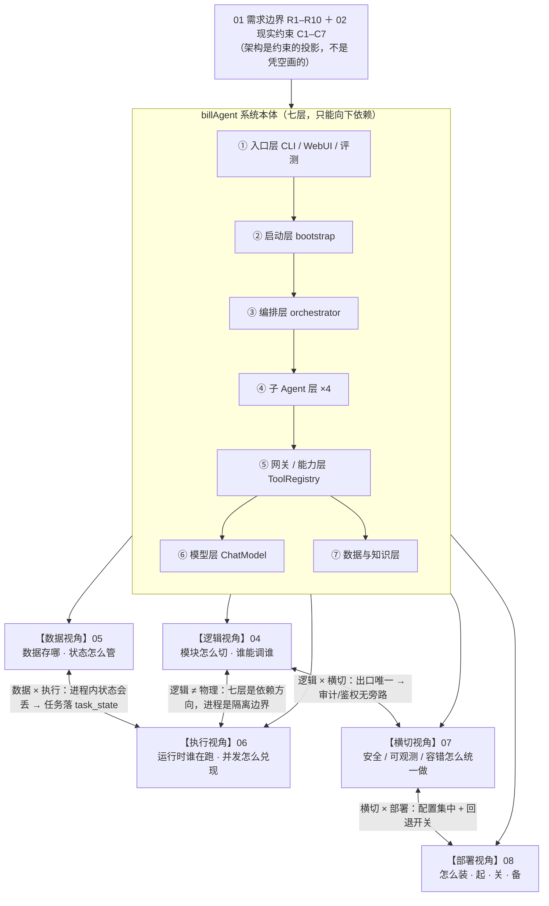

# 03 · 架构总览：视角地图（软件工程 Stage 3 入口）

> 前两篇回答了**要做什么（01）** 与 **用什么技术（02）**。
> 本篇回答：**"架构"到底是一个什么整体？它由哪些视角组成？视角之间怎么互咬？**
>
> 组织主张：工具平台 / 数据记忆 / 模型防幻觉 / 执行并发 **不是五个独立子系统，而是同一个架构从五个视角看过去的样子**。
> 本篇是"地图"：每个视角给**一页总览 + 它回答的问题 + 详情的去向（04–08）**；
> 读完本篇你应能说出：系统**为什么长成七层、数据为什么六类、运行时为什么 1 主进程 + 4 协程 + 3 常驻服务**。
>
> 更新日期：2026-09-04 ｜ 依据索引：每个视角标注权威源（原 `设计/` 章节 + 本系列后续篇）。

---

## 1. 从需求到架构：需求如何"挤出"系统形状

架构不是凭空画的，而是**约束的投影**。01 篇的边界（R1–R10）与 02 篇的现实约束（C1–C7）直接决定了系统宏观形状：

| 需求 / 约束 | 它挤出的架构形状 | 主要在哪个视角生效 |
|---|---|---|
| **R1** 单用户、单机、SQLite | 不需要用户体系、服务端、容器；数据收敛在单机文件系统 | 数据 / 部署 |
| **R4** 数字必须确定性 | 事实数字只从 SQL/数值计算来 → 数据层是"事实唯一源"，LLM 只做表达 → 逻辑上分层隔离 | 逻辑 / 数据 |
| **R5** 本地免费可跑 + 外部可选 | 双通道模型 → 模型层需要"换后端不改业务"的抽象 | 逻辑 / 横切 |
| **R6** 预警不得打扰 | 规则触发式而非轮询 → 账单写入口挂预警检查链 | 逻辑 |
| **R8** 追问最多 3 轮 | 跨轮计数不能放 graph state → 会话级状态容器 | 数据 |
| **R9 / Q6** 用户文档只作参考 | 第 6 类存储（userDocs 文件系统真相源），语义检索与事实数字**物理隔离** | 数据 |
| **R10** 禁止静默失败 | 可观测性前置 → 横切能力（Tracer）从第一天就切入 | 横切 |
| **C1** 单机 + 多 Agent 协作 | worker 是**协程不是进程** | 执行 / 部署 |
| **C2** Agent 级消费 | A2A 按 agent 分队列 | 执行 |
| **C4** 本地 1.8B 能力有限 | 大任务拆小、专业分工（1+4 Agent）、确定性计算兜底 | 逻辑 |

> 依据：`设计/01` §7（R1–R10 / C1–C7 两表）；「各约束怎么投影到架构」的推演贯穿 `设计/03` §9.3.1（各层设计考量）。

**一句话总览**：这是一个**"确定性核心 + 语义外壳"**的系统——
账目/统计/比价/预警等**事实能力**由 SQL 与数值计算保证 100% 确定；
LLM 只承担**意图识别、结构化提取、文案表达**，且输出都要被白名单/规则校验兜底；
为了让"哪些靠计算、哪些靠模型、谁能碰什么"永远不含糊，架构用**七层逻辑 + 六类存储 + 双通道模型 + 横切治理**把它钉死。

---

## 2. 视角地图：一个架构，五个视角

| 视角 | 回答的问题 | 一页总览（本系统答案） | 详情文档 |
|---|---|---|---|
| **1 逻辑视角** | 有哪些模块？怎么分层？模块间接口契约？ | 七层（入口/启动/编排/子Agent/网关/模型/数据知识）；只准向下依赖；工具平台与模型接入是两个关键"能力抽象"模块 | **04** |
| **2 数据视角** | 数据怎么存？状态怎么管？ | 六类存储（生命周期分）；bill.db 7 表；任务状态机 + 幂等键；记忆分长短 | **05** |
| **3 执行视角** | 运行时谁在跑？并发怎么兑现？ | 协程事件驱动；A2A 按 agent 分队列；3 个 MCP 常驻服务；DAG 批量派发 | **06** |
| **4 横切视角** | 安全/可观测/容错/配置怎么统一做？ | 唯一入口自动附加（RBAC/审计/沙箱/Tracer）；错误分类；方案 C 防幻觉 | **07** |
| **5 部署视角** | 交付后怎么跑？备份恢复？ | 单机：1 主进程 + 3 MCP 常驻 + 1 Ollama；`bootstrap_all()` 顺序启动 | **08** |

> 权威视图定义：`设计/00` §2（视图 ≠ 编号）；本系列每篇视角文档头部均有"互引表"标注它依赖谁、输出给谁。

### 2.0 全景图：一个架构，五个视角

> **同一套系统，从五个角度各看一遍**——不是五个子系统。图中央是系统本身（七层），五个视角是观察它的五副眼镜。



### 2.1 一个易混点先钉死：模块间"数据流" vs "数据存储"

- **模块间传什么**（数据契约）→ 属于**逻辑视角**（04，接口设计的一部分）
- **数据存哪、状态怎么管**（存储）→ 属于**数据视角**（05）

二者不可混为一谈：前者跟着模块走，后者跟着存储走（依据 `设计/00` §2 附注）。

### 2.2 三个"跨层组件"怎么不重不漏

| 组件 | 本质 | 在哪讲"它是什么" | 在哪讲"它治理了什么" |
|---|---|---|---|
| ToolRegistry | 逻辑层模块（网关层唯一出口） | 04 逻辑视角 | 07 横切视角（审计/RBAC 无旁路） |
| TaskManager | 任务持久化（Durable） | 05 数据视角（task_state 表 + 状态机） | 07 横切视角（容错/防重投） |
| 方案 C 防幻觉 | 质量属性（确定性优先） | 04 逻辑视角（模型层输出校验） | 07 横切视角（三层防护机制） |

---

## 3. 视角速览 1：逻辑视角（详情见 04）

> 核心问题：**代码按什么边界切成模块？模块之间谁能调用谁？**

### 3.1 七层结构（自上而下）

| 层 | 代表模块 | 职责（做什么） | 明确不做什么（防越界） |
|---|---|---|---|
| **① 入口层** | `main.py`（CLI）、`webUI/app.py`、`evaluation/` | 收用户输入、展示结果 | ❌ 业务逻辑；❌ 会话状态 |
| **② 启动层** | `startup/bootstrap.py` | 一次性装配：DB → RAG/记忆索引 → 注册 Agent → 拉起 worker → 恢复孤儿任务 | ❌ 业务规则；❌ 长周期调度 |
| **③ 编排层** | `agents/orchestrator/`（plan→dispatch⇄wait→collect） | 意图识别、任务规划、DAG 调度、结果汇总（方案 C 白名单校验在此） | ❌ 不直连 DB；❌ 不直调子 Agent 函数 |
| **④ 子 Agent 层** | bill / stat / price / finance | 单一意图端到端执行：解析 → 调工具 → 返回结构化结果 | ❌ 跨意图决策；❌ 持有别家状态 |
| **⑤ 网关/能力层** | `mcpGateway/`（client + 3 server）+ ToolRegistry | **唯一能力出口**：注册/发现/执行/鉴权/审计/计时 | ❌ 业务规则；❌ 业务状态 |
| **⑥ 模型层** | `modelService/`：ChatModel + providers/ + router | 模型统一抽象：能力契约 + 路由 + 重试 + 回退 | ❌ 提示词；❌ 结果校验 |
| **⑦ 数据与知识层** | SQLite / FAISS / pkl / `userDocs/` | 事实唯一来源 + 语义检索 + 用户文档库 | ❌ Agent 不直连（走网关） |

> 权威源：`设计/03` §9.1（全景 mermaid）、§9.2（模块清单）、§9.3.1（分层考量）。功能模块划分 / 1+4 Agent / 一次对话全程见 04。

### 3.2 依赖方向铁律

```
入口 → 启动 → 编排 → 子 Agent → 网关/能力层 → 数据 / 模型
```

- 只能向下调用；向上依赖或跨层直连 = 架构债务（`设计/03` §9.3.1）；
- 实例：编排器曾 9 处直连 DB（D15）——安全与可观测"有后门"的根因，已收口为读事实走网关 `fact:read`（`设计/03` §9.9、`mcpGateway/rbac_config.py`）；
- 价值：**想改数据访问，只有网关一个地方；想查一次请求，只有 Tracer 一条链路**——可演进来自"出口唯一"。

---

## 4. 视角速览 2：数据视角（详情见 05）

> 核心问题：**什么数据存哪里？生命周期多长？怎么保证一致与不丢？**
> 权威源：`设计/04`；本系列 05。

### 4.1 六类存储（生命周期是分视图的第一理由）

| # | 存储 | 内容 | 重启后 |
|---|---|---|---|
| 1 | SQLite `bill.db` | 账单/配置/物价/习惯/调用统计/span | 保留 |
| 2 | FAISS 长期记忆索引（进程内） | 长期记忆向量 | 由 pkl 重建 |
| 3 | pkl 文件 | 长期记忆原文（12 个月滚动裁剪） | 保留 |
| 4 | 进程内状态 | A2A 队列/结果/会话记忆/草稿/OrchState | **丢失**（需任务层兜底） |
| 5 | 日志文件 | 运行/审计日志（7 天轮转） | 保留 |
| 6 | 用户文档库 `userDocs/` | 用户笔记（文件系统真相源，上限 1000 条） | 保留 |

> ⚠️ 第 4 类"进程内状态会丢"不是缺陷，是设计事实——所以 Durable（TaskManager）把**任务状态**落进 SQLite。

### 4.2 一致性策略一句话

单机 + 单写者 + **WAL + `busy_timeout=5000`** 足够（`设计/04` §4.2）；"统计包含本次记账"由 DAG 依赖 + DB 事务双层保证（`设计/03` §9.8.4）。

---

## 5. 视角速览 3：执行视角（详情见 06）

> 核心问题：**进程/线程/协程怎么排？任务怎么流转？并发怎么兑现？**
> 权威源：`设计/05`、`设计/03` §9.8；本系列 06。

### 5.1 执行单位：为什么协程

IO 密集（LLM/DB/HTTP）的协作式任务 → **asyncio 协程**是最低成本解：多进程无隔离必要（T2），多线程有 GIL 与竞态（`设计/05` §1.4）。

### 5.2 运行时四层 + 任务流转

```
1 主进程（CLI 或 WebUI）
├ 事件循环：orchestrator（随请求 ainvoke）+ 4 worker 协程（bill/stat/price/finance，常驻）
├ 线程池：to_thread 卸载同步阻塞（DB 写、embedding）
├ MCP 常驻服务 ×3（独立进程，Streamable HTTP）：sql_bill / llm_base / llm_finance
└ 外部：Ollama 127.0.0.1:11434

orchestrator.plan 拆任务 → dispatch 批量派发本波就绪任务
→ A2A 按 agent 队列分发（事件驱动，无轮询）→ worker 执行（落 task_state）
→ wait_result 用 asyncio.gather 并发等整波 → 依赖就绪再下一波 → collect 汇总
```

依赖 DAG：`bill ∥ stat ∥ price → finance`；实测第二波 `stat ∥ price` 墙钟 10.2s → 7.6s（`设计/08` §5.2 M6）。

---

## 6. 视角速览 4：横切视角（详情见 07）

> 核心问题：**安全/可观测/容错/配置这些"每层都要"的能力，怎么统一做而不散落？**
> 权威源：`设计/06`；本系列 07。

| 横切能力 | 统一做法 | 切入位置 |
|---|---|---|
| 鉴权 RBAC | 枚举最小权限 + 工具级过滤 + 双层校验 | Registry（发现时 + 执行时） |
| SQL 注入 | 参数化 + 白名单下沉 ToolSpec | 网关层 |
| 审计 | 所有工具必经 Registry.invoke → 审计自动生效（无旁路） | Registry |
| 可观测 | Tracer span 树 + `llm_call_stat` + `trace_span` 表 | 3 个固定埋点 |
| 容错 | 错误分类（可重试/不可重试）→ 统一预算池 → 幂等才可重试 | 工具执行层 + 模型层 |
| 防幻觉 | 方案 C 三层：白名单校验 → 修正重试 → 回退本地渲染 | 编排层汇总 + 模型层 |
| 沙箱 | 子进程资源限制 + 危险工具前缀白名单 | 网关层 |
| 配置 | `config/config.py` 集中 + 启动自检 + 密钥环境变量 | 启动层 |

> **设计原则**：横切能力由"唯一入口"自动附加——业务代码不写"先鉴权再调用"，而是**架构保证你绕不过去**（`设计/06` §1）。

---

## 7. 视角速览 5：部署视角（详情见 08）

> 核心问题：**这套系统交付后怎么跑起来、怎么关、怎么备份？**
> 权威源：`设计/07`；本系列 08。

**单机部署：1 主进程 + 3 个 MCP 常驻服务 + 1 个本地 Ollama，零外部中间件。**

| 项 | 事实 | 依据 |
|---|---|---|
| 启动 | `bootstrap_all()`：DB → 记忆索引 → A2A → 注册 Agent → worker → MCP 常驻拉起（含健康检查） | `startup/bootstrap.py`、`设计/07` §3.2 |
| 关闭 | `shutdown_system()` 优雅关闭：先停 worker/MCP，防孤儿进程 | `设计/07` §3.3 |
| 备份 | bill.db（+WAL/SHM）、userDocs/、ragKnowledge/*.pkl、logs 可选 | `设计/07` §5.1 |
| 回滚开关 | `BILLAGENT_MCP_STDIO=1` 可回退 stdio 短连接模式 | `设计/07` §1 |

---

## 8. 五个视角怎么咬合成一个系统（关键认知）

| 问题 | 答案 | 视角间关系 |
|---|---|---|
| 逻辑七层 ≠ 物理四进程？ | **是的**。分层是"代码依赖方向"，进程是"运行时隔离边界" | 逻辑 × 执行 |
| 为什么 Agent 必须走网关？ | 保证**审计/鉴权/计时无旁路**——横切靠"唯一出口"成立 | 逻辑 × 横切 |
| 为什么任务要落 `task_state` 表？ | 进程内状态会丢（§4.1 第 4 类），但任务必须可恢复 | 数据 × 执行 |
| 为什么 finance 最特殊？ | 同时依赖：确定性数字、用户文档参考、LLM 表达 + 白名单校验 | 全视角交汇 |
| 部署最小可跑？ | Python venv + Ollama + bill.db → `main.py`；WebUI/外部模型都是可选 | 部署 × 横切（配置） |

> **掌握本系统的捷径**：先记七层依赖铁律（§3.2）与六类存储生命周期（§4.1），再补"运行时 4 协程 + 3 常驻"（§5.2）——三张图在手，04–08 每篇都只是往里填细节。

---

## 9. 与后续各篇的映射（读到这里该往哪走）

| 本系列篇 | 展开的是哪个视角 | 你将看到 |
|---|---|---|
| **04** 逻辑视角（产品功能模块） | 视角 1 | 功能→模块划分、1+4 Agent、一次对话、工具平台与模型接入的接口落地 |
| **05** 数据视角 | 视角 2 | 六类存储/表/状态机/记忆/userDocs/一致性的接口与约束 |
| **06** 执行视角 | 视角 3 | 协程/事件驱动/常驻 MCP/批量派发/生命周期 |
| **07** 横切视角 | 视角 4 | RBAC/沙箱/审计/可观测/容错/防幻觉/配置 |
| **08** 部署视角 | 视角 5 | 部署形态/启动关闭/备份恢复/运维排障 |

> 下一篇（04）：开始看**第一个视角**——产品功能模块：系统提供哪些功能、由哪些 Agent/模块承载、一次对话怎么走完全程。

---

## 10. 修订记录

| 日期 | 变更 |
|---|---|
| 2026-09-04 | 体系重构：由旧「03_架构总览_五视图」改造为「视角地图」，五视角详情独立成 04–08，本文只留一页总览 + 互引 |
| 2026-09-06 | 补 §2.0「全景图：一个架构，五个视角」Mermaid 图 1 张（此前本篇及各视角篇均无架构图，图在体系重构时遗漏） |
