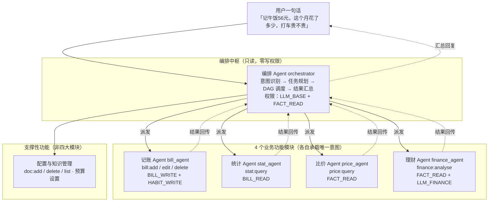
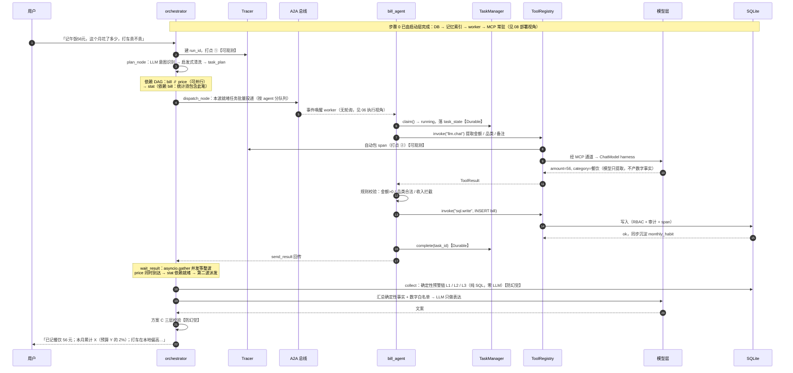
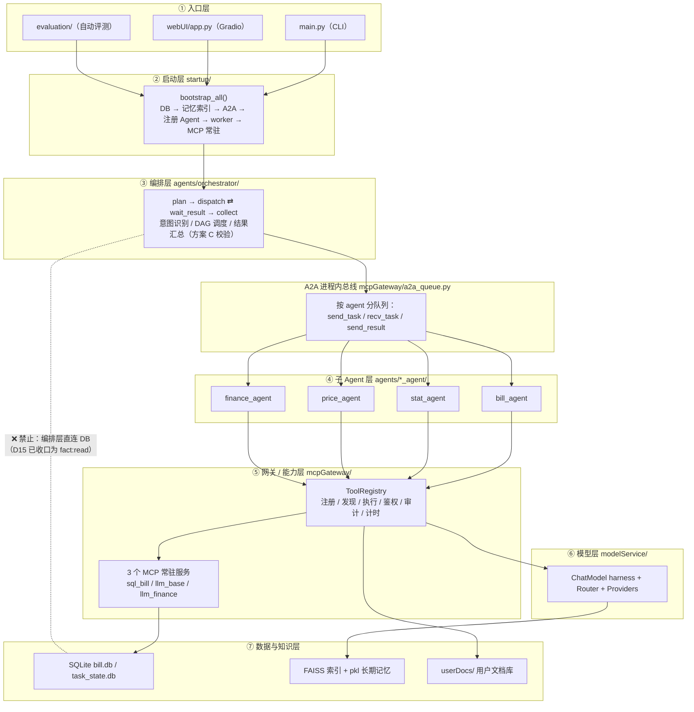
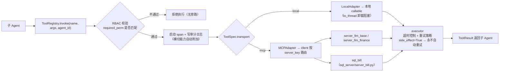
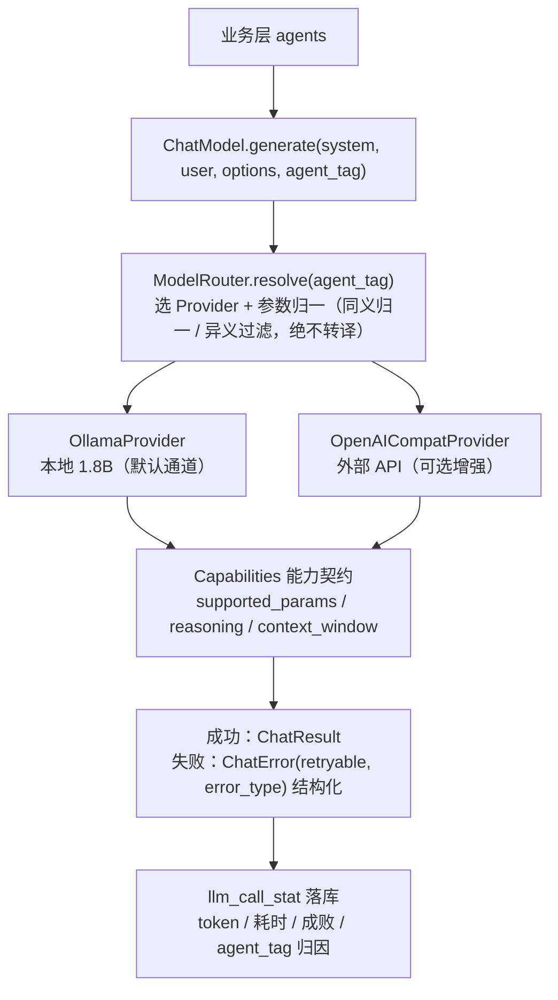
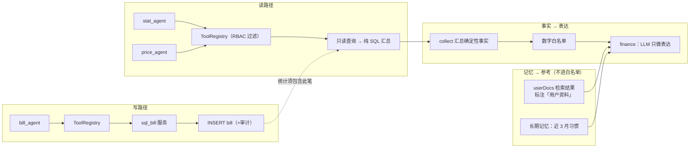

# 04 · 架构视角 1：逻辑视角（产品功能模块）

> 本文展开架构的第一个视角：**系统提供哪些功能 → 这些功能由哪些模块/Agent 承载 → 模块之间按什么规则协作（分层与依赖铁律）→ 关键模块的接口落地设计**。
>
> 这是全系列最"像架构文档"的一篇：从**产品功能模块**出发，而不是从技术组件出发。
>
> 互引表：本篇依赖 01（需求边界）/02（T1/T3/T11 取舍）/03（全景）；
> 输出给 05（本视角各模块的"数据长什么样"）、06（A2A/派发的执行细节）、07（工具唯一入口带来的安全横切）、09（接口契约全量）。
>
> 依据：模块清单/分层见 `设计/03_逻辑架构.md` §2/§9.1–9.3；时序见 §1.2/§9.7；工具平台实施设计见 `设计/08` 第 1 章；模型接入 harness 见 `设计/08` 第 8 章；接口契约权威在 `设计_从零系列/09_模块契约手册.md`（§1–§9 按模块小组逐模块给出）。
>
> 更新日期：2026-09-04

---

## 1. 产品功能模块：先按"用户要什么"切一遍

### 1.1 功能模块矩阵（用户要什么 → 谁来做）

从 01 篇的能力矩阵出发，系统有 **8 种能力意图**，它们按"用户要什么"收敛为 **4 个业务功能模块**：

| 产品功能模块 | 包含意图 | 一句话职责 | 数字来源 |
|---|---|---|---|
| **记账模块** | `bill:add/edit/delete` | 把一句话变成一条账（解析→校验→落库） | 全确定性 |
| **统计模块** | `stat:query` | 把账变成"数"（SQL 汇总/同比环比） | 纯 SQL |
| **比价模块** | `price:query` | 把一笔账放回城市均价里看贵不贵 | 纯数值 |
| **理财模块** | `finance:analyse` | 综合全部事实给建议（含用户资料参考） | 事实确定，表达 LLM |

配置与知识管理（`doc:add/delete/list`、预算设置）是**支撑性功能**：配置落 `user_config`，知识走用户文档库（05 数据视角）。

> 依据：`设计/01` §3.1（能力矩阵 8 意图）；意图→模块映射贯穿 `设计/03` §9.2 模块清单。

### 1.2 为什么是"4 个业务模块 + 1 个编排"，而不是一个超大 Agent？

| 方案 | 问题 | 结论 |
|---|---|---|
| 一个 Agent 一条提示词干完 | 提示词巨大、意图边界模糊，小模型易漏任务/脑补任务（实证 `设计/09` §1.1）；记账格式校验与统计 SQL 正确性混在一起，失败无法归因 | ❌ |
| 每个意图一个 Agent | 通信拓扑复杂度**正比于 Agent 数**；跨 Agent 状态同步成本高 | ❌ |
| **1 编排 + 4 子 Agent** | 编排管"怎么拆、怎么收口"，子 Agent 管"怎么干"；职责内聚、失败隔离、可替换、可单独测试 | ✅ |

> 依据：`设计/03` §9.3.1（子 Agent 层设计考量）；职责内聚/失败隔离/可测试性收益见 `设计/09`（L3 分维度评测）。

### 1.3 功能模块 → Agent 承载（职责分配表）

| Agent | 目录 | 承载的功能模块 | 职责 | 权限（最小化） |
|---|---|---|---|---|
| 编排 Agent | `agents/orchestrator/` | 全部（调度中枢） | 意图识别/任务规划/DAG 调度/结果汇总 | `LLM_BASE` + `FACT_READ`（零写） |
| 记账 Agent | `agents/bill_agent/` | 记账模块 | 记账/改账/删账解析与落库 | `BILL_WRITE` + `HABIT_WRITE` |
| 统计 Agent | `agents/stat_agent/` | 统计模块 | 查询→汇总→文本 | `BILL_READ` |
| 比价 Agent | `agents/price_agent/` | 比价模块 | 均价→溢价率 | `FACT_READ` |
| 理财 Agent | `agents/finance_agent/` | 理财模块 | 综合事实→建议 | `FACT_READ` + `LLM_FINANCE` |

> 依据：`mcpGateway/rbac_config.py`（AGENT_PERMISSION_MAP）；`设计/08` §5.2 M9 行（权限收口）。
> 权限语义：**写操作只在有职责的子 Agent**，编排器只有只读事实权限（防 D15 类后门）。

### 1.4 功能模块 → Agent 承载全景图

> 看懂这张图就抓住了逻辑视角的一半：**一个中枢负责"怎么拆、怎么收口"，四个子 Agent 各自只干一件事**。



> 图例：实线 = 任务派发（向下），虚线 = 结果回传（向上）。**编排器与子 Agent 之间是"派发—回传"，不是直接函数调用**（物理上走 A2A 总线，见 06 执行视角）。

---

## 2. 一次对话怎么走完全程（功能模块协作的"主线剧情"）

> 时序权威源：`设计/03` §9.7（目标架构）。此处为文字版，**标注了每步撞上的横切能力**（说明这些不是事后补丁）。



> 横切能力在旅程中的位置：可观测（步骤 1/7/11 打点）、Durable（步骤 4/8）、防幻觉（步骤 10/11）——
> **这三件事从零就该内置**，原项目正是缺失它们攒出 D1–D17 大半（`设计/02`）。

### 2.1 追问治理（Q5 的落点）

- 子 Agent 信息不足 → 返回 `need_more_info` + 追问文案；
- collect_node 向用户追问，**最多 3 轮**（R8），计数在**会话级** `ShortSessionMemory`（graph state 每次 ainvoke 重建，放不下跨轮计数——T9）；
- 超限 → 清草稿 + 返回"信息不全，执行失败，请重新来"。

> 依据：`设计/01` §3.4/§8 Q5；`设计/03` §9.4 ①。

---

## 3. 模块怎么切（纵向）：七层 + 一条依赖铁律

> 产品功能模块回答"做什么"；纵向分层回答"**代码放哪、谁能调谁**"。两者正交，都必须画清楚。
> 权威源：`设计/03` §9.1–9.3。

### 3.1 七层结构

| 层 | 代表模块 | 职责（做什么） | 明确不做什么 |
|---|---|---|---|
| ① 入口层 | `main.py`（CLI）、`webUI/app.py`、`evaluation/` | 收用户输入、展示结果 | ❌ 业务逻辑、会话状态 |
| ② 启动层 | `startup/bootstrap.py` | 一次性装配：DB→RAG→Agent→worker→MCP 常驻→孤儿恢复 | ❌ 业务规则、长周期调度 |
| ③ 编排层 | `agents/orchestrator/`（plan/dispatch/wait/collect） | 意图识别、任务规划、DAG 调度、结果汇总 | ❌ 直连 DB（D15 已收口）、❌ 直调子 Agent 函数 |
| ④ 子 Agent 层 | bill/stat/price/finance | 单一意图端到端执行 | ❌ 跨意图决策、持有别家状态 |
| ⑤ 网关/能力层 | `mcpGateway/` client+3 server、ToolRegistry | **唯一能力出口**：注册/发现/执行/鉴权/审计/计时 | ❌ 业务规则、业务状态 |
| ⑥ 模型层 | `modelService/` ChatModel+providers+router | 模型统一抽象：能力契约+路由+重试+回退 | ❌ 提示词、结果校验、参数转译 |
| ⑦ 数据与知识层 | SQLite/FAISS/pkl/`userDocs/` | 事实唯一来源 + 语义检索 + 用户文档库 | ❌ Agent 不直连（走网关） |

### 3.2 七层分层与依赖铁律（全架构最重要的一张图）

> 实线 = 允许的调用方向（**只能向下**）；虚线 = 明令禁止的越界。



一句话铁律：

```
入口 → 启动 → 编排 → 子 Agent → 网关/能力层 → 数据 / 模型
```

- **只能向下调用**；向上依赖或跨层直连 = 架构债务（`设计/03` §9.3.1）；
- 反面实例：编排器曾 9 处直连 `db.`（D15）→ 安全与可观测有后门，已收口为读事实走网关 `fact:read`（`设计/03` §9.9）；
- 正面价值：想改数据访问方式只有网关一个地方；想查一次请求只有 Tracer 一条链路——**可演进性来自"出口唯一"**。

---

## 4. 关键模块接口落地 ①：工具接入平台（网关层）

> 为什么需要：Agent 要能力（LLM/SQL/本地计算）。最朴素做法是直接 import 函数调用——
> 结果鉴权/审计/计时到处手写（D1）、加能力要改调用方、权限无法收口（D15）、审计有旁路。
> **根因：工具被当成"调用点"而不是"可管理资产"**（`设计/02` §4.3）。
> 实施级方案：`设计/08` 第 1 章；代码落点：`mcpGateway/`（tool_model.py / registry.py / executor.py / adapters.py / client.py）。

### 4.1 五块结构 + 核心接口

| 块 | 文件 | 职责 | 核心接口 |
|---|---|---|---|
| ① 工具统一模型 | `tool_model.py` | 声明工具"是什么" | `ToolSpec`（见下） |
| ② 注册层 | `registry.py` | 工具资产的注册中心 | `ToolRegistry.register(spec)` / `.invoke(name, args, agent_id)` |
| ③ 发现层 | （registry 内） | 按 RBAC 过滤，返回某 Agent 可见工具 | `registry.list_tools(agent_id) -> list[ToolSpec]` |
| ④ 执行引擎 | `executor.py` | 执行 + 超时 + 审计 + span 计时 | `invoke(name, args, agent_id) -> ToolResult` |
| ⑤ 协议适配层 | `adapters.py` | transport 归一：local / mcp | `LocalAdapter` / `MCPAdapter`（按 `ToolSpec.transport` 路由） |

**ToolSpec（工具资产的关键字段，接口落地核心）**：

```python
ToolSpec(
    name="sql.write",                  # 全局唯一，点分命名（sql.read / sql.write / llm.chat …）
    description="写入账单数据库…",      # ★给 LLM 看，决定它选不选这个工具
    params_schema={...},               # JSON Schema：参数校验 + LLM 可见性
    required_perm=DBPerm.BILL_WRITE,   # RBAC 所需权限（None=公开）；枚举见 rbac_config.py
    side_effect=True,                  # 有写副作用 → 前置审计 + ★永不自动重试（防重复记账）
    idempotent=False,                  # 语义标注（是否天然幂等）
    timeout=30.0,                      # 单次调用超时（config 集中配置）
    max_retry=0,                       # 引擎层自动重试上限（side_effect=True 必须 0）
    protocol="mcp",                    # "mcp" / "local"
    binding={"server_key": "sql_bill", "tool": "exec_sql"},  # mcp：绑定目标
    # local 工具：binding={"func": <callable>, "to_thread": True}
)
```

> 依据：`mcpGateway/tool_model.py`（字段语义以代码注释为准）；权限枚举 `mcpGateway/rbac_config.py`。
> 红线（tool_model.py 头注）：任何层不允许"MCP 特判/本地特判"——**统一模型不存在，工具平台就不成立**。

### 4.2 为什么注册制自动带来"四件套"

工具元数据一次性声明，基础设施按元数据自动附加：**鉴权**（required_perm → 发现时过滤 + 执行时二次校验）、**审计**（执行必经 registry → 写审计日志，无旁路）、**计时**（执行包 span）、**文档**（name+schema 即工具文档）。（`设计/03` §八 T1）

### 4.3 一次工具调用的执行路径



> 关键点：`client.py` 对外只剩内部 `_call_server`，不再暴露手写 3 方法（防双入口绕过审计，`设计/03` §9.4 ②）；RBAC 双层（发现时 + 执行时）防"知道工具名就硬调"（矩阵权威见 `设计_从零系列/09` §4.3）。

---

## 5. 关键模块接口落地 ②：模型接入 harness（模型层）

> 大前提：**LLM 不是"算账的"，是"表达和拆解的"**（见 07 横切视角的确定性分工）。本模块负责把"表达"这条通道做好——双通道 + 统一抽象。
> 取舍：T11（标准 harness）；实施设计：`设计/08` 第 8 章；代码：`modelService/`。

### 5.1 没有统一接入层的教训（为什么抽象是刚需）

- 本地参数 `num_predict`（软约束）与外部参数 `max_tokens`（硬上限、含 reasoning 消耗）**语义不同**——曾直接透传，导致推理模型 reasoning 吃满预算、`content` 空串、连续重试烧 token（`设计/01` §8.1 T4 载明 M1 实测事故）；
- "换模型就崩"：参数语义靠"程序员记得"而非"结构保证"。

### 5.2 ChatModel harness 结构与接口



接口落地要点：

1. **能力契约 `Capabilities`**：每个 Provider 声明 `supported_params / reasoning / context_window`——适配行为由契约定义，不靠人记；
2. **参数绝不转译**：同义归一、异义过滤并告警（绝不把 `num_predict` 当 `max_tokens`）；
3. **路由集中**：换模型 = 换 Provider + 声明 Capabilities，业务层不感知；
4. **错误结构化**：抛 `ChatError(retryable, error_type)`，不再返回"错误字符串"让上层猜；
5. **兼容层**：`llm_loader.py` 保留 `ollama_base_call`/`external_llm_call` 签名内部转调 Router——~40 处按名 patch 的测试不能击穿（C5）。

> 依据：`设计/03` §八 T11；`设计/08` 第 8 章（D17 harness：四层结构/能力契约/Provider/Router）；`设计/01` §8.1 T4（参数分层已落地）。
> 通道路由开关：`EXTERNAL_LLM_ENABLED` 自动推导、`BILLAGENT_FORCE_EXTERNAL=1`、`BILLAGENT_DISABLE_LOCAL_LLM=1`（配置见 config/README）。

---

## 6. 模块间数据流契约（逻辑视角收尾：谁给谁传什么）

> 完整字段权威在 `设计_从零系列/09_模块契约手册.md`（§1–§9 按模块小组给出）。此处只给"流向"不复制字段。



> 依据：`设计/03` §9.9（工具收回方案）；`设计/04` §5（数据契约）。
> 数据流契约（模块间传什么）属于逻辑视角；数据**存储**（存哪、怎么管）属于数据视角（05）——见 03 §2.1 的易混点。

---

## 7. 小结

1. **产品功能模块 = 记账/统计/比价/理财 + 配置/知识支撑**，由 **1 编排 + 4 子 Agent** 承载；
2. 一次对话旅程是"plan→dispatch→wait→collect"，其中 trace / task_state / 防幻觉**从第一步就在场**；
3. 纵向七层 + 依赖铁律：只能向下，出口唯一——这是安全/可观测能成立的物理前提；
4. 两个关键"能力抽象"模块接口落地：**工具平台（ToolSpec+Registry）** 与 **模型接入（ChatModel harness）**；
5. 每个模块的接口签名细节查 **09 模块契约手册**（本系列不复制正文，防双份维护）。

> 下一篇（05 数据视角）：逻辑层各模块要"装数据"——**六类存储、表结构、任务状态机、记忆分层、用户文档库**。

---

## 8. 修订记录

| 日期 | 变更 |
|---|---|
| 2026-09-04 | 体系重构：由旧「04 Agent体系与一次对话 + 05 工具接入平台 + 07 模型接入与防幻觉」合并重组为「逻辑视角」；防幻觉机制细节移入 07 横切视角；接口落地仅列核心签名，全量指 09 契约手册 |
| 2026-09-06 | 补齐架构图 6 张（Mermaid）：§1.4 功能模块→Agent 承载全景、§2 一次对话时序图、§3.2 七层分层与依赖铁律、§4.3 工具调用链路、§5.2 模型 harness 结构、§6 模块间数据流；原 ASCII 字符画全部替换为图 |
