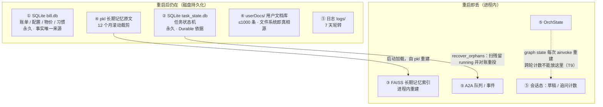
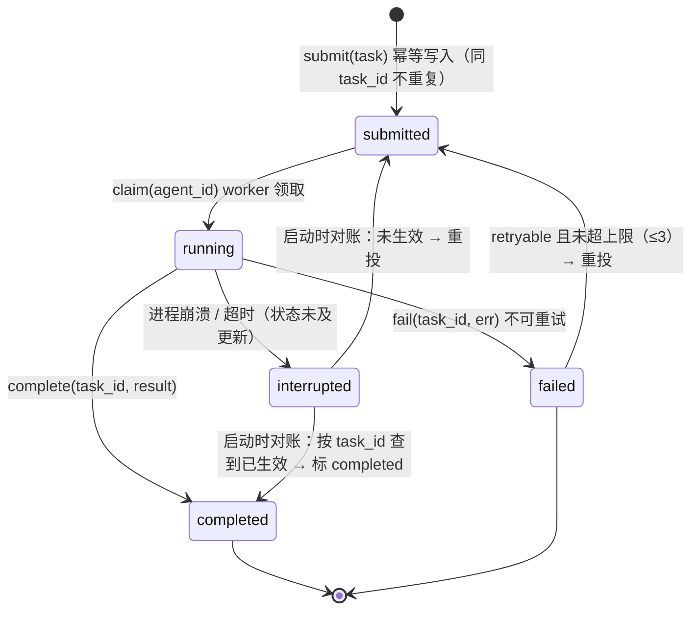
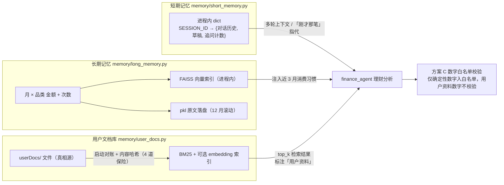

# 05 · 架构视角 2：数据视角

> 本文展开架构的第二个视角：**数据怎么存、状态怎么管、记忆怎么分层、并发写怎么保证一致**。
> 一句话总览：**系统不是"一个数据库"，而是"六类存储"并存，生命周期各不相同**（`设计/04` §1）。
>
> 互引表：本篇依赖 01（R4 数字确定性 / R8 追问计数 / R9 用户文档）与 04（各模块需要哪些数据）；
> 输出给 06（任务状态机的执行语义）、07（Durable 容错 / 可观测表）、09（State/表字段契约权威）。
>
> 依据：旧版叙事见 `设计/04_数据架构.md`（改造期决策追溯）；**表/DDL 权威见 `设计_从零系列/09_模块契约手册.md` §8**；State 字段权威见 09 §1.3/§2.2/§7；代码 `database/`、`memory/`、`startup/task_manager.py`。
>
> 更新日期：2026-09-04

---

## 1. 六类存储全景（生命周期是第一视角）

| # | 存储 | 持久化 | 生命周期 | 承载什么 |
|---|---|---|---|---|
| 1 | **SQLite `bill.db`** | 磁盘 | 永久 | 账单/配置/物价/习惯（确定性事实层） |
| 2 | **SQLite `task_state.db`** | 磁盘 | 永久 | 任务状态机（Durable Execution） |
| 3 | **FAISS 索引（长期记忆）** | 内存重建 | 进程内 | 历史记忆的向量检索 |
| 4 | **pkl 文件（长期记忆原文）** | 磁盘 | 12 个月滚动 | `_long_mem_texts` 原文 |
| 5 | **进程内状态** | 内存 | 单次运行 | A2A 队列/事件/会话 dict/草稿/OrchState |
| 6 | **`userDocs/` 用户文档库** | 磁盘 | 用户控制（≤1000） | 个性化知识（文件系统=真相源） |

> 依据：`设计/04` §1.1 存储全景表。
> ⚠️ 为什么强调生命周期：**"重启即丢"与"永久"的边界在哪，决定了 Durable/幂等设计**——第 5 类进程内状态丢失，正是原 D2/D5 两条缺陷的根因（`设计/02`）。

### 1.1 六类存储全景图（按"重启后还在不在"分组）

> 分视图的第一刀不是"存在哪种介质"，而是**生命周期**——它直接决定哪些数据必须额外设计兜底。

---

## 2. 业务库 bill.db 的表（确定性事实层）

| 表 | 作用 | 关键约束 |
|---|---|---|
| `bill` | 账单主表 | `CHECK(amount>0)`（仅支出）；五分类 CHECK 硬编码；`task_id`（幂等键） |
| `user_config` | 用户配置 | 城市/月预算/消费模式/品类预算/提醒偏好；`budget_type` 收敛为仅 `month` |
| `city_price` | 城市×品类均价基准 | 比价事实源（白名单） |
| `monthly_habit` | 月×品类习惯累计 | 金额+次数，供推算/预警 |
| `llm_call_stat` | LLM 调用统计 | token/耗时/成败/`agent_tag` 归因（可观测，见 07） |
| `trace_span` | trace span 树 | run_id/parent/耗时（可观测，见 07） |
| `task_state` | 任务状态机（独立 `task_state.db`） | `submitted/running/completed/failed/interrupted` |

> 依据：`设计/04` §2（各表字段明细）与 §2.6（新增表）；`database/init_db.py`。
> ⚠️ 曾有 `analysis` 死表（零调用），后清理——教训：**表必须有真实读写方**（`设计/04` §2.2）。

### 2.1 为什么"数字"一定落在这几张表（而不是靠 LLM）

- **R4**：回复里的数字必须 100% 来自确定性计算；
- 统计 SUM、比价差值、预算进度 = SQL/数值计算；
- LLM 从不直接写这些数字——它只负责"读这些数字并表达"（方案 C，见 07 横切视角）。

> 依据：`设计/01` R4/§6；`设计/03` §9.3.1（数据与知识层：确定性优先）。

---

## 3. 任务状态机与幂等（Durable Execution 的数据侧）

### 3.1 为什么需要（从零想一遍）

场景：用户说"记午饭56元"，进程**在写库后、回复前崩溃**：
- 没状态记录：重启后这笔账记没记？重跑 → 重复记账（脏数据）；不跑 → 丢账。
- 有状态记录：重启后查任务状态 → 已 `completed` 不再重做；还 `running` → 恢复/重投。

> 要求：任务生命周期有持久化状态 + 每个任务有幂等键（`task_id`）。

### 3.2 状态机（`startup/task_manager.py` + `task_state.db`）

> 状态机关键：**`interrupted` 不是终态**——它靠 `recover_orphans()` 按 `task_id` 对账后分流到 `completed` 或 `submitted`，这就是"崩了不丢、重投不重"的全部秘密。

| 操作 | 语义 |
|---|---|
| `submit(task) -> task_id` | 幂等写库（同 task_id 不重复） |
| `claim(agent_id)` | worker 领取 → running |
| `complete(task_id, result)` | 终态 completed |
| `fail(task_id, err)` | 失败（`retryable` 决定是否重投，上限 3） |
| `recover_orphans()` | 启动时扫描残留 running → 按 task_id 对账：已记账→completed，未完成→重投 |

### 3.3 幂等怎么保证

- **幂等键 = `task_id`**：创建时生成（规则 `t{ms}{hex3}`），bill 表写入带 `task_id`；
- 重投检查：同 `task_id` 已 completed → 不再执行；
- `bill.task_id` 由**代码层写入**（不依赖 LLM 生成）。

> 依据：`设计/04` §3.1（状态机）/§3.2（幂等键）/§3.3（副作用记录）；代码 `startup/task_manager.py`。
> M5 实测：kill -9 重启恢复、重复投递无重复记账（`设计/08` §5.2 M5 行）。

---

## 4. 会话态（草稿/追问计数）存在哪

- 追问计数、半成品草稿（bill_add/edit/delete）放**会话级** `ShortSessionMemory`；
- **不放 graph state**：graph state 每次 `ainvoke` 重建，跨轮次必丢（T9，`设计/03` §八）；
- 追问上限 3 轮（R8）；超限清草稿。
- ⚠️ 进程内会话态重启仍会丢——P2 方向是迁 Redis+TTL（T4 决策 B），当前单机单用户可接受（R1）。

> 依据：`设计/03` §9.4 ①（追问治理）；`设计/04` §3.4（会话态）；`memory/short_memory.py`。

---

## 5. 记忆分层：短期 + 长期

### 5.1 分层原则（红线 4）

> 记忆分两层：**短期随会话、长期跨会话**（`设计/00` §1.1 红线 4）。

### 5.2 短期记忆 `memory/short_memory.py`

- 进程内 dict：`SESSION_ID -> {对话历史, 草稿缓存}`；
- 用途：多轮上下文、"刚才那笔"指代、追问计数。

### 5.3 长期记忆 `memory/long_memory.py`

- 记录**消费习惯**（需求 3）：月×品类金额+次数；
- 存储：FAISS 索引（语义检索）+ pkl 原文落盘（`ragKnowledge/long_consume_mem.pkl`），**12 个月滚动清理**；
- 使用：finance 分析时注入"近 3 月习惯"（`_load_recent_habits(3)`）做推算依据。

> 依据：`设计/01` §4 需求 3；`设计/04` §1（长期记忆存储细节）；代码 `memory/long_memory.py`。
> 为什么长期记忆只沉淀"月×品类"——01 篇边界已锁定：不做跨会话复杂状态（`设计/01` §5）。

---

## 6. 用户文档库（第 6 类存储，个性化知识）

### 6.1 定位

> `userDocs/` = 用户自己的笔记 = 确定性事实（`city_price` 表）覆盖不到的**生活场景知识**。
> 它是 RAG 的**唯一知识源**（M8 起），不是"系统内置规则库"。

### 6.2 实现要点（`memory/user_docs.py`）

| 机制 | 说明 |
|---|---|
| 文件系统 = 真相源 | 用户直接改文件夹，或对话指令（doc:add/delete/list） |
| 索引自动对齐 | 启动对账 + 内容哈希对账 + 增删改即时更新（4 道保险） |
| 检索 | 内嵌 `_BM25`（k1=1.5/b=0.75）+ embedding 可选；embedding 不可用自动降级 BM25-only |
| 上限 | 1000 条 |
| 使用方 | finance 分析时检索 top_k → 注入 prompt，标注「用户资料」 |

> 依据：`设计/01` §3.5（需求）；`设计/04` §3.5（存储设计）；`设计/08` §5.2 M8 行；代码 `memory/user_docs.py`。

### 6.2.1 记忆分层与知识检索全景图

> 一张图看清**两层记忆 + 一个文档库**分别往 `finance_agent` 里灌什么，以及为什么后者**不进数字白名单**。

> 为什么 RAG 唯一入口是 user_docs：内置"理财规则 10 条"本是参数/规则，被确定性层接管清理（T7/T8，`设计/03` §八）——**规则不该装在 RAG 里，用户笔记才该走 RAG**。

### 6.3 与确定性事实的边界（R9）

| | 确定性事实（表） | 用户文档 |
|---|---|---|
| 是否进数字白名单 | ✅ 是 | ❌ 否 |
| 冲突时谁赢 | ✅ 确定性 | 输（但需向用户说明） |
| 谁来用 | 所有计算 | finance 参考输入 |

> 依据：`设计/01` R9/§3.5；`设计/04` §3.5.3。

---

## 7. 一致性：SQLite 怎么扛住并发（先说清"到底是谁在并发"）

### 7.0 澄清：业务账单表**不存在**多 Agent 抢写

按 RBAC 最小权限（`mcpGateway/rbac_config.py`）：

| Agent | 权限 |
|---|---|
| orchestrator | `LLM_BASE` + `FACT_READ`（**零写权限**） |
| bill_agent | `BILL_READ` + **`BILL_WRITE`** + `HABIT_WRITE` |
| stat / price / finance | `BILL_READ`（只读） |

即**只有 `bill_agent` 能写账单**，"多个 Agent 并发修改同一条账单"这个场景在设计上就不允许发生（权限层已拦死）。

那本节说的并发是什么？是下面三类，与"业务写"无关：

| # | 并发类型 | 谁和谁 | 典型场景 |
|---|---|---|---|
| ① | **横切写入**（真·写写并发） | 5 个 Agent 都在写 `llm_call_stat` / `trace_span`，TaskManager 写 `task_state` | 记账与比价并行执行，各自记录 LLM 调用统计与 span |
| ② | **读写并发** | `bill_agent` 写 `bill` ↔ `stat_agent` 读 `bill` | 并行派发后：一边记账落库，一边统计查询 |
| ③ | **跨进程** | 主进程 ↔ 3 个 MCP 常驻服务进程 | 常驻化后，服务进程与主进程打开同一个库文件 |

> ① 是真并发写——这也是 **`task_state` 独立成库**的原因：状态流转每次都要写，与业务库同库会争抢写锁（`startup/task_manager.py` 注释）。
> ②③ 才是 WAL 的主要价值：**读不阻塞写**——SQLite 默认 journal 模式下读写互斥，写事务会撞上 `database is locked`。

### 7.1 约束与演进

- 单 SQLite 文件 + 多协程/多进程并发访问（上述 ①②③）→ `database is locked` 风险；
- 解法定案（M3.5）：**WAL 模式 + `busy_timeout=5000`**；
- 全局 `db_lock`（asyncio.Lock）降级为**只包写事务**；同步 `time.sleep` 删除（防冻结事件循环，执行视角细说）。

### 7.2 为什么 WAL 够用

- WAL 允许**读不阻塞写**（统计读与记账写可并发）；
- `busy_timeout` 让写冲突**等待而非立刻报错**；
- 单机单用户场景（R1）写入频率低，WAL 已足够——不需要外部数据库。

> 依据：`设计/04` §4.2/§4.3（WAL 与并发写策略，M3.5 已落地）；`设计/08` §5.2 M3.5 行。
> ⚠️ 常驻 server 子进程内的连接仍需 `busy_timeout`/线程安全连接（`设计/04` §4.3 注）。

---

## 8. 数据契约（模块间传什么，一句话）

| 契约 | 载体 | 说明 |
|---|---|---|
| A2A 消息 | 消息 dict | task 投递/结果回传（含 task_id/agent/run_id） |
| OrchState | 编排 graph state | 一次运行的共享状态（非跨轮） |
| ToolSpec/ToolResult | 工具调用 | 工具入参出参（见 04 逻辑视角） |

> 完整字段见 09 模块契约手册（本系列不复制，避免双份维护）。

---

## 9. 小结

1. 六类存储各管一段生命周期——**"重启丢不丢"要一清二楚**；
2. 业务事实 = SQLite 几张表，数字只从这里来（R4）；
3. 任务 = 持久化状态机 + `task_id` 幂等 → 崩溃不丢、重投不重（Durable）；
4. 记忆 = 短期（会话 dict）+ 长期（FAISS+pkl 习惯）两层；
5. 知识 = `userDocs` 用户文档库（RAG 唯一入口），是参考不是事实；
6. 并发写 = WAL + busy_timeout，够用且零依赖。

> 下一篇（06 执行视角）：数据与任务状态就位后，回答**运行时怎么跑——协程/事件驱动/A2A/常驻 MCP/批量派发**。

---

## 10. 修订记录

| 日期 | 变更 |
|---|---|
| 2026-09-04 | 体系重构：由旧「06 数据状态与记忆」重组为「架构视角 2 数据视角」，头部加互引表，引用编号同步新体系 |
| 2026-09-06 | 补齐架构图 3 张（Mermaid）：§1.1 六类存储全景（按生命周期分组）、§3.2 任务状态机（stateDiagram，含 interrupted 对账分流）、§6.2.1 记忆分层与知识检索全景 |
| 2026-09-06 | 勘误 §7：原「并发写」表述误导——业务表按 RBAC 仅 `bill_agent` 可写，不存在多 Agent 抢写账单；新增 §7.0 澄清真正的三类并发：①横切写入（llm_call_stat/trace_span/task_state，5 个 Agent 都在写）②读写并发（记账写 ↔ 统计读）③跨进程（主进程 ↔ MCP 常驻服务） |
