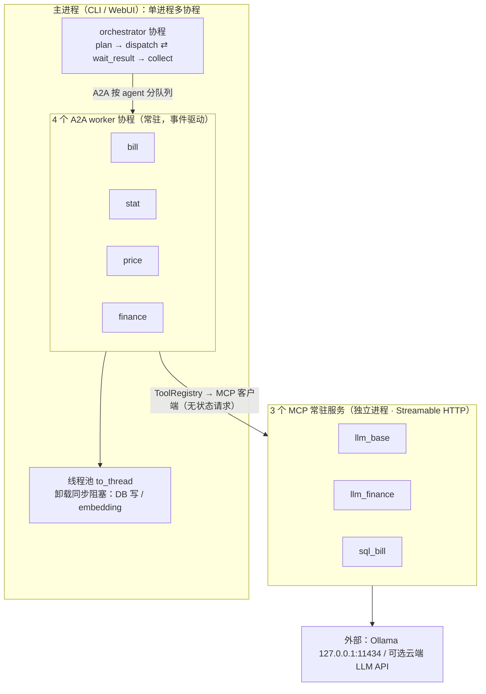
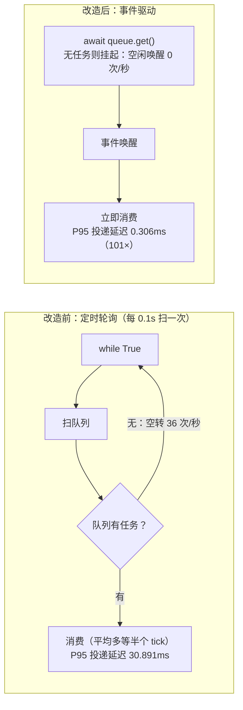
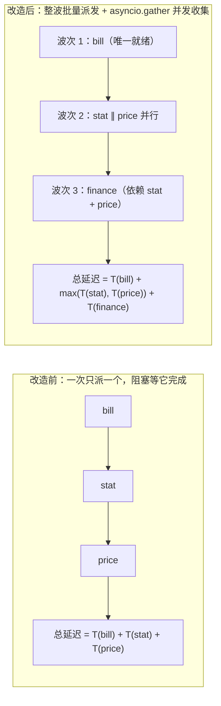
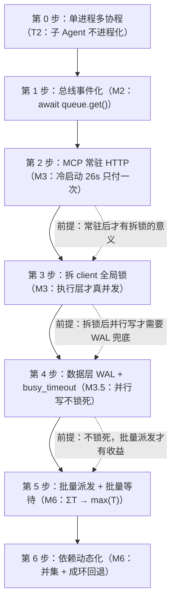

# 06 · 架构视角 3：执行视角（并发模型与运行时）

> 本文展开架构的第三个视角：**运行时谁在跑、并发怎么兑现、消息怎么通信、任务怎么调度**。
> 多 Agent 的意义在于"能并行干活"，但并行带来**并发写库冲突、共享状态竞争、子任务协调成本**——本文逐个回答。
>
> 互引表：本篇依赖 02（T2/T3/T4 取舍）与 05（WAL/任务状态机——本视角并发的数据前提）；
> 输出给 07（可观测埋点位置、超时后的容错）、08（部署进程边界）。
>
> 依据：执行模型基础见 `设计/05_执行架构.md`；优化决策见 `设计/08` §5.2（M2/M3/M3.5/M6 里程碑）；`设计/03` §9.8（并发执行模型与 MCP 传输层改造）。
>
> 更新日期：2026-09-04

---

## 1. 并发单位的选型：进程 / 线程 / 协程

### 1.1 三种执行单位一句话（`设计/05` 第 1 章）

| 单位 | 比喻 | 切换成本 | 适用 |
|---|---|---|---|
| 进程 | 独立餐厅 | 高 | 隔离/多核/不同程序 |
| 线程 | 同一餐厅多个服务员（共享厨房） | 中 | IO 密集 + 需真并行（有锁） |
| 协程 | 一个服务员同时接待多桌 | 低 | **大量 IO 等待**场景 |

### 1.2 本项目为什么选协程为主（T2 决策）

- 负载分析：Agent 大部分时间在**等**——等 LLM、等 SQL、等队列（IO 密集）；
- **推理负载不在主进程内**：本地模型跑 Ollama 服务，外部模型跑云端 API——主进程无 CPU 重计算；
- 因此"单进程 + 多协程"完全够用，**子 Agent 不进程化**（`设计/03` §9.8.6 / §八 T2）——进程化是负优化。

> ⚠️ 阻塞是协程死敌（`设计/05` §3.4）：同步 `time.sleep` 冻结整个事件循环——数据层同步 sleep 被删除（M3.5）。

---

## 2. 运行时全景：不止"1 进程 1 线程"

> 最终形态是"**多进程 + 每进程多协程**"，各进程边界清晰（`设计/05` §6.6）：

| 进程 | 角色 | 说明 |
|---|---|---|
| 主进程 | 编排 + 4 个 A2A worker（子 Agent 协程） | CLI/WebUI 常驻 |
| `llm_base`（`server_llm_base.py`） | LLM MCP 服务（常驻） | 供各 Agent 调模型 |
| `llm_finance`（`server_llm_finance.py`） | finance 专用 LLM 服务（常驻） | 独立配额/模型 |
| `sql_bill`（`sql_server/server_bill.py`） | SQLite MCP 服务（常驻） | 数据访问唯一入口 |

> 依据：`mcpGateway/client.py` 的 `SERVER_CMD_MAP`（3 个 server_key）；`startup/bootstrap.py`（`start_mcp_servers` 按 map 拉起）。
> 为什么 LLM 独立进程：模型加载/推理在子进程，崩溃不拖垮主进程；SQLite 服务独立进程提供跨进程并发访问的受控入口。

### 2.1 运行时全景图（进程边界 = 故障隔离边界）

> 记住三句话：**主进程只等 IO 不算力；MCP 独立进程只为故障隔离；worker 是协程不是进程**（T2，进程化是负优化）。

---

## 3. 消息总线事件化（M2）：从轮询到唤醒

### 3.1 历史问题

A2A 最早是**定时轮询**（0.1s 扫队列）：
- 延迟高：任务要等下一个轮询 tick（实测 P95 投递延迟 ~30.9ms）；
- 空转：没事也每 0.1s 醒一次（36 次/秒）；
- 还有回插扫描、死参数 `target_agent` 等债。

### 3.2 事件驱动改造（M2 落地）

- 消费端 `recv_task()` 改为 `await queue.get()`——**有任务才唤醒**，无任务让出 CPU；
- 保留快路径 `get_nowait` 防 worker 抢消息 + 旁路暂存防忙循环；
- 实测：P95 投递延迟 **30.891ms → 0.306ms（101×）**；空闲唤醒 **36 次/秒 → 0**。

> 依据：`设计/08` §5.2 M2 行（含完成注实测）；代码 `mcpGateway/a2a_queue.py`。
> 教训：事件驱动不是"优化技巧"，是**正确模型**——轮询是"没想清楚用事件"的副作用。

### 3.3 轮询 vs 事件驱动（对照图）

---

## 4. MCP 常驻化（M3）：从每次冷启动到一次就绪

### 4.1 历史问题（C6）

MCP 最早用 **stdio 短连接**：每次工具调用拉起子进程 → 模型加载 26~29s 冷启动 → 一次记账要调 2-3 次模型 = 分钟级等待。

### 4.2 常驻改造（M3 落地）

- 3 个 server 改为 **Streamable HTTP 常驻服务**，随 `bootstrap_all()` 启动拉起；
- 客户端 `client.py` 无状态请求——**不持有需维护的连接**，从根上规避 stdio 长连接的 cancel scope 跨 task 崩溃问题（T3，`设计/03` §9.8.2）；
- 端到端实测：**58.5s vs 76.6s（-24%）**，3 服务约 6s 就绪。

> 依据：`设计/03` §9.8.2；`设计/08` §5.2 M3 行。代价 = 常驻服务生命周期管理（启动顺序/健康检查/端口），见 08 部署视角。

### 4.3 拆全局锁：常驻后的并发前提

- 旧 `client.py` 有全局 `self._lock`：所有 MCP 调用被串行化——**即便派发层并行，执行层也排队**；
- M3 拆除该锁 → 两次 LLM 调用可**真并发**（实测并发 ratio 0.76）；
- 前提关系：**并行派发的收益必须建立在常驻 + 拆锁之后**（否则收益为零，`设计/03` §9.4 ③）。

---

## 5. 数据层并发（M3.5）：SQLite 怎么扛住并行写

并行派发后，记账（写）与统计（读）可能同时到 SQLite：

| 机制 | 作用 |
|---|---|
| `journal_mode=WAL` | 读不阻塞写；写不阻塞读 |
| `busy_timeout=5000` | 写冲突等待 5s 而非立刻 `database is locked` |
| `db_lock` 只包写事务 | 纯读不加锁（锁是协程级，仅护进程内） |
| 删同步 `time.sleep` | 防冻结事件循环 |

> 实测：双进程并发各写 80 行，**零 locked 错误**（`设计/08` §5.2 M3.5 行）。
> ⚠️ 跨进程写互斥由 WAL/busy_timeout 兜底（`db_lock` 管不到别的进程）——这是常驻化后必须补 WAL 的原因。

---

## 6. 并行派发与依赖动态化（M6）：兑现多 Agent 的并行收益

### 6.1 历史问题：名义 4 worker、实际并发度 1

早期 `dispatch_node` **一次只派"第一个就绪任务"，然后阻塞等它完成**——即便 stat 与 price 互不依赖也只能串行：延迟 = ΣT，多 Agent 并行名存实亡。

### 6.2 批量派发 + 批量等待（M6）

- **dispatch**：把当波**全部就绪任务**批量投递到各 Agent 队列；
- **wait_result**：`asyncio.gather` 并发收集（以 running 集合为准，结果乱序归位）；
- 收益：延迟从 `ΣT` → `max(T)`；依赖语义不变（就绪检查 `set(deps).issubset(done)` 保留，并行只作用于无依赖任务）。

### 6.3 依赖动态化（LLM 也参与定依赖）

- 静态表 + LLM 输出依赖**取并集**——动态只往"更保守（更串行）"走，**最坏退化为静态，绝不更差**；
- 环检测：动态依赖成环 → 回退静态表继续执行（有兜底）。

> 依据：`设计/03` §9.8.4（批量派发/等待）/§9.8.5（动态依赖）；`设计/08` §5.2 M6 行（实测串行 10.2s vs 并行 7.6s，结果逐字一致）。

### 6.4 并行派发对照图（延迟从 ΣT 降到 max(T)）

> 依赖来源：静态表 ∪ LLM 动态依赖**取并集**——动态只往"更串行"方向走，成环则回退静态表，**最坏退化为现状，绝不更差**。

---

## 7. 超时与防挂起

| 机制 | 值/说明 |
|---|---|
| 工具级超时 | `ToolSpec.timeout`（SQL 30s / LLM 300s，可配置，≤0=关闭） |
| 外部调用超时 | `EXTERNAL_LLM_TIMEOUT`（300s 防挂起） |
| 任务整体超时 | wait_result 侧超时 → 失败路径（e2e 曾遇 240s 超时 = worker 没启动的提示） |

> 依据：`设计/06` §4（容错）；`设计/01` §7.2 C6/§6；M4 落地见 `设计/08` §5.2 M4 行。
> 超时后干什么：进入容错分类（可重试/不可重试）+ 回退——见 07 横切视角。

---

## 8. 这套执行模型的成型顺序（每步都有前置依赖）

> 关键洞察：并行派发要在常驻 + 拆锁之后才有收益；拆锁后写库并行要靠 WAL 兜底。这就是 `设计/08` §5.1 的全局依赖主干。

---

## 9. 小结

1. 并发单位 = 单进程多协程（推理在外，主进程只等 IO）；
2. 运行时 = 主进程 + 3 个常驻 MCP server 进程，边界清晰；
3. 总线事件化（101× 延迟改善）——轮询是没想清楚用事件；
4. MCP 常驻 HTTP + 拆全局锁 = 执行层真并发的两个前提；
5. WAL + busy_timeout 扛住并行写；
6. 批量派发让延迟从 ΣT 降到 max(T)，依赖动态化带兜底。

> 下一篇（07 横切视角）：跑得快也要跑得对——**Durable / 可观测 / 安全 / 容错 / 防幻觉（方案 C）怎么统一治理**。

---

## 10. 修订记录

| 日期 | 变更 |
|---|---|
| 2026-09-04 | 体系重构：由旧「08 执行与并发」重组为「架构视角 3 执行视角」，头部加互引表，引用编号同步新体系 |
| 2026-09-06 | 补齐架构图 4 张（Mermaid）：§2.1 运行时全景（进程/协程边界）、§3.3 轮询 vs 事件驱动对照、§6.4 并行派发对照（ΣT → max(T)）、§8 成型顺序依赖链 |
