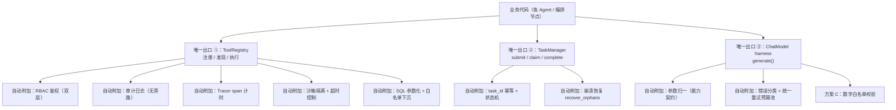
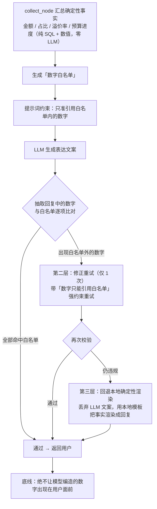
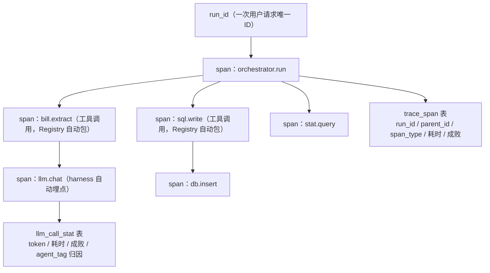
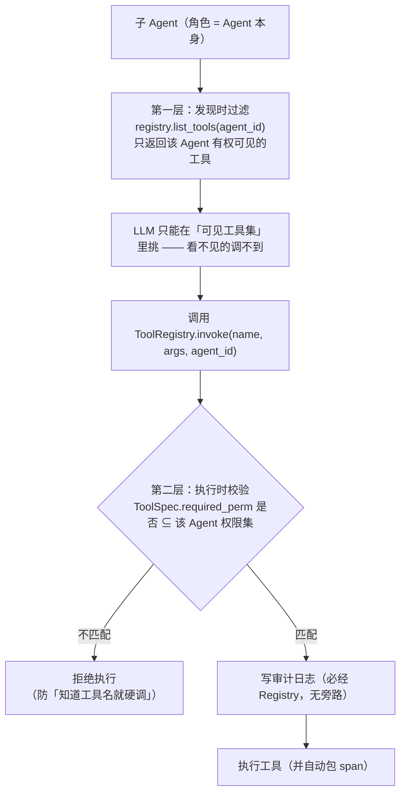
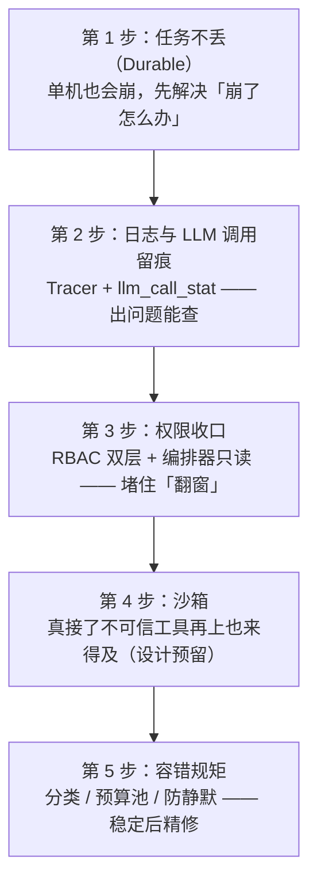

# 07 · 架构视角 4：横切视角（确定性 / 安全 / 可观测 / 容错）

> 本文展开架构的第四个视角：**那些"每一层都要、又不能散落"的能力，怎么统一做**。
> 包含本系统的灵魂——**防幻觉（方案 C）**，以及四件工程硬货：**Durable（任务不丢）、可观测（出事能查）、安全（越界能拦）、容错（失败有规矩）**。
>
> 组织主张：这些不是"另一个子系统"，而是**插在统一入口（ToolRegistry / TaskManager / Tracer / harness）上的能力**——业务代码不写"先鉴权再调用"，架构保证你**绕不过去**。
>
> 互引表：本篇依赖 04（工具唯一入口、模型 harness——横切切入的具体位置）与 05（task_state/trace_span 表）；
> 输出给 08（部署要配套的可观测/回滚开关）、12（评测里"防幻觉拦截率"指标）。
>
> 依据：横切总览见 `设计/06_横切能力设计.md`；方案 C 见 `设计/01` §6 与 `设计/03` §9.3.1；Durable 见 `设计/04` §3；可观测见 `设计/04` §2.6 与 `utils/tracer.py`；安全见 `设计/06` §2；容错见 `设计/06` §4 与 `设计/01` §8.1 T5。
>
> 更新日期：2026-09-04

---

## 1. 先定分工：LLM 在这个系统里到底干什么（数字可信的地基）

> **先把话说明白：LLM 不是"算账的"，是"表达和拆解的"。** 这是防幻觉能成立的前提。

| 谁 | 干什么 | LLM 参与？ |
|---|---|---|
| 统计 SQL | SUM/GROUP BY 汇总 | ❌ 纯 SQL |
| 比价 | 均价对比/溢价率 | ❌ 纯数值 |
| 预警 | 预算四档判定 | ❌ 纯规则 |
| 意图识别 | 用户话 → task_plan | ✅ LLM |
| 信息提取 | "午饭56元" → {金额,品类} | ✅ LLM |
| 文案表达 | 事实 → 自然语言回复 | ✅ LLM |

> 依据：`设计/01` §3.1（能力矩阵"数字来源"列）。

**推论**：回复中的每个数字，在 LLM 开口前就已由确定性层算好并"点名"给模型——**模型只能引用，不能创造**。

---

## 2. 横切能力总表（一表看全）

| 横切能力 | 统一做法 | 切入位置 | 详见 |
|---|---|---|---|
| 数字确定性 | 确定性事实层 + **方案 C 三层防护** | 编排汇总 + 模型 harness | §3 |
| 鉴权 RBAC | 枚举最小权限 + 工具级过滤 + 双层校验 | ToolRegistry（发现时 + 执行时） | §5.1 |
| SQL 注入 | 参数化 + 白名单下沉 ToolSpec | 网关层 | §5.1 |
| 审计 | 所有工具必经 Registry.invoke → 自动审计 | ToolRegistry | §5.1 |
| 可观测 | run_id/span 树 + `llm_call_stat` + `trace_span` 表 | 3 个固定埋点（自动） | §4 |
| 容错 | 错误分类 → 统一预算池 → 幂等才重试 | harness + 工具执行层 | §6 |
| Durable | task_id 幂等 + 状态机 + 启动恢复 | TaskManager | §7 |
| 沙箱 | 子进程资源限制 + 危险工具前缀白名单 | 网关层 | §5.2 |
| 配置 | `config/config.py` 集中 + 启动自检 + 密钥环境变量 | 启动层 | §8 |

### 2.1 横切能力挂载全景图（为什么"绕不过去"）

> 业务代码里**没有一行"先鉴权再调用"**——所有横切能力都挂在**唯一入口**上，调用方想绕也绕不开。

---

## 3. 防幻觉方案 C：三层防护（系统的心脏）

### 3.1 目标

> **回复里出现的每一个数字，都必须是确定性层点名给模型的。** 模型多说了、说错了，都要被拦下。

### 3.2 三层防护（`设计/01` §6 / `设计/03` §9.3.1）

> 三层防护的"设计味道"：**数字 100% 可信是架构保证的，不是模型自觉的**——模型只是"表达者"，且每次表达都要过闸。

> 代码落点：`utils/number_whitelist.py`；编排 collect_node 汇总事实注入。

### 3.3 用户文档数字为什么"不进白名单"（Q6/R9 边界落地）

- 白名单前提：数字由**确定性层产出**；
- 用户文档里的数字（"我们那香蕉8块一斤"）是**用户陈述，不是系统事实** → 不校验，但 finance 引用时标注「用户资料」；冲突时确定性事实优先并向用户说明。

> 依据：`设计/01` §3.5/§8 Q6；`设计/03` §八 T8。

### 3.4 finance 防幻觉三件套（为什么不是"灌知识"）

| 件 | 内容 | 为什么 |
|---|---|---|
| ① 确定性事实底稿 | 目标/统计/物价/近 3 月习惯 全由 SQL/数值算好注入 | 模型只表达已有事实 |
| ② 白名单校验 | 见方案 C | 数字不能编 |
| ③ 历史记忆注入 | long_memory 检索近 3 月习惯 | 建议有据 |

> ⚠️ 曾考虑"RAG 增强"方案被否：RAG 文本无法被白名单校验，防不了幻觉还增加不可控面（T8）。

---

## 4. 可观测：出事能查到哪、为什么

### 4.1 为什么可观测是"前置需求"（血的教训）

M1 开发期**零可观测**：故障只能"重跑 + 加 print"——`num_predict` 语义不兼容、`force_bill` 死代码、重试不分层等坑**长期未暴露**（`设计/02` D1 章"M1 实战补课"注）。

> 结论：可观测是**前置**需求（`设计/01` R10）；"禁止静默失败"是它的另一半——任何兜底必须 WARNING + 计数。

### 4.2 Tracer 模型（`utils/tracer.py`）

| 概念 | 说明 |
|---|---|
| `run_id` | 一次用户请求唯一 ID（`t{ms}{hex}`），贯穿全链路 |
| span | 一次可观测动作（节点执行/工具调用/LLM 调用），含 parent 关系 |
| span 树 | 一次 run_id 下所有 span 组成树，回答"延迟花在哪、谁失败" |
| `agent_tag` | LLM 调用归属 Agent（成本/故障归因维度） |
| 落盘 | `trace_span` 表（run_id/parent_id/agent_tag/span_type/耗时/成败） |

**Span 创建是自动的**：工具调用经 ToolRegistry 自动包 span；LLM 调用经 harness 自动埋点——**不需要各 Agent 自己打点**。这就是"横切能力靠唯一入口附加"的实例。

### 4.3 LLM 调用统计（成本归因）

每次 LLM 调用记录 token（含 reasoning_tokens）/耗时/成败/`agent_tag` → `llm_call_stat`；空响应重试**逐次记录**（`error_type=EMPTY_CONTENT`）——重试是真实计费的，只有逐次记录才能回答"这一轮为什么烧了这么多 token"。

> 依据：`设计/06` §3.2；`设计/04` §2.6；代码 `utils/tracer.py`、`utils/trace_view.py`。

### 4.4 Span 树结构图（一次请求长什么样）

> span 是**自动**产生的：工具走 Registry、模型走 harness，业务代码不写一行打点——这就是"横切能力靠唯一入口附加"的最直观例子。

---

## 5. 安全：谁有什么权限 + 恶意工具怎么办

### 5.1 RBAC：角色 = Agent，权限 = 资源:动作

| 设计点 | 内容 |
|---|---|
| 角色 | 5 个 Agent 各是一角色（`AGENT_PERMISSION_MAP`，严格最小权限） |
| 双层鉴权 | 发现时（list_tools 按 agent 过滤）+ 执行时（invoke 再校验）——防"知道工具名就硬调" |
| 关键收敛 | 编排器只有 `LLM_BASE` + `FACT_READ`（只读事实），**零写权限**（D15 修复：9 处 `db.` 直连收口） |
| 审计 | 所有工具经 `ToolRegistry.invoke` → 审计自动生效（无旁路） |

> 依据：`mcpGateway/rbac_config.py`（AGENT_PERMISSION_MAP，运行时真相）；**RBAC 双层矩阵权威见 `设计_从零系列/09` §4.3**；M9 收敛见 `设计/08` §5.2 M9 行（决策追溯）。

### 5.1.1 RBAC 双层鉴权流程图

> 收敛要点：**编排器只有 `LLM_BASE` + `FACT_READ`，零写权限**（D15：9 处 `db.` 直连已收口）——写操作只可能发生在有职责的子 Agent 里。

### 5.2 沙箱：不可信工具跑飞怎么办（M4）

| 层 | 机制 | 效果 |
|---|---|---|
| 子进程隔离 | `sandbox.py`（Windows Job Object / POSIX RLIMIT） | 内存/CPU 硬上限 |
| 工具级超时 | `ToolSpec.timeout` | 死循环被掐断 |
| 危险操作白名单 | 11 个危险前缀拦截 | 禁止 rm/格式化等 |

**关键验收**：构造死循环/爆内存工具 → 被拦且**常驻服务本身存活**（`设计/08` §5.2 M4 行）。

---

## 6. 容错：失败处理的一整套规矩

### 6.1 黄金原则

1. **重试先分类**：可重试 vs 不可重试，分开处理（`设计/01` §8.1 T5）；
2. **统一预算池**：重试共享预算，防嵌套放大（单次 llm_call 最坏仍 3 次）；
3. **本地免费链路不重试**（烧钱策略不适用免费通道）；
4. **禁止静默降级（R10）**：回退/兜底必须 WARNING + 计数。

### 6.2 错误分类矩阵（LLM 调用）

| 类别 | 错误 | 处理 |
|---|---|---|
| 可重试 | 模型格式错/瞬时 5xx/限流 429/连接错误/空 content | 统一预算池重试（上限 3） |
| 不可重试 | 401/402/400/鉴权/超时 | 立即短路（重试只烧钱） |

### 6.3 回退链

- 模型失败 → 方案 C 第三层：本地确定性渲染兜底——**绝不让用户看到空回复或编造内容**；
- finance 建议生成失败 → 结构化重试（`FINANCE_ERROR` 边界字符串，业务层协议不变）。

> 依据：`设计/06` §4；`设计/01` §8.1 T5；错误类型见 `modelService/chat_model.py` 的 `ChatError`。

---

## 7. Durable：任务不丢、重投不重（可靠性横切）

### 7.1 要防的故障形态

| 故障 | 后果（若无 Durable） |
|---|---|
| 记账写入后、回复前崩溃 | 重启后不知这笔记没记 → 重跑=重复记账 / 不跑=丢账 |
| worker 崩溃，任务还在队列 | 任务永远没人执行 |
| 用户重复提交 | 同一意图执行多次 → 重复记账 |

### 7.2 三个支柱

| 支柱 | 机制 | 代码/表 |
|---|---|---|
| ① 幂等键 | `task_id`：任务创建时生成（`t{ms}{hex3}`），贯穿任务与副作用记录 | bill 表带 `task_id` |
| ② 状态机 | `submitted → running → completed/failed`，独立库 `task_state.db` | `startup/task_manager.py` |
| ③ 恢复 | 启动扫描残留 running → 对账（按 task_id 查是否已生效）→ 已完成标 completed，未完成重投 | `recover_orphans()` |

> 数据侧的完整设计见 05 数据视角 §3；M5 实测：kill -9 重启恢复、重复投递无重复记账（`设计/08` §5.2 M5 行）。

---

## 8. 配置管理（横切的最后一块）

- 全部配置集中在 `config/config.py`：开关（外部 LLM 三开关）、端口、超时、模型参数、上下文窗口；
- 环境变量覆盖 + 默认值兜底：`EXTERNAL_LLM_ENABLED` 由 base_url+api_key 齐备自动推导；
- 为什么集中：散落的硬编码是 D13（魔法数）教训，集中后一处改全局生效。

> 依据：`设计/06` §5；代码 `config/config.py`。

---

## 9. 从零视角的"什么时候该上"（成熟度阶梯）

> 实际项目踩的顺序是 D2/D3/D8/D15/D5……（混着排），导致 M1 在零观测下开发。**从零做时按上面 1→5**——这正是 R10"可观测前置"想固化的经验（`设计/02` §4）。

---

## 10. 小结

1. **先定分工**：LLM 只拆解/提取/表达，数字全来自确定性层——这是防幻觉成立的前提；
2. **方案 C 三层**：白名单 → 修正重试 → 本地渲染回退——**数字 100% 可信是架构保证的，不是模型自觉的**；
3. 横切能力 = 插在统一入口上的机制（TaskManager/Tracer/ToolRegistry/harness），不是独立模块；
4. 可观测前置（R10）：run_id/span 树/agent_tag 自动埋点，禁止静默失败；
5. 安全：RBAC 双层（编排器零写）+ 沙箱三层（工具跑飞）；
6. 容错：重试先分类 + 统一预算池 + 本地不重试 + 兜底必须出声。

> 下一篇（08 部署视角）：所有设计就位后，回答**怎么装、怎么起、怎么关、怎么备份恢复**。

---

## 11. 修订记录

| 日期 | 变更 |
|---|---|
| 2026-09-04 | 体系重构：由旧「09 可靠可观测安全容错」与旧「07 模型接入与防幻觉（§1/§4/§5）」合并重组为「架构视角 4 横切视角」；模型接入 harness 部分留在 04 逻辑视角；引用编号同步新体系 |
| 2026-09-06 | 补齐架构图 5 张（Mermaid）：§2.1 横切能力挂载全景、§3.2 方案 C 三层防护、§4.4 Span 树结构、§5.1.1 RBAC 双层鉴权、§9 成熟度阶梯 |
