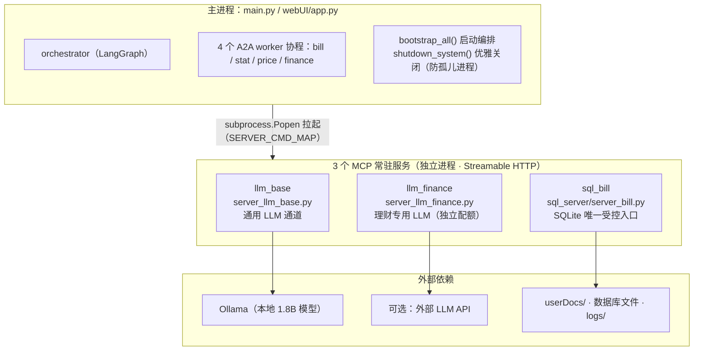
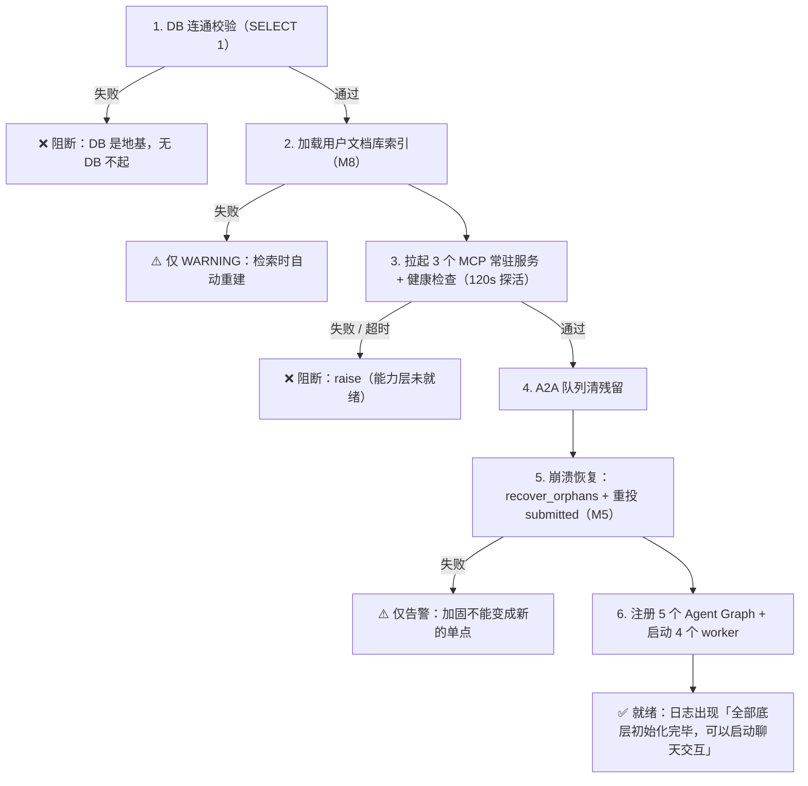
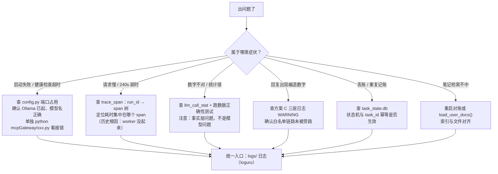

# 08 · 架构视角 5：部署视角（安装 / 启动 / 备份恢复 / 排障）

> 本文展开架构的第五个视角：**这套设计交付后怎么跑起来、日常怎么用、出问题去哪查、数据怎么备份**。
> 读完这篇，你应该能自己把系统从零跑起来，并在出问题时知道"去哪查、查什么"。
>
> 互引表：本篇依赖 06（3 个 MCP 常驻的进程边界）与 07（排障用可观测三件套、配置回退开关）；
> 输出给 12（验收里"数据不丢/任务不丢"的可操作验收步骤）。
>
> 依据：部署细节见 `设计/07_部署架构.md` 与 `设计/03` §五（运行与评测）；启动代码 `startup/bootstrap.py`；运行入口根 `main.py` 与 `webUI/app.py`；安装见 `install_cpu.bat`/`requirements.txt`/README。
>
> 更新日期：2026-09-04

---

## 1. 部署形态总览

> 系统是**单机部署**（R1），但由**4 个进程**组成（06 执行视角 §2 讲过为什么）：



> 进程边界 = 故障隔离边界：LLM 推理崩了不拖垮主进程；SQLite 通过独立服务提供**受控**的跨进程访问入口。

- 3 个 MCP 常驻服务由主进程拉起（`startup/bootstrap.py::start_mcp_servers`，按 `client.py` 的 `SERVER_CMD_MAP`），主进程退出时 `stop_mcp_servers` 关闭（防孤儿进程）；
- `BILLAGENT_MCP_STDIO=1` 可回退 stdio 模式（M3 改造前形态，`设计/03` §9.8.2）。

> 依据：`startup/bootstrap.py`（拉起/健康检查/优雅关闭全流程）。

---

## 2. 安装环境（一次性）

| 依赖 | 用途 | 备注 |
|---|---|---|
| Python 3.10+ | 运行环境 | 全项目 |
| `requirements.txt` 所列包 | langgraph/mcp/fastapi/pandas/loguru/gradio 等 | `pip install -r requirements.txt` |
| **Ollama + 本地模型**（1.8B qwen） | 本地 LLM 通道 | 可选装（配外部 API 可不装） |
| （可选）外部 LLM API key | 增强表达 | `BILLAGENT_EXT_*` 环境变量 |

Windows 一条龙：仓库提供 `install_cpu.bat`（建 venv + 装依赖 + Ollama 模型检查），README 有逐步说明。

---

## 3. 启动系统

### 3.1 一键启动

```powershell
# 命令行对话
.\venv\Scripts\python.exe main.py

# 或 WebUI（Gradio）
start_webui.bat    # 或 python webUI/app.py
```

### 3.2 启动顺序（`bootstrap_all()` 内部做了什么）

| 步骤 | 动作 | 失败处理 |
|---|---|---|
| 1 | DB 连通校验（SELECT 1） | 失败即阻断（DB 是地基） |
| 2 | **加载用户文档库索引**（M8） | 失败只 WARNING，检索时自动重建 |
| 3 | **拉起 3 个 MCP 常驻服务** + 健康检查（120s 探活） | 启动失败/超时 → raise（阻断） |
| 4 | A2A 队列清残留 | — |
| 5 | **崩溃恢复**：`recover_orphans` + 重投 submitted（M5） | 失败只告警不阻断（加固不能变单点） |
| 6 | 注册 5 个 Agent Graph + 启动 4 个 worker | — |

> 依据：`startup/bootstrap.py::bootstrap_all`。顺序不可颠倒（尤其 5 的"先改状态、再重投"）。

### 3.2.1 启动顺序与失败语义（阻断 vs 告警）



> 设计味道：**失败语义是分级的**——地基类（DB / MCP 服务）失败必须阻断，加固类（索引 / 崩溃恢复）失败只能告警，否则"为可靠而加的东西"会变成新的不可用来源。

### 3.3 就绪标志

日志出现 `======== 全部底层初始化完毕，可以启动聊天交互 ========` 即就绪。

---

## 4. 日常使用速记

| 想做什么 | 说 |
|---|---|
| 记账 | "记午饭56元" |
| 改/删账 | "把刚才那笔改成60" / "删掉刚才那笔" |
| 查统计 | "这个月花了多少" |
| 比价 | "打车贵不贵" |
| 理财建议 | "给我点省钱建议" |
| 设预算 | "设置月预算3000" |
| 记笔记（用户文档库） | "记下：我们那香蕉8块一斤" |
| 管理笔记 | "删掉XX那条笔记" / "列一下我的笔记" |

> 依据：`设计/01` §3.1 能力矩阵；知识管理（doc:add/delete/list）见 `01` §3.5。

### 4.1 数据与文件（在哪、管什么）

| 路径 | 内容 | 备注 |
|---|---|---|
| `database/bill.db` | 业务事实（账单/配置/物价/习惯/统计表） | 需备份 |
| `database/task_state.db` | 任务状态机 | 崩溃恢复依据 |
| `userDocs/` | 用户文档库（文件=真相源） | 用户可手改，启动对账 |
| `ragKnowledge/long_consume_mem.pkl` | 长期记忆原文落盘 | 12 月滚动 |
| `logs/` | 日志 | 排障入口 |
| `config/config.py` | 全部配置（端口/开关/模型） | 改配置处 |

---

## 5. 排障手册（常见症状 → 去哪查 → 怎么解）

### 5.1 启动类

| 症状 | 根因线索 | 解法 |
|---|---|---|
| MCP 常驻服务健康检查超时 | 端口被占/模型没拉起来 | 查 `config.py` 端口；确认 Ollama 已起、模型名对 |
| MCP 服务启动失败，退出码… | server 依赖缺失/配置错 | 单独 `python mcpGateway/xxx.py` 看报错 |
| 数据库 locked | 别的主进程还在跑 | 关掉残留进程（WAL 本可并发，单文件被旧进程独占时除外） |
| 主进程退出后一堆孤儿 python | 非优雅关闭 | 用 `stop_mcp_servers`（Ctrl+C 应自动走 shutdown） |

### 5.2 运行时类

| 症状 | 根因线索 | 解法 |
|---|---|---|
| 一次请求 240s 超时 | worker 没启动（历史根因） | 确认启动日志 4 个 worker 消费循环已起 |
| 外部模型回复空/一直重试烧 token | reasoning 吃满 max_tokens（D17） | `EXTERNAL_BASE_LLM_OPTIONS.max_tokens` 调大 ≥512；或换非推理模型 |
| 统计/比价数字不对 | SQL/数据问题（不是模型问题） | 查 `llm_call_stat`/`trace_span` 确认事实层；跑 integration 数据正确性测试 |
| 回复出现编造数字 | 防幻觉防线失效 | 查方案 C 三层日志（WARNING）；确认白名单链路未旁路 |
| finance 建议引用了旧习惯 | 长期记忆过期 | pkl 12 月滚动策略，正常行为 |
| 用户文档检索不中 | 索引与文件不同步 | 启动会对账；手动 `load_user_docs()` 或重启 |

### 5.3 查问题三件套（按序）

1. **日志** `logs/`（loguru 统一输出）；
2. **trace**：`run_id` → `trace_span` 表 → `utils/trace_view.py` 看 span 树（延迟花在哪/谁失败）；
3. **数据**：`llm_call_stat`（LLM 成本/成败归因）、`task_state.db`（任务生命周期）。

> 依据：可观测三件套见 07 横切视角；查看工具 `utils/trace_view.py`。

### 5.4 排障决策图（症状 → 查什么）



---

## 6. 备份与恢复

| 要备份 | 频率建议 | 说明 |
|---|---|---|
| `database/bill.db` | 每日 | 业务事实，重中之重 |
| `userDocs/` | 用户改动后 | 文件系统即真相源 |
| `ragKnowledge/long_consume_mem.pkl` | 周 | 长期记忆（丢了可从习惯重新沉淀） |
| `config/config.py` 相关环境变量 | 变更后 | 部署配方 |

> ⚠️ SQLite 备份用文件拷贝即可，但**拷贝时建议走 WAL checkpoint**（或先停写）：直接拷 `.db` 可能漏掉 WAL 里未合并的数据（`设计/07` §3.3/§3.4）。日常已开启 WAL，`-wal`/`-shm` 与 `.db` 同目录需一并处理。

---

## 7. 日常迭代工作流（改代码 → 验证）

```
改代码
  ├─ 离线快速：python -m pytest tests/unit -q   （263 passed，30s，不含模型）
  ├─ 数据层：python -m pytest tests/integration -q
  ├─ 检索：python evaluation\user_docs_recall_eval.py
  ├─ 全链路：python -m pytest tests/e2e -v（需 3 MCP 常驻 + 4 worker + LLM）
  ├─ 质量：python evaluation\agent_answer_eval.py（L3，1.5h）
  └─ 契约红线：python -m pytest tests/contract/test_contract_check.py（设计文档与代码漂移即 FAIL）
```

> 依据：README「测试与评测」；**契约红线 test_contract_check.py——改完先跑它**（详见 09 契约手册 / 10 开工守则）。

---

## 8. 部署的"设计味道"（面试可讲）

1. **进程边界 = 故障隔离边界**：LLM 推理崩了不拖垮主进程；SQLite 有受控入口；
2. **常驻 = 一次成本换多次收益**：冷启动 26~29s 只付一次，换来每笔请求秒级；
3. **启动顺序 = 依赖序**：DB → 索引 → 服务 → 恢复 → worker，5 步不可颠倒，失败各有语义（阻断 vs 告警）；
4. **备份清单 = 六类存储的生命周期答案**（05 数据视角）——该备的备、该滚动的滚动；
5. **可观测三件套是排障入口**——日志、span 树、统计表，先看哪个由症状决定。

---

## 9. 小结

1. 单机部署 = 1 主进程 + 3 常驻 MCP + 1 Ollama，零外部中间件；
2. `bootstrap_all()` 5 步有严格依赖序，失败语义分级（阻断/告警）；
3. 日常使用一句话即可触发全部能力；
4. 排障 = 日志 → span 树 → 统计表三件套；
5. 备份 = bill.db + userDocs + pkl（WAL checkpoint 注意）；
6. 改代码先跑契约红线测试（见 09/10）。

> 下一篇（09 模块契约手册）：施工前最后的"查照本"——**所有接口/状态/表/红线的唯一事实源**，AI 施工时按它写代码，验收按它查漂移。

---

## 10. 修订记录

| 日期 | 变更 |
|---|---|
| 2026-09-04 | 体系重构：由旧「11 部署运行与排障」重组为「架构视角 5 部署视角」，头部加互引表，引用编号同步新体系 |
| 2026-09-06 | 补齐架构图 3 张（Mermaid）：§1 进程部署形态图（替换原 ASCII 方框）、§3.2.1 启动顺序与失败语义（阻断 vs 告警）、§5.4 排障决策图 |
